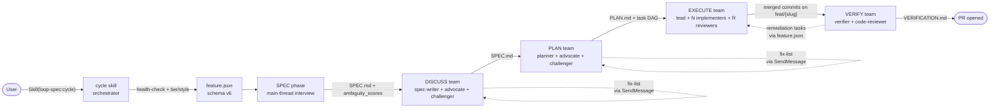
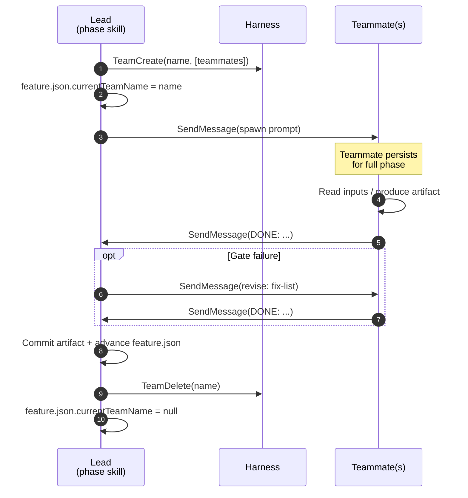
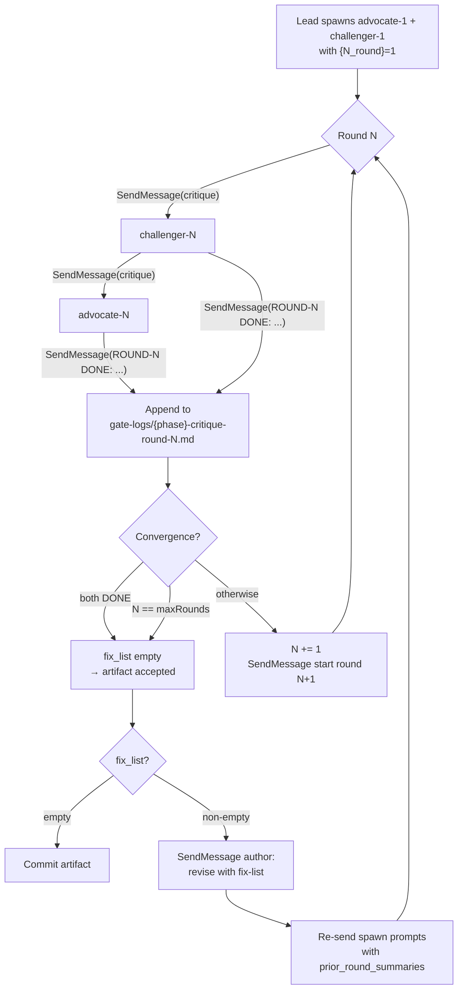
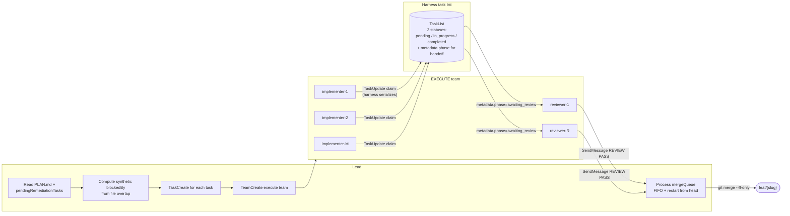
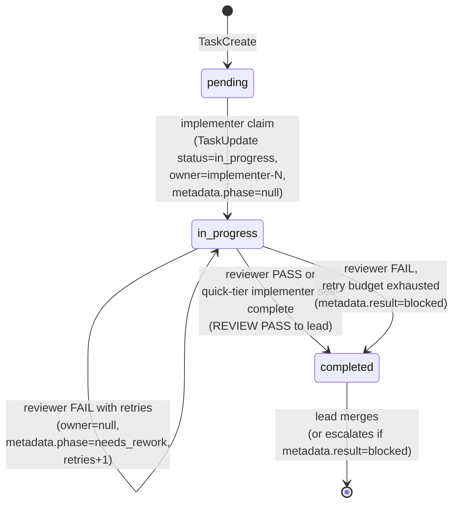

# loop-spec

A spec-driven development plugin for Claude Code. Shipped code is Bash + git + jq + python3 only -- no npm/pip/brew installs. One external tool is required: [graphify](https://github.com/safishamsi/graphify) (`uv tool install graphifyy`), the de-facto code graph the design phases query. 5 phases. 3 tiers. Fixed per-role model map. 4 execution styles.

**Status:** v1.1.0 (rebranded from super-spec; previous lineage v1.0.0–v3.2.0). Built on Claude Code agent teams when available (CC v2.1.32+ with `CLAUDE_CODE_EXPERIMENTAL_AGENT_TEAMS=1`), with first-class loop-runner execution that works without teams: every phase has a documented no-teams fallback, and EXECUTE runs as a supervised fleet of bounded autonomous loops (`skills/loop-runner/`).

## Why this exists

The two open-source ideas I kept reaching for:

- **[superpowers](https://github.com/obra/superpowers)** -- a curated bundle of skills (brainstorming, writing-plans, subagent-driven-development, TDD, debugging, ...) that turn Claude Code from a freeform assistant into a fast, disciplined collaborator. The lesson I took: skills are how you encode workflow. Skills are how you make Claude FAST.
- **[get-shit-done](https://github.com/gsd-build/get-shit-done)** -- a multi-phase workflow (spec → discuss → plan → execute → verify) that captures every decision in markdown artifacts kept in `.planning/`. The lesson I took: spec-driven development beats prompt-driven development the moment a task is bigger than one commit, because the spec is what catches the design errors that re-rolls can't fix.
- **[ponytail](https://github.com/DietrichGebert/ponytail)** -- a "lazy senior dev" skill that climbs a laziness ladder (YAGNI → reuse → stdlib → native → installed dep → one line → minimum) before writing code, while never cutting validation, error handling, security, or accessibility. The lesson I took: a spec-driven cycle that plans and reviews without an explicit anti-over-engineering reflex still ships bloat; the cheapest code is the code you talk yourself out of writing. Realized here as **simplicity mode** (`skills/simplicity/`, on by default) plus an over-engineering pass in VERIFY's `code-reviewer`.

loop-spec is what happens when you take the speed of superpowers (persistent specialized agents, asymmetric tier-based model selection, parallel work) and bolt it onto the durability of GSD (every phase produces a committed markdown artifact, every gate is auditable, every `feature.json` is resumable). Plus a handful of opinionated additions:

- **Persistent phase teams**: each phase runs in a `TeamCreate`d team whose teammates persist for the full phase and communicate via `SendMessage`. Within a phase the lead does not re-dispatch a teammate as a fresh `Agent` call — rework rides on `SendMessage` so accumulated context is preserved across rounds.
- **EXECUTE concurrency ladder**: EXECUTE picks its dispatch mechanism by the structural width `W` of the task DAG (`lib/dag-width.sh`), scaling the orchestration weight to the available parallelism instead of always reaching for the heaviest tool. `W == 1` runs a **subagent** sequentially; `2 <= W < t_team` fans out batched **subagent** waves (parallel one-shot `Agent` calls, no persistent team); `t_team <= W < t_wf` spins up an **agent team** (the self-claim `TeamCreate` path); `W >= t_wf` escalates to the **Workflow DAG** (`lib/workflows/execute-dag.js`) only when the operator opted in (`LOOP_SPEC_EXECUTE_WORKFLOW=1`) and the `Workflow` tool is available; and the **loop fleet** (`skills/shared/execute-loop-fleet.md`) runs at any width on `LOOP_SPEC_EXECUTE_LOOPS=1`, or replaces the team rung automatically when agent teams are unavailable. Width thresholds (`t_team`, `t_wf`) live per-tier in `skills/shared/tier-matrix.md`. All rungs share the same spec-compliance + retry contract, merge each passed task branch into `feat/{slug}`, and return the identical `{merged, blocked, escalation}` result (subagent/team/workflow rungs use per-task git worktrees under `.loop-spec/worktrees/{slug}/task-NNN/`; the loop fleet uses supervisor-managed worktrees on `loop/<id>` branches). Synthetic `blockedBy` edges between tasks with overlapping `files[]` provide concurrency safety beyond the explicit DAG. This follows the Anthropic tool idiom: subagents for modest fan-out, teams for coordinated high concurrency, Workflow only on explicit opt-in for undeniable fan-out ROI.
- **Critique gates** (advocate + challenger pair) on SPEC and PLAN. ROUND-N debate is logged to `.loop-spec/features/{slug}/gate-logs/` and a non-empty fix-list re-dispatches the upstream author via `SendMessage` with prior summaries threaded in. Skipped on `quick` tier.
- **First-run codebase map** that ingests an existing GSD `.planning/codebase/` if present, then dispatches mappers only for whatever's still missing -- pay for the map once per project, never twice.
- **Pattern-mapper** (also borrowed from GSD) that runs at PLAN Step 0 and writes per-feature `PATTERNS.md` so the planner cites real codebase analogs instead of inventing shapes.
- **Bounded retries**: 3 per gate, per-phase ceilings, 30 global. The cycle either ships or escalates -- it never loops forever.
- **Worktrees always project-local**: per-task worktrees are created under `.loop-spec/worktrees/` (EXECUTE), always within the repo root. The `using-git-worktrees` skill (superpowers-extended-cc plugin) was updated in tandem to enforce the same constraint for general skill use, removing the former `~/.config/...` global path option. Multi-repo setups get a separate worktree dir per repo in single-repo mode; workspace mode uses in-place `feat/{slug}` branches instead (see "Workspaces (multi-repo)" below).
- **VERIFY marker scan** (ported from GSD): before dispatching any acceptance agents, VERIFY scans changed files for unresolved `TBD`/`FIXME`/`XXX` markers and fails fast, saving agent budget on incomplete work.
- **Stall detection** (ported from GSD): EXECUTE resume distinguishes "done", "stalled mid-write" (re-dispatches with the partial diff as context), and "clean stall" (fresh re-dispatch). The previous heuristic of "commits exist = done" could skip review on a crashed agent.
- **Orphaned worktree pruning** (ported from GSD): after EXECUTE completes, it prunes worktrees whose branches are already merged without destroying uncommitted work.
- **Remediation routing**: when VERIFY's acceptance gate or code-review HARD-GATE fires, remediation tasks are persisted to `feature.json.pendingRemediationTasks[]` and consumed by EXECUTE on re-entry — they survive the verify team's teardown without requiring the verify and execute teams to share state.
- **Loop engineering, first-class**: the plugin bundles the **loop-runner**
  skill (`skills/loop-runner/`, also invocable standalone as `/loop-spec:loop-runner`) —
  three tested layers for autonomous execution: `compile_spec.py` (spec → verified task
  plan), `supervisor.py` (plan → fleet of workers in isolated worktrees with merge +
  halt policy), `loop.py` (bounded loop with verifier-integrity locking,
  budget/iteration/stall/timeout stops, durable state, `result.json` contract). EXECUTE
  gains a **loop-fleet rung**: PLAN.md tasks are compiled to a loop plan
  (`lib/plan-to-loop.sh`) and run as a supervised fleet — every iteration of every
  worker mechanically re-runs the task's `verifyCommand`, and SPEC.md/PLAN.md are
  hash-locked so no worker can edit the requirements to match its work. This is the
  strongest spec-adherence guarantee in the plugin, and it requires neither agent teams
  nor the Workflow tool. Enable everywhere with `LOOP_SPEC_EXECUTE_LOOPS=1`; it is also
  the automatic EXECUTE path when agent teams are unavailable. The loop-runner offline
  regression suite (29 checks, fake claude binary) runs as part of `tests/run-all.sh`.
- **Teams-optional operation**: the cycle no longer aborts when
  `CLAUDE_CODE_EXPERIMENTAL_AGENT_TEAMS` is unset. Every phase declares a no-teams
  fallback (`skills/shared/no-teams-fallback.md`): one-shot subagents with the same
  agent types/models/prompts for critique and verify, loop-fleet or subagent rung for
  EXECUTE. Hook guards (task metadata validation, lint/typecheck completion gates, agent
  path restrictions) are scoped to loop-spec-owned tasks (`metadata.loopSpec` /
  `task-NNN:` subjects) and active loop-spec projects, fail open on any parse error,
  and each carries a kill switch — they no longer throw on ordinary TaskCreate/
  TaskUpdate/TaskCompleted traffic or tax tool calls in unrelated projects.

The rest of this README is install + usage.

## Quickstart

1. Register the marketplace and install the plugin:
   ```bash
   claude plugin marketplace add https://github.com/aztechead/loop-spec.git
   claude plugin install loop-spec@loop-spec-marketplace
   ```

2. Optionally set `CLAUDE_CODE_EXPERIMENTAL_AGENT_TEAMS=1` (requires Claude Code v2.1.32+) to enable persistent phase teams. See [docs/loop-spec/PREREQUISITES.md](docs/loop-spec/PREREQUISITES.md) for setup options. Without it the cycle runs on the no-teams fallbacks (`skills/shared/no-teams-fallback.md`): one-shot subagents for critique/verify and the loop-fleet rung for EXECUTE (requires the `claude` CLI on PATH).

   Ensure `bash >= 4`, `git`, `jq >= 1.5`, and `python3 >= 3.6` are on PATH. macOS ships them all by default; minimal Linux images (Alpine, distroless) may need `apk add jq python3` or equivalent.

3. **Install graphify (required).** graphify is loop-spec's de-facto code-graph solution; the cycle aborts at startup without it, because the design phases (SPEC/DISCUSS/PLAN) query the graph to ground their work. It is a Python 3.10+ tool published as `graphifyy`:
   ```bash
   uv tool install graphifyy     # recommended (manages PATH); or pipx/pip install graphifyy
   graphify install              # register the skill, then `graphify --help` to verify
   ```
   On first cycle run loop-spec builds `graphify-out/graph.json` (deterministic AST extraction, no API key, offline) and commits it. Constrained environments can bypass the requirement with `LOOP_SPEC_REQUIRE_GRAPHIFY=0` (degraded mode: design phases fall back to Glob/Grep).

4. Update your `CLAUDE.md` model policy to allow `claude-opus-4-8` and `claude-sonnet-4-6` (the fixed model map uses exactly these two; see `skills/shared/model-matrix.md`).

5. Restart Claude Code (or run `/reload-plugins`) so the new skills register.

## Usage

### Start a feature cycle

`cd` into the project repo, open Claude Code, then invoke either:

```
/loop-spec:cycle
```

or equivalently:

```
Skill(loop-spec:cycle)
```

Each per-phase skill is directly slash-invocable (the skill is the command, no separate command layer): `/loop-spec:spec`, `/loop-spec:discuss`, `/loop-spec:plan`, `/loop-spec:execute`, `/loop-spec:verify`, `/loop-spec:iterate`, `/loop-spec:map-codebase`. Use one when you want to run a single phase rather than the full cycle. The bundled loop engine is also directly invocable as `/loop-spec:loop-runner` for standalone autonomous loops ("implement this spec", "keep going until tests pass", overnight/cron runs) outside the cycle. Two additional standalone skills are available outside the cycle:

- `/loop-spec:assess` -- standalone, read-only codebase fragility and health assessment; workspace-aware; dispatches bounded code-reviewer subagents at the top-N hotspots and writes `docs/loop-spec/assessment/ASSESSMENT.md`.
- `/loop-spec:quality-loop` -- iterative pre-commit review convergence loop; workspace-aware; runs deterministic checks then parallel code-reviewer and security-reviewer passes, repeating until convergence or the round budget is exhausted.
- `/loop-spec:grill` -- toggle grill mode (`on`/`off`/`status`). Grill mode is **on by default**: a session-start directive makes the assistant front-load 2-4 sharp disambiguation questions right after your initial prompt to lower ambiguity before acting. Persists in `.loop-spec/grill.conf`; `LOOP_SPEC_GRILL=0` is the session kill switch.
- `/loop-spec:discipline` -- toggle discipline mode (`on`/`off`/`status`), an opt-in set of five behavioral gates (brainstorm-before-coding, verification-before-claims, investigation-before-fixes, decision-gate, intent-gate). Persists in `.loop-spec/discipline.conf`.
- `/loop-spec:simplicity` -- toggle simplicity mode (`on`/`off`/`status`) and set intensity (`lite`/`full`/`ultra`). **On by default at `full`**: a session-start directive makes the assistant climb the laziness ladder before writing code -- YAGNI, reuse, stdlib, native, installed dep, one line, then the minimum that works -- without cutting validation, error handling, security, or accessibility. VERIFY's `code-reviewer` runs the matching over-engineering pass (delete/stdlib/native/yagni/shrink) on quality/balanced tiers. Concept and implementation ported from [ponytail](https://github.com/DietrichGebert/ponytail). Persists in `.loop-spec/simplicity.conf`; `LOOP_SPEC_SIMPLICITY=0` is the session kill switch.
- `/loop-spec:rules` -- manage the **self-learning loop** rules (`add`/`list`/`render`/`path`). Every repeated mistake becomes a permanent rule in `.loop-spec/RULES.md`, carried into every future session by `hooks/team/rules-inject.sh` (default on, inert until rules exist; `LOOP_SPEC_RULES=0` kills it). Pass `--check "<cmd>"` to back a rule with a deterministic check rather than a prose note. Mechanics in `lib/rules.sh`.
- `/loop-spec:onboard` -- one-time guided setup wizard. A few multiple-choice questions write the optional config in place (grill, self-learning, discipline, commit strategy). Non-destructive and re-runnable; everything it sets is also documented for manual setup here.

None of the workflow skills set `disable-model-invocation`: the cycle orchestrator chains phases via the Skill tool (a `disable-model-invocation` skill cannot be invoked that way), and each phase hands off to the next the same way. You start a run with `/loop-spec:cycle`; the orchestrator drives the rest.

The cycle skill runs a quiet startup health-check — agent-teams probe, model probe (two 1-token dispatches, cached 24h in `.loop-spec/runtime.json`; `LOOP_SPEC_SKIP_HEALTHCHECK=1` skips), and Workflow availability. **You just give it a feature description** — there is no tier/style menu. `/loop-spec:cycle <feature description>` launches immediately: the cycle **infers the tier** from your prompt (and from any grill answers), defaults style to `auto`, and proceeds. A bare `/loop-spec:cycle` asks one free-text question for what you want to build — nothing else.

**Tier is inferred, not asked.** Tier controls gate behavior, retries, and fan-out width (never models). The cycle reads the request and picks:

- `quality` -- spec + plan critique gates run; code-review blocks on Critical + Important. Inferred for high-blast-radius work: auth/security, payments, data migrations, public API/contract changes, concurrency, "production"/"critical" framing, or wide refactors.
- `balanced` -- same gate behavior as quality. The default for typical multi-file features and the fallback whenever signals are mixed or thin.
- `quick` -- **critique gate skipped**; code-review blocks on Critical only. Inferred for trivially-scoped, low-blast-radius changes: typos, small bugfixes, one isolated function, config tweaks.

You can still override the inference inline anywhere in the text (`tier:quick|balanced|quality`), and override the style the same way (`style:auto|step|interactive|review-only`), but you are never prompted to choose.

**Execution style** (`auto` default; override inline):
- `auto` -- end-to-end. Hard-gate failures self-heal (re-dispatch upstream agent with findings, max 3 retries per gate, 30 global) before pausing for human.
- `step` -- pause between phases. You review SPEC.md / PLAN.md / VERIFICATION.md before next phase fires.
- `interactive` -- pause before every subagent dispatch. Maximum control.
- `review-only` -- auto except at critique-gate reconciliation, where it pauses for your judgment.

**Grill mode (on by default).** Right after your opening prompt, the assistant runs a short "grill" pass — 2-4 sharp clarifying questions (structured multiple-choice where the answers are discernible) — to collapse the highest-leverage ambiguities before committing to an approach, and feeds those answers into tier inference. Inside the cycle, the SPEC phase Socratic interview is the in-cycle realization of this; outside the cycle it is injected as a session-start directive by `hooks/team/grill-inject.sh`. Toggle with `/loop-spec:grill on|off|status` or the `LOOP_SPEC_GRILL=0` kill switch.

**Model selection is fixed** (no preset). Opus runs the reasoning-heavy roles (spec-writer, planner, advocate, challenger, spec-compliance-reviewer); sonnet runs the high-throughput roles (implementer, code-reviewer, verifier, mappers). See `skills/shared/model-matrix.md`.

### What the cycle does

The six phases run in order (ITERATE can rewind the chain):

| Phase | Produces | Gates |
|-------|----------|-------|
| **SPEC** | `docs/loop-spec/features/{slug}/SPEC.md` with `ambiguity_scores` frontmatter | 6-round Socratic interview; ambiguity gate (ambiguity <= 0.20) |
| **DISCUSS** | `docs/loop-spec/features/{slug}/SPEC.md` (revised) | spec critique gate (skipped on quick) |
| **PLAN** | `docs/loop-spec/features/{slug}/PATTERNS.md` (Step 0) + `PLAN.md` (Step 1) | plan critique gate + feasibility check |
| **EXECUTE** | per-task commits on `feat/{slug}` branch | per-task spec-compliance gate with retry (quality/balanced); dispatch via the concurrency ladder (subagent / loop fleet / agent team / opt-in Workflow DAG) |
| **VERIFY** | `docs/loop-spec/features/{slug}/VERIFICATION.md` + map-codebase refresh in `docs/loop-spec/codebase/` + PR opened | acceptance gate + code-review HARD-GATE |
| **ITERATE** | `docs/loop-spec/features/{slug}/ITERATION.md` (per-iteration verdict log) | dual oracle (deterministic acceptance gate **+** an `iterate-judge` goal re-judge); converged → ship, else classify the gap and rewind to EXECUTE / PLAN / SPEC. Bounded by `feature.iterate.maxIterations` (quick 1 / balanced 2 / quality 3) and the cycle-wide global budget |

**ITERATE — the convergence loop.** VERIFY proves the SPEC acceptance checklist is met; ITERATE asks the harder question: is the result there yet *against the original goal*? A fresh `iterate-judge` (opus, maker≠checker) scores the integrated result against the user's original intent and classifies the single highest-leverage gap — `execute` (implementation), `plan` (decomposition), or `spec` (wrong scope) — then ships when converged or the iteration budget is spent, or rewinds to the matching phase to fix it.

**Fully autonomous in `auto`/`review-only`.** No gap type blocks on a human: `execute`, `plan`, and `spec` rewinds all run on their own (the `spec` rewind re-enters DISCUSS in autonomous refinement mode). This is safe because the judge always scores against the **immutable original goal** (`feature_title`), never the rewritten SPEC, so a rewind can move the work *toward* the goal but can never redefine "done" to cheat its own oracle — and the iteration budget hard-caps the loop. When the budget is spent it ships-with-warnings rather than waiting. An overnight `auto` run never pauses for input. Only the explicit human-in-loop styles (`step`/`interactive`) surface the SPEC-rewind approval gate. This generalizes loop-spec's former EXECUTE-only remediation into the full `DISCOVER → PLAN → EXECUTE → VERIFY → ITERATE → repeat` loop.

EXECUTE dispatch is the concurrency ladder (see "EXECUTE concurrency ladder" above and `skills/shared/tier-matrix.md`): the DAG width `W` selects sequential/batched **subagent** waves, the self-claim **agent team** (2-4 implementers, cap from `tier.execute.maxParallelImplementers`, manual FIFO merge queue), or — on explicit `LOOP_SPEC_EXECUTE_WORKFLOW=1` opt-in for very wide DAGs — the deterministic **Workflow DAG** (`lib/workflows/execute-dag.js`). The **loop fleet** (`LOOP_SPEC_EXECUTE_LOOPS=1`, or automatic when agent teams are unavailable) instead compiles the tasks to a loop plan and runs them as bounded headless `claude -p` loops with per-iteration verification and SPEC/PLAN hash-locking. All rungs merge into `feat/{slug}` and return the same result shape.

### First-run setup (one time per project)

The very first time you invoke `/loop-spec:cycle` in a project, before SPEC starts the cycle ensures `docs/loop-spec/codebase/{TECH,ARCH,QUALITY,CONCERNS,DOMAIN}.md` all exist:

1. **GSD ingest.** If the project already has a get-shit-done map at `.planning/codebase/`, loop-spec concatenates the relevant GSD docs into loop-spec format (with an `Imported from GSD` header) and commits them.
2. **Mapper dispatch.** For whatever's still missing after ingest (always at least `DOMAIN.md`, since GSD has no analog), the cycle invokes `Skill(loop-spec:map-codebase) --domain <missing>`. Mapper agents run in parallel; each writes one of the 5 docs.

Subsequent runs skip Step 5.5 entirely; the incremental refresh at end of VERIFY keeps the map fresh.

### Resume an in-flight feature

If a cycle was interrupted, re-invoke `Skill(loop-spec:cycle)`. It scans `.loop-spec/features/*/feature.json`, finds incomplete features within the staleness window (default 48h), probes the prior phase team via `TaskList` to distinguish stale-but-resumable state from a still-live orphaned team (when agent teams are unavailable the team is treated as gone and the feature resumes directly), and offers to resume from the last completed step. State writes are atomic (`.tmp` + `sync` + rename, with `.bak` rotation) so partial crashes leave the previous-good state recoverable. Loop-fleet EXECUTE state is durable too: re-entering EXECUTE resumes budget-halted tasks from `.loop/` state instead of re-paying completed iterations.

### Refresh codebase mapping standalone

Auto-refresh runs at end of each cycle. Manual invocation:

```
Skill(loop-spec:map-codebase)             # incremental, only stale domains
Skill(loop-spec:map-codebase) --full      # re-map all 5 domains
Skill(loop-spec:map-codebase) --domain tech,arch
```

### Non-interactive mode

For CI / scripting / smoke tests, set env vars before invoking:

```bash
export LOOP_SPEC_NON_INTERACTIVE=1
export LOOP_SPEC_ANSWER_TIER=quick
export LOOP_SPEC_ANSWER_STYLE=auto
export LOOP_SPEC_ANSWER_TITLE="add subtract function"
```

The cycle skill detects the env var and skips every AskUserQuestion call.

### Environment variables

| Variable | Effect |
|---|---|
| `LOOP_SPEC_EXECUTE_LOOPS` | `1` = force the EXECUTE loop-fleet rung at any DAG width; `0` = never select it (kill switch). Unset = automatic when agent teams are unavailable and `claude` is on PATH. |
| `LOOP_SPEC_LOOP_FLEET_BUDGET` / `LOOP_SPEC_LOOP_TASK_BUDGET` / `LOOP_SPEC_LOOP_MAX_ITERATIONS` | Loop-fleet spend bounds (defaults 20 / 4 USD / 10 iterations per task). |
| `LOOP_SPEC_EXECUTE_WORKFLOW` | `1` opts into the Workflow DAG rung on very wide DAGs. |
| `LOOP_SPEC_SKIP_HEALTHCHECK` | `1` skips the startup model probe (also auto-skipped when probed < 24h ago). |
| `LOOP_SPEC_TASK_GUARD` | `0` disables the task metadata / lint / typecheck completion gates. |
| `LOOP_SPEC_PATH_GUARD` | `0` disables the agent path-restriction hook. |
| `LOOP_SPEC_BLOCKEDBY_GUARD`, `LOOP_SPEC_USERGATE_GUARD`, `LOOP_SPEC_BUDGET_GUARD`, `LOOP_SPEC_STRATEGY_ROTATION`, `LOOP_SPEC_COMPRESSOR`, `LOOP_SPEC_DONE_CRITERIA`, `LOOP_SPEC_DEFLECTION_GUARD`, `LOOP_SPEC_LEARNINGS`, `LOOP_SPEC_DISCIPLINE` | `0` = per-hook kill switches (blockedBy enforcement, user-gate evidence, cost ceiling, failure-strategy rotation, output compression, done-criteria injection, deflection guard, learnings log, discipline injection). |
| `LOOP_SPEC_GRILL` | `0` = disable the grill-mode SessionStart directive (grill is on by default; `/loop-spec:grill off` persists it). |
| `LOOP_SPEC_SIMPLICITY` | `0` = disable the simplicity-mode (laziness-ladder) SessionStart directive (on by default at `full`; `/loop-spec:simplicity off` persists it). |
| `LOOP_SPEC_RULES` | `0` = disable self-learning RULES.md injection (on by default, inert until rules exist). |
| `LOOP_SPEC_REQUIRE_GRAPHIFY` | `0` = bypass the hard graphify requirement (constrained environments). Default: required; the cycle aborts at startup if graphify is missing, and the design phases fall back to Glob/Grep only in bypass mode. |
| `LOOP_SPEC_MAX_COST_USD` | Session cost ceiling enforced by the budget-gate hook (unset = no ceiling). |
| `LOOP_SPEC_NON_INTERACTIVE` + `LOOP_SPEC_ANSWER_*` | CI mode, see above. |

All hook guards additionally self-scope: they no-op outside projects with `.loop-spec/` state, and the task gates only fire on loop-spec-owned tasks (`metadata.loopSpec` / `task-NNN:` subjects).

### Self-learning loop, commit strategy, per-task model tiers

- **Self-learning loop (`RULES.md`).** A loop only improves if it carries its lessons forward. When a gate or verifier rejects the same class of mistake twice, the cycle appends a rule to `.loop-spec/RULES.md` (`lib/rules.sh add "<lesson>" --check "<cmd>"`, deterministic checks preferred over prose). `hooks/team/rules-inject.sh` injects the current rules into every session, and the escalation contract makes coordinators consult `RULES.md` (and PLAN.md's `## User decisions (already made)` record) **before** asking the user anything. You own and curate the file; manage it with `/loop-spec:rules`.
- **Commit strategy.** `.loop-spec/workflow.json` `{"commitStrategy":"at-end"}` makes EXECUTE collapse `feat/{slug}` into a single commit at phase exit; the default (`per-task`, or no file) keeps per-task commit history. Read via `lib/workflow-config.sh`; skipped in workspace mode.
- **Per-task model tier.** A plan task may carry an optional `modelTier` (`mechanical`/`standard`/`frontier`); EXECUTE's subagent/loop rungs resolve it via `lib/model-tier.sh` to route that one task to the cheapest fitting model, overriding the fixed per-role map (a concrete `model` pin still wins). The team rung keeps role defaults since teammates are pre-spawned.

### Artifact tree

```
docs/loop-spec/                          # COMMITTED
├── features/{slug}/
│   ├── SPEC.md
│   ├── PATTERNS.md
│   ├── PLAN.md
│   └── VERIFICATION.md
└── codebase/
    ├── TECH.md
    ├── ARCH.md
    ├── QUALITY.md
    ├── CONCERNS.md
    └── DOMAIN.md

.loop-spec/                              # GITIGNORED (except codebase/index.json)
├── features/{slug}/
│   ├── feature.json                      # schema v6, atomic-write with .bak rotation
│   ├── feature.json.bak
│   ├── spec-interview-transcript.md      # SPEC Socratic interview transcript
│   ├── discuss-transcript.md             # DISCUSS conversational transcript
│   ├── loop-plan.json                    # EXECUTE loop-fleet rung: compiled loop plan
│   └── gate-logs/                        # critique-gate round transcripts
├── worktrees/{slug}/                     # per-task git worktrees, lifecycle = task
├── runtime.json                          # teamsMode, teamsAvailable, workflowsAvailable, workflowExecuteOptIn, modelsProbedAt
└── codebase/
    └── index.json                        # file -> domain[] for incremental map (TRACKED)

.loop/                                    # GITIGNORED loop-fleet runtime state (per worktree)
├── fleet-result.json                     # supervisor result: completed/failed/skipped + per-task results
└── {task-id}/                            # per-loop state: result.json, iter-NNN.raw.json, PROGRESS.md, verifier output
```

### When things fail

- **Health check fails** -- your `CLAUDE.md` model policy probably blocks one of the two models the fixed model map uses. Update policy to allow `claude-opus-4-8` and `claude-sonnet-4-6`.
- **Critique gate keeps bouncing** (>3 retries on same gate) -- spec or plan is genuinely ambiguous. Cycle pauses and escalates. Edit the artifact manually then re-invoke cycle to resume.
- **Merge conflict on a task branch** -- the lead's sequential merge rebases the worktree onto current `feat/{slug}` HEAD and retries once. If still fails, cycle pauses (counts against `tier.execute.maxRetriesPerTask`).
- **Crash mid-execute** -- `feature.json` records `currentTeamName`, `mergeQueue`, and per-phase artifact paths; the harness task list owns per-task status. Resume probes whether the EXECUTE team is still live, replays the merge queue, and instructs implementers to re-claim orphaned in-flight tasks.
- **Loop-fleet task halts** -- read `halt_reason` in `.loop/fleet-result.json`, not vibes: `no_progress` = task under-specified or too big (split it in PLAN.md); `budget`/`timeout` = raise `LOOP_SPEC_LOOP_TASK_BUDGET` and re-enter EXECUTE (state is durable, completed iterations are not re-paid); `verifier_integrity` = a worker touched SPEC.md/PLAN.md/verify targets — inspect the diff with suspicion before resuming. Full table in `skills/shared/execute-loop-fleet.md`.
- **Teams unavailable** -- not a failure: the cycle continues on the no-teams fallbacks (`skills/shared/no-teams-fallback.md`). Set `CLAUDE_CODE_EXPERIMENTAL_AGENT_TEAMS=1` to restore persistent phase teams.

See `docs/adopting.md` for more pitfalls and `docs/design.md` for the full architecture (phase walkthroughs, retry budgets, model matrix, tier policy, agent catalog).

## Workspaces (multi-repo)

loop-spec supports multi-repo projects through workspace mode. Cycle Step 0 runs `lib/workspace.sh detect` and classifies the invocation directory as one of three modes:

- **single** -- the current directory is inside a git repo. Everything works exactly as today.
- **workspace** -- the current directory is a parent containing one or more immediate-child git repos (depth-1 scan, hidden dirs skipped), or an explicit `.loop-spec/workspace.json` pin is present. The pin is required when the parent is itself a git repo (detection would otherwise prefer single mode) or to select a subset of discovered repos.
- **none** -- neither condition holds; the cycle aborts with instructions to cd into a repo or create `.loop-spec/workspace.json`.

### workspace.json pin

Create `.loop-spec/workspace.json` at the parent directory to opt into workspace mode or select a subset:

```json
{"schemaVersion": 1, "repos": [{"name": "frontend", "path": "frontend"}, {"name": "backend", "path": "backend"}]}
```

Each `path` is relative to the workspace root. If the workspace root is or becomes a git repo, add `.loop-spec/` to its `.gitignore`.

### How workspace mode runs

- **State and artifacts** are rooted at the workspace root: `.loop-spec/` and `docs/loop-spec/features/{slug}/`.
- **Repo confirmation** -- cycle Step 0 announces the repo list and (interactively) asks whether to proceed with all repos or a subset. Non-interactive: set `LOOP_SPEC_ANSWER_REPOS=frontend,backend` (comma-separated repo names; default = all).
- **In-place branches** -- each participating repo gets a `feat/{slug}` branch created directly in the working checkout. There are no feature worktrees in workspace mode. The cycle performs a two-phase dirty-repo check before creating any branch: phase 1 scans ALL repos for uncommitted changes and aborts (listing every dirty repo) before ANY branch is touched; phase 2 creates branches only when all repos are clean.
- **Per-repo command detection** -- Step 4 detects test, lint, and typecheck commands separately for each repo root.
- **Per-task `repo` field** -- PLAN tasks each carry a `repo` field (matching a workspace repo name) and workspace-relative `files[]` paths (`<repo>/<path>`). One task = one repo; cross-repo work = multiple tasks with `blockedBy` edges.
- **EXECUTE subagent rung** -- workspace mode caps EXECUTE at the subagent rung. At most one implementer works per repo concurrently; implementers commit directly on the repo's `feat/{slug}` branch via `git -C <repo>`. No per-task worktrees.

  **KNOWN LIMITATION (v1):** the team, loop-fleet, and Workflow EXECUTE rungs are single-repo only. Workspace mode always runs the subagent rung regardless of DAG width. `LOOP_SPEC_EXECUTE_LOOPS=1` is refused with an escalation in workspace mode. These rungs are deliberately deferred to a future release.

- **Per-repo push and PR** -- VERIFY pushes and opens one PR per repo that has commits over its base SHA. Repos with no task commits are left untouched; their `feat/{slug}` branch is deleted on completion.
- **Resuming** -- workspace features store `"workspaceMode": "workspace"` in `feature.json` (schema v7). Resume requires re-invoking the cycle from the workspace root; invoking from any other directory will prompt you to cd to the workspace root.

## Architecture

loop-spec is built on Claude Code agent teams when they are available. The cycle skill is a thin orchestrator; each phase skill owns its own team, teammates persist for the full phase and communicate via SendMessage, and tasks are tracked via the harness `TaskList`. Cycle Step 2 resolves a **`teamsMode`** (`lib/teams-capability.sh`, version-gated): on Claude Code **>= 2.1.178** (`implicit`) the `TeamCreate`/`TeamDelete` tools were removed, so each phase spawns its named teammates directly with `Agent({name})` (`skills/shared/implicit-team-mode.md`); on earlier builds (`explicit`) it uses per-phase `TeamCreate`/`TeamDelete`. With teams enabled either way, the orchestrator never spawns one-shot subagents for in-phase work -- fresh `Agent` calls without a `name` are reserved for background codebase mappers. Without teams (`teamsMode == "none"`, i.e. `runtime.json.teamsAvailable == false`), phases substitute one-shot `Agent` calls per `skills/shared/no-teams-fallback.md`, and EXECUTE runs the loop-fleet rung (bounded headless `claude -p` loops supervised by `skills/loop-runner/scripts/supervisor.py`) or subagent waves -- same artifacts, gates, and result contracts on all paths.

Each feature runs in its own git worktree created at cycle Step 5 via `git worktree add .claude/worktrees/{slug} -b feat/{slug} {baseSha}`. All phase work (SPEC through VERIFY: docs, state, code, commits) happens inside that worktree on branch `feat/{slug}`. The user's main checkout is never switched onto a feature branch. On resume, the cycle discovers in-progress features by reading `git worktree list` output and locating each worktree's `feature.json` (schema v6 adds `worktreePath`). Features created on schema v5 or earlier resume in-place without a worktree (back-compat).

### Top-level cycle



Solid arrows are forward progression; dotted arrows are gate-failure retry loops. Each phase persists its artifact under `docs/loop-spec/features/{slug}/` and commits it before handoff, so a crash at any boundary is resumable.

### Per-phase team lifecycle

Every phase follows the same lifecycle. The lead is the orchestrator's tool-using thread; teammates are spawned via `TeamCreate` with specialized agent types from `agents/loop-spec-*.md`.



Resume detection in cycle Step 1 reads `currentTeamName` from each candidate `feature.json` and probes the harness via `TaskList`: a successful call means the prior team is still live (orphaned — manual `TeamDelete` required), an error means the team is gone and the feature can be resumed by recreating the team fresh.

### Critique gate (DISCUSS + PLAN)

Both DISCUSS and PLAN run a paired critique gate on their artifact. The gate is skipped on `quick` tier and capped at `tier.maxCritiqueRounds` (1/2/3 for quick/balanced/quality). Convergence ends the loop early on mutual `DONE`.



Gate transcripts are persisted under `.loop-spec/features/{slug}/gate-logs/` so a re-entry after revision can replay prior debate context into the new round.

### EXECUTE: the agent-team rung (self-claim parallelism)

EXECUTE is the only phase without an authoring/critique pair. The diagram below is the **agent-team rung** of the concurrency ladder (selected when `t_team <= W < t_wf` with teams available). The lead pre-populates the harness task list from PLAN.md tasks (plus any `pendingRemediationTasks` from a prior VERIFY pass), then a long-lived team of implementers (and reviewers on quality/balanced tiers) self-claim unblocked tasks until the list drains. On narrower DAGs (`W < t_team`) EXECUTE instead runs the lighter **subagent rung** (`skills/shared/execute-subagent.md`): the lead drives waves of one-shot `Agent` calls and merges inline, with no persistent team. On `LOOP_SPEC_EXECUTE_LOOPS=1` (any width) or when teams are unavailable, the **loop-fleet rung** (`skills/shared/execute-loop-fleet.md`) replaces this diagram entirely: `lib/plan-to-loop.sh` compiles the same task set into a loop plan and `supervisor.py` walks the DAG with bounded headless loops. On very wide DAGs with opt-in it escalates to the **Workflow DAG**. All rungs produce the same merged `feat/{slug}` branch.



Each claimed task runs in an isolated per-task git worktree under `.loop-spec/worktrees/{slug}/task-NNN/`, so concurrent implementers cannot race on the working tree. Synthetic `blockedBy` edges between any pair of pending tasks whose `files[]` overlap (computed in Step 2b) provide additional concurrency safety beyond the explicit DAG.

On `quick` tier the reviewer role is omitted (`R = 0`); implementers self-complete and the lead merges directly.

### Implementer task lifecycle



All status transitions are confined to the three harness-documented values (`pending`, `in_progress`, `completed`). Implementer/reviewer handoffs and rework happen via `owner` reassignment and `metadata.phase`/`metadata.result` mutation while status stays `in_progress`.

See [docs/loop-spec/PREREQUISITES.md](docs/loop-spec/PREREQUISITES.md) for setup.

## Limitations

Known harness limitations when running with agent teams enabled (none of these apply to the loop-fleet or subagent paths):

1. **No session resumption with in-process teammates.** `/resume` will not restore teammates from a previous session; phase-boundary resume only.
2. **No nested teams.** Teammates cannot spawn sub-teams. Only the lead agent may create a team.
3. **One team at a time per lead.** A lead cannot manage multiple concurrent teams.
4. **`skills` and `mcpServers` frontmatter in agent definitions are inert when running as teammate.** Only the lead's skills and MCP servers are active.
5. **Permissions set at spawn.** All teammates inherit the lead's permission mode; per-teammate permission scoping is not supported.

## Repository layout

```
loop-spec/
├── .claude-plugin/
│   ├── plugin.json
│   └── marketplace.json
├── agents/                          # 13 specialized agent defs (teammates + one-shot mappers/probe)
│   ├── spec-writer.md
│   ├── planner.md
│   ├── pattern-mapper.md
│   ├── implementer.md
│   ├── spec-compliance-reviewer.md
│   ├── verifier.md
│   ├── code-reviewer.md
│   ├── advocate.md
│   ├── challenger.md
│   └── mapper-{quality,concerns,domain}.md
├── skills/
│   ├── cycle/SKILL.md               # entry point
│   ├── spec/SKILL.md
│   ├── discuss/SKILL.md
│   ├── plan/SKILL.md
│   ├── execute/SKILL.md
│   ├── verify/SKILL.md
│   ├── map-codebase/SKILL.md
│   ├── assess/SKILL.md              # standalone codebase fragility and health assessment (workspace-aware)
│   ├── quality-loop/SKILL.md        # iterative pre-commit review convergence loop (workspace-aware)
│   ├── loop-runner/                 # bundled loop-runner skill: loop.py, compile_spec.py, supervisor.py + offline test suite
│   ├── pause/ rollback/ forensics/  # cycle lifecycle utilities
│   ├── discipline/                  # 5-gate behavioral directive toggle
│   ├── simplicity/                  # laziness-ladder directive toggle (ponytail-ported; lite/full/ultra)
│   ├── checking-gates/ specifying-gates/  # user-gate verification flow
│   └── shared/                      # model-matrix, tier-matrix, team-prompts/, model-policy, execute-loops, execute-subagent, execute-loop-fleet, no-teams-fallback, cycle-resume-escalation, dispatch-fanout, feature-state-schema
├── lib/                             # extracted bash with unit tests
│   ├── feature-write.sh             # atomic feature.json writes with .bak rotation
│   ├── git-ops.sh                   # base-branch detection, slugify, sha helpers (-C <path> for workspace mode)
│   ├── workspace.sh                 # workspace mode resolver (detect / list-repos / resolve-repo)
│   ├── fragility-scan.sh            # per-file fragility ranking from git history (used by assess)
│   ├── quality-loop-state.sh        # round/finding/convergence tracker (used by quality-loop)
│   ├── gsd-ingest.sh                # codebase + PATTERNS.md ingestion from GSD
│   ├── dag-width.sh                 # DAG peak-antichain width for the EXECUTE ladder
│   ├── plan-to-loop.sh              # EXECUTE tasks[] -> loop-runner plan (loop-fleet rung)
│   ├── ralph-remediation.sh         # VERIFY remediation loop harness
│   ├── workflow-availability.sh     # CC-version gate for the Workflow tool
│   ├── feature-init.sh              # single source of truth for the schema-7 feature.json skeleton + models map
│   ├── resolve-bin.sh               # resolve real executables past version-manager shell shims (nvm/pyenv/...)
│   ├── acceptance-lint.sh           # flags bare-substring grep acceptance criteria (plan feasibility gate)
│   ├── team-ops.sh                  # team_name_for_phase + agent-teams env assertion
│   ├── workflows/                   # dynamic-workflow scripts (execute-dag, map-codebase, ...)
│   └── checkpoint / decision-coverage / detect-test-cmd / pause-snapshot / plan-adherence / regression-scan / validate-task-metadata / worktree-commit-check
├── hooks/
│   ├── restrict-agent-paths.sh      # PreToolUse Write|Edit: per-role path guard (open-dispatch caller detection, fail-open)
│   ├── team/                        # task gates (TaskCreate/TaskCompleted, scoped to loop-spec tasks), budget gate, advisory hooks (strategy-rotation, output-compressor, done-criteria, deflection guard, learnings, discipline)
│   └── hooks.json
├── tests/
│   ├── run-all.sh                   # meta runner: validators + hook + lib units + workflow syntax + loop-runner suite
│   ├── validate-agents.sh           # frontmatter + tools-list + model invariants
│   ├── lib/                         # unit tests for lib/*.sh
│   ├── workflows/smoke.sh           # ESM syntax check (runtime async-wrapper emulation) for lib/workflows/*.js
│   └── fixtures/                    # probe transcripts, sample agent definitions
└── docs/
    ├── design.md                    # full architecture
    ├── tier-guide.md
    └── adopting.md
```

## Docs

- `docs/design.md` -- full architecture
- `docs/tier-guide.md` -- when to use each tier
- `docs/adopting.md` -- adoption guide
- `tests/README.md` -- test matrix

## Tests

```bash
bash tests/run-all.sh    # 32 suites: validators + hook + lib units + workflow syntax + the bundled loop-runner offline suite (no claude CLI required — loop tests use tests/fakeclaude)
```

End-to-end cycle coverage is the manual matrix in `tests/README.md` (run against a live Claude Code session); there is no scripted headless e2e test. The loop-runner suite (`skills/loop-runner/tests/run_tests.sh`, 29 checks) covers every halt reason, verifier-integrity locking, resume, plan validation, compilation, and a full supervisor end-to-end with worktrees and merges.

## Workflows integration

Phase skills opportunistically dispatch [Claude Code dynamic workflows](https://code.claude.com/docs/en/workflows) at fan-out points (`map-codebase`, VERIFY acceptance gate, VERIFY code-review HARD-GATE, PLAN multi-angle on quality tier). The wrapper pattern preserves all existing TeamCreate orchestration and falls back automatically when the `Workflow` tool is unavailable.

### Setup

The cycle's startup health-check probes `Workflow` tool availability and writes `.loop-spec/runtime.json` (which also records `teamsAvailable`, `workflowExecuteOptIn`, and the cached `modelsProbedAt`). If the tool is denied:

```bash
/permissions
# add Workflow to allow list
```

To force the fallback path everywhere:

```bash
export CLAUDE_CODE_DISABLE_WORKFLOWS=1
```

Workflow subagents need `Bash`, `Read`, `Grep`, `Glob` (already in the typical loop-spec allowlist).

### Tier parameters

| Param | quality | balanced | quick |
|---|---|---|---|
| refuteVoters | 5 | 3 | 1 |
| planAngles | 5 | 3 | 1 |
| dimensionReviewers | 4 | 3 | 1 |
| completenessCritic | true | true | false |

### Bundled standalone commands

`hooks/install-bundled-workflows.sh` mirrors two scripts as user-facing slash commands:

- `/loop-spec:codebase-audit` -- multi-dimension code review of the current diff
- `/loop-spec:multi-angle-plan` -- draft N plans, judge, synthesize

## License

MIT.
