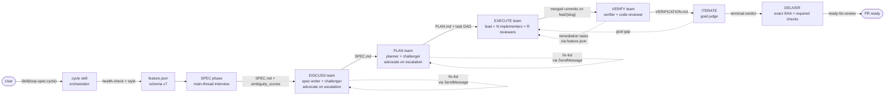
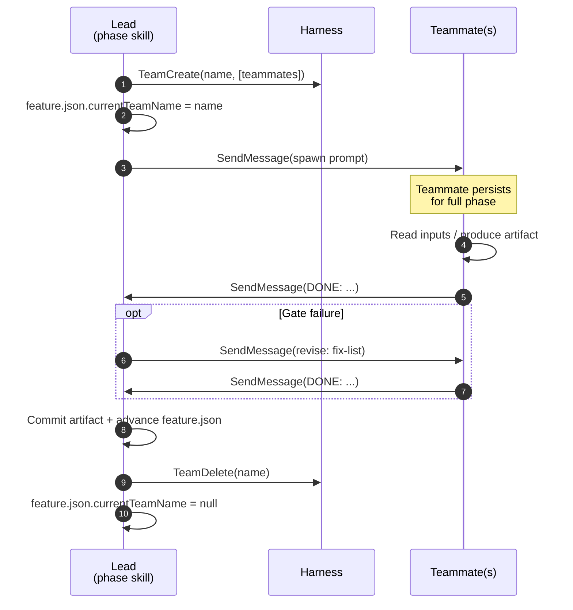
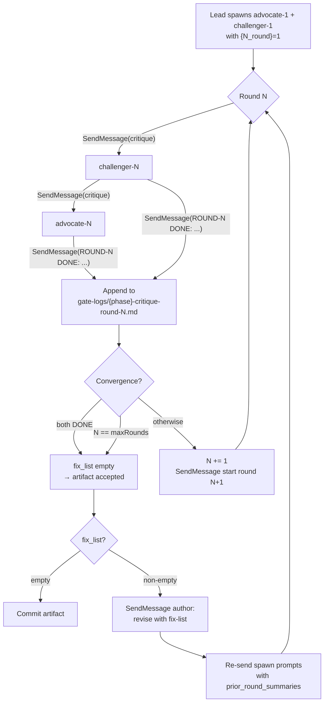
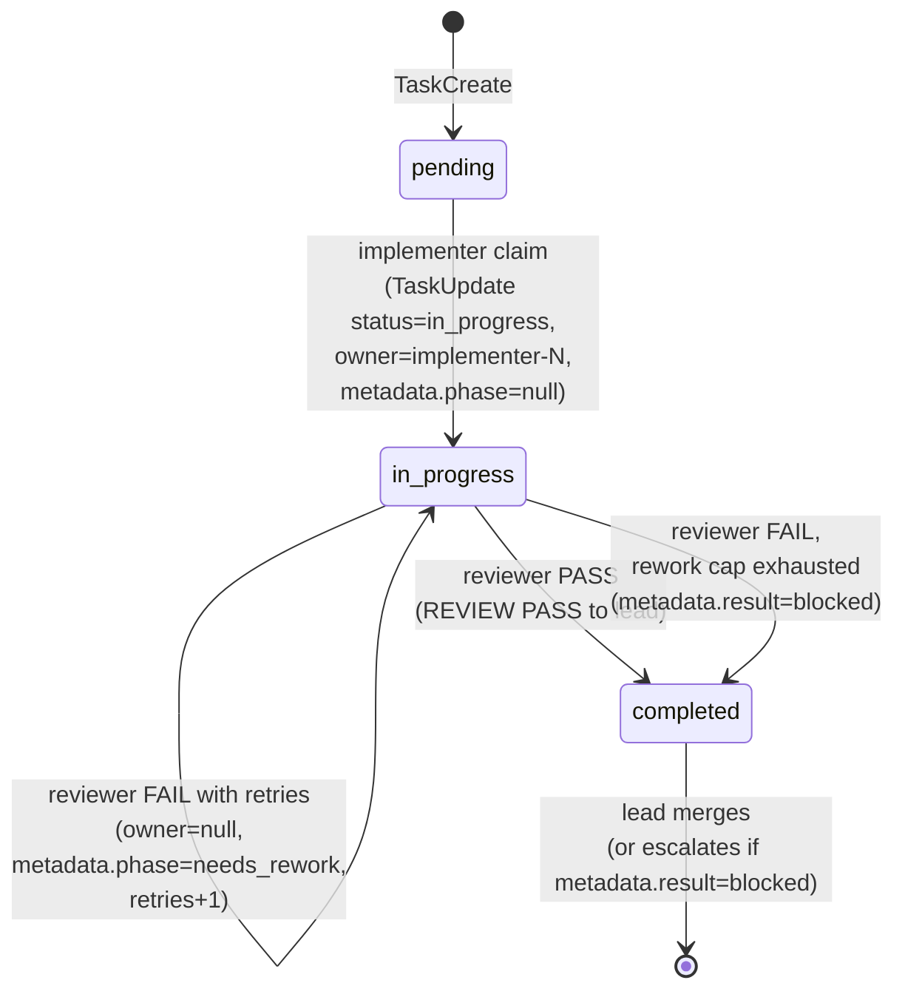

# loop-spec

Spec-driven development loops for Claude Code (and [pi](https://pi.dev), and [opencode](https://opencode.ai)).

Give the cycle a feature description, or a pre-authored spec file, and it runs seven phases: SPEC, DISCUSS, PLAN, EXECUTE, VERIFY, ITERATE, DELIVER. ITERATE judges the integrated result against your original request and rewinds until the goal is met or the iteration limit (10) is spent. DELIVER then pushes the exact verified SHA, creates or reuses one PR, waits for required checks, and marks it ready for review. Phase state and evidence are durable in `feature.json` and committed artifacts, so interrupted runs resume instead of starting over.

The same machinery covers adjacent workflows:

- `/loop-spec:cycle new <description>` bootstraps a net-new application in an empty directory.
- `/loop-spec:debug <error or symptom>` runs a bounded debugging loop that requires a red reproduction before any fix.
- `/loop-spec:intake <anything>` converts a Slack message, Jira ticket, email, or plain prompt into a spec draft and starts the cycle from it.
- The `autonomous` token makes any of these run without questions: each point that would ask a human takes the model's recommended answer and records it in an auditable decision log.
- `/loop-spec:sentinel` watches your work sources (issues, CI failures, backlog) and can drive the queue through the cycle on a schedule, within strict, script-enforced bounds.

Design constraints that hold throughout:

- Shipped code is bash, jq, python3, and markdown. No package manager, no daemon, no database. Scheduling means cron/launchd/CI recipes that invoke normal entry points.
- Decisions about whether the loop may act without a human are made by tested shell scripts, not by prose in a skill. The model proposes; scripts authorize.
- One external tool is required: [graphify](https://github.com/Graphify-Labs/graphify), the knowledge graph the design phases query.
- Works with or without Claude Code agent teams, and on both team harness generations. Without teams it degrades to one-shot subagents or a bounded headless loop fleet.

Current version: 2.22.0 (renamed from super-spec at v2.5.2). Direction: [docs/loop-spec/ROADMAP-3.0.md](docs/loop-spec/ROADMAP-3.0.md).

## Install

### Claude Code

1. Register the marketplace and install:

   ```bash
   claude plugin marketplace add https://github.com/aztechead/loop-spec.git
   claude plugin install loop-spec@loop-spec-marketplace
   ```

2. Install graphify (required). The cycle aborts at startup without it, because SPEC/DISCUSS/PLAN ground their work in the code graph:

   ```bash
   uv tool install graphifyy     # or pipx/pip install graphifyy (needs Python 3.10+)
   graphify install              # register the skill; `graphify --help` to verify
   ```

   Every cycle invokes Graphify's assistant skill before design: `.` performs the first full build and `. --update` incrementally refreshes code plus changed semantic inputs. Code remains local AST extraction; docs, papers, and images use the current assistant model and its existing authentication, including Vertex/Agent Platform ADC supplied by the host. loop-spec then validates named nodes and the complete output set before committing shared artifacts. Constrained environments can set `LOOP_SPEC_REQUIRE_GRAPHIFY=0`; design phases then fall back to Glob/Grep.

### Graphify artifacts

loop-spec follows Graphify's team workflow: generated graph outputs are committed so a clone can query the graph immediately. `skills/shared/graphify-lifecycle.md` invokes the external assistant skill; `lib/graphify-preflight.sh validate` requires human-readable node labels plus `graph.json`, `GRAPH_REPORT.md`, `graph.html`, and `manifest.json`. Its `stage` command stages those shared files and portable analysis/label sidecars while excluding local-only or disposable files through the clone's Git exclude file:

- `graphify-out/cost.json`
- `graphify-out/cache/` (content-addressed acceleration data)
- `graphify-out/.graphify_python` and `.graphify_root` (machine-specific paths)
- temporary/lock files and dated safety-backup directories
- partial assistant extraction intermediates

Graphify node IDs in `graph.json` are deterministic, path-qualified identifiers; consumers should still treat them as opaque because the upstream ID scheme can evolve. Random-looking hexadecimal filenames under `graphify-out/cache/` are expected content hashes, not unnamed graph nodes, and loop-spec does not commit them. The standard visualization is the fixed file `graphify-out/graph.html`; per-node Markdown/Obsidian or other HTML exports are optional Graphify exports and are not required by loop-spec.

3. Check the base prerequisites: `bash >= 4`, `git`, `jq >= 1.5`, `python3 >= 3.6`. Prompt-to-PR delivery additionally requires an authenticated GitHub CLI (`gh auth status`) and an `origin` remote. Minimal Linux images may need `apk add jq python3` or equivalent.

4. Optional: set `CLAUDE_CODE_EXPERIMENTAL_AGENT_TEAMS=1` to enable agent teams (see [docs/loop-spec/PREREQUISITES.md](docs/loop-spec/PREREQUISITES.md)). Without it the cycle uses one-shot subagents for critique/verify and the loop-fleet rung for EXECUTE, which needs the `claude` CLI on PATH.

5. Make sure your `CLAUDE.md` model policy allows whatever the harness `opus` and `sonnet` aliases resolve to. Dispatch targets these two aliases (`skills/shared/model-matrix.md`).

6. Restart Claude Code (or run `/reload-plugins`).

### pi

loop-spec ships as a pi package from the same source tree:

```bash
pi install git:github.com/aztechead/loop-spec
uv tool install graphifyy
graphify install --platform pi
```

This loads every skill, the `/loop-debug` prompt template, and a bundled extension (`extensions/pi/loop-spec.ts`) that bridges the Claude Code surface: it exports `LOOP_SPEC_HARNESS=pi`, `CLAUDE_PLUGIN_ROOT`, `CLAUDE_PROJECT_DIR`, and `CLAUDE_SKILL_DIR` into every bash command and runs the SessionStart / prompt-submit / session-end hooks that pi has no native equivalent for. graphify and the base prerequisites are the same.

Differences under pi (full contract: `skills/shared/pi-harness.md`):

- pi has no subagents, teams, or Workflow tool. Critique and verify run inline on the lead thread with the same artifacts and gates. EXECUTE selects the inline rung or the loop-fleet rung, whose headless loops spawn `pi --mode json` instead of `claude -p`.
- Interactive mode is the pi TUI; the preferred headless/SDK entry is `pi --mode json "/skill:auto <description>"` (or the pi SDK's `createAgentSession()`), which routes simple maintenance to micro, bounded bugs to debug, and feature-scale work to the full cycle. `/skill:cycle autonomous ...` forces the full cycle.
- There are no per-dispatch model aliases. Inline work uses the session model; fleet dispatch takes pi model ids.

The Claude Code path is not affected by any of this; pi support is an additive branch keyed on `lib/harness.sh detect`.

### opencode

loop-spec installs into [opencode](https://opencode.ai) (TUI, `opencode run`, and the `@opencode-ai/sdk` server) from a clone, using only opencode's native discovery surfaces:

```bash
git clone https://github.com/aztechead/loop-spec
bash loop-spec/lib/opencode-install.sh install            # global: ~/.config/opencode
bash loop-spec/lib/opencode-install.sh install --project . # or per-project: ./.opencode
uv tool install graphifyy
graphify install --platform opencode
```

The installer generates namespaced `loop-spec-<name>` skill adapters so common names such as `cycle`, `plan`, and `status` never shadow user/project skills, places `/loop-debug` as a native command, and generates a `/loop-spec/<name>` command wrapper for every skill (opencode's TUI hides skill-sourced entries from the `/` autocomplete popup, so these real commands are how you discover and launch the skills — `/loop-spec/auto` is the preferred autonomous entry and `/loop-spec/cycle` explicitly forces the full cycle). It also converts `agents/*.md` into opencode subagents named `loop-spec-<role>`, creates a deny-by-default `loop-spec-readonly` primary agent for compiler/judge passes, and drops a bundled plugin (`extensions/opencode/loop-spec.ts`) that bridges the rest of the Claude Code surface through documented plugin hooks: `shell.env` exports `LOOP_SPEC_HARNESS=opencode`, `CLAUDE_PLUGIN_ROOT`, `CLAUDE_PROJECT_DIR`, and `CLAUDE_SKILL_DIR` into every bash command; `chat.message` and the event stream run the SessionStart / prompt-submit / session-end hooks. `status` and `uninstall` use an identity-checked manifest and preserve modified/replaced files. graphify and the base prerequisites are the same.

Differences under opencode (full contract: `skills/shared/opencode-harness.md`):

- One-shot subagent dispatch is NATIVE: opencode's `task` tool requires `{description, prompt, subagent_type}`, with agent ids spelled `loop-spec-<role>`. Questions use `multiple` rather than Claude Code's `multiSelect`. Agent teams and the Workflow tool remain Claude Code-only; EXECUTE tops out at the subagent and loop-fleet rungs, whose headless loops spawn `opencode run --format json` instead of `claude -p`.
- Interactive mode is the opencode TUI; the preferred headless/SDK prompt is `opencode run --format json "Load the loop-spec-auto skill and run: <description>"` — or drive the same prompt through `createOpencode()` / `client.session.prompt()` against `opencode serve`. Load `loop-spec-cycle` with `autonomous` to force all seven phases.
- There are no per-dispatch model aliases. Per-role models live in the generated agent files (`provider/model` ids; default inherits the session model); fleet dispatch takes opencode ids via `--model`.
- Multiple logged-in providers can be mixed in one cycle. Keep the primary session on Vertex Anthropic, for example, and install `--model adversarial=github-copilot/<frontier-model>` to route challenger, iterate-judge, code-reviewer, and security-reviewer tasks through GitHub Copilot. Any role can be pinned with another `--model role=provider/model`; explicit roles override the shorthand. Project `opencode.json` agent overrides provide the same routing per repo. Restart OpenCode after changing installed agents or config.
- OpenCode cannot switch a running session's project root. After a clean-base guard, cycle creates the feature branch in place (`executionRootMode: in-place`) rather than pretending worktree creation changed cwd. DELIVER itself is identical across harnesses because it uses explicit repository paths.

As with pi, the Claude Code path is untouched: opencode support is an additive branch keyed on `lib/harness.sh detect`.

## Quick start

From a repo you want to change:

```
/loop-spec:cycle add a --json flag to the export command
```

What happens:

1. Startup probes run silently (teams, models, Workflow availability) and cache to `.loop-spec/runtime.json`. The first run in a project also builds the graphify graph and a 5-domain codebase map under `docs/loop-spec/codebase/`. That cost is paid once.
2. Claude Code creates a feature worktree at `.claude/worktrees/{slug}` on branch `feat/{slug}`. OpenCode/pi create the same branch in place after requiring a clean checkout.
3. SPEC interviews you (up to 6 rounds, one perspective per round) until its ambiguity gate passes, then writes `docs/loop-spec/features/{slug}/SPEC.md`. Answering these questions is your main involvement in the default style.
4. DISCUSS runs the spec critique. PLAN writes `PATTERNS.md` (real codebase analogs for the planner to follow) and `PLAN.md` (a task DAG with per-task verify commands), gated by its own critique, feasibility, and coverage checks.
5. EXECUTE implements the tasks, in parallel where the DAG allows, one commit per task on `feat/{slug}`.
6. VERIFY runs the marker scan, test-tamper scan, every acceptance criterion's verify command, and a blocking code review, then commits the evidence without pushing.
7. ITERATE judges the integrated result against your original request, not the spec the loop wrote for itself. If the goal is not met it classifies the gap and rewinds to the right phase.
8. DELIVER pushes the terminal commit by explicit SHA, reconciles an existing checkpoint PR or creates one draft, waits for required checks, verifies the remote and PR still point at that SHA, then marks the PR ready and prints its URL.

You review the PR.

Variations:

- Checkpoints: `/loop-spec:cycle style:step <description>` pauses after every phase so you can read SPEC.md / PLAN.md / VERIFICATION.md before continuing.
- Existing spec: `/loop-spec:cycle path/to/spec.md` skips the interview. The draft is grounded against the code graph, scored on the ambiguity gate, and normalized with your requirements preserved verbatim.
- Interrupted run: invoke `/loop-spec:cycle` again. Resume reads `PROGRESS.md`, checks `git log`, runs your test command once, and continues from the last durable state.

## Skills

All skills are invoked as `/loop-spec:<name>` (or `Skill(loop-spec:<name>)`). The per-phase skills (`spec`, `discuss`, `plan`, `execute`, `verify`, `iterate`, `deliver`, `map-codebase`) can be run individually; `cycle` chains them.

| Skill | Purpose |
|---|---|
| `auto` | Preferred headless/SDK entry. Grounds the request, validates a semantic micro/debug/full decision fail-closed, then delegates once. |
| `cycle` | The full seven-phase prompt-to-ready-PR loop. Also: `new` (greenfield), `backlog` (drain deferred work), spec-file ingest, resume. |
| `intake` | Convert any input (Slack, Jira, email, file, prompt) into a spec draft and start the cycle. `--no-run` stops after the draft. |
| `debug` | Bounded debugging loop: triage, red reproduction, fix, verify. Writes a committed `BUG.md` audit trail. |
| `loop-debug` | One-shot debug entry: same machinery with autonomous mode forced on, reports once at the end. |
| `assess` | Read-only codebase fragility and health assessment; writes `docs/loop-spec/assessment/ASSESSMENT.md`. |
| `quality-loop` | Iterative pre-commit review loop: deterministic checks plus code/security review passes until convergence. |
| `revise` | Ingest human review feedback on an open loop-spec PR, fix what is fixable on the branch, answer or backlog the rest, and post one summary comment. |
| `retro` | Mine accumulated telemetry for repeated failure patterns and turn them into rule candidates and parameter tuning. |
| `status` | Read-only dashboard: per-feature status, aggregate stats, the metrics contract, trust level, pending needs-human items. |
| `sentinel` | Watch work sources and triage them into a queue (`scan`); drive the queue through the cycle within trust-governed bounds (`run`). |
| `watch` | Post-merge check for a shipped feature: did the default branch stay green, did anyone patch the feature's files? |
| `micro` | Lightweight protocol for ad-hoc tasks: stated done-criteria, test-first, evidence before done. On by default as a session mode. |
| `loop-runner` | The bundled loop engine, standalone: bounded autonomous loops for "implement this spec" or overnight runs. |
| `grill` / `simplicity` / `discipline` / `rules` | Session-mode toggles; see Configuration below. |
| `onboard` | Guided one-time setup for the optional modes. Re-runnable; everything it writes is documented here. |
| `pause` / `rollback` / `forensics` | Cycle lifecycle utilities: snapshot a paused run, restore a checkpoint, inspect a finished one. |

Notes on the ones with more surface:

**intake.** The conversion rule is restructure, never invent: every requirement in the draft must be traceable to the source text, the source's open questions stay open for the ambiguity gate and DISCUSS to resolve, and the verbatim original is preserved in the draft's `## Source` block. Inline tokens pass through, so `/loop-spec:intake new autonomous <pasted text>` takes a Slack message describing a new app all the way to a PR.

**debug.** A specific error (message, stack trace, failing test) goes straight to reproduction. A vague symptom ("something's wrong", flaky, slow) first runs a triage pass (suite run, git history and bisect, graph and fragility hotspots) that converges on one reproducible signal. The hard gate is a red reproduction before any fix. The fix loop is bounded at 5 hypotheses with 3 attempts each, and VERIFY keeps the reproduction as a regression test.

**revise.** `/loop-spec:revise <pr#>` reads inline comments, reviews, and discussion (resolved threads filtered out), classifies each actionable item, fixes implementation-class items on the PR branch in a dedicated worktree (your checkout is untouched and nothing is force-pushed), backlogs scope changes, and posts one comment mapping every item to a commit, an answer, or a backlog entry.

**retro.** `report` is read-only and writes `docs/loop-spec/RETRO.md`; `apply` appends rule candidates to `.loop-spec/RULES.md`. At cycle completion the retro gates itself: interactive runs get a candidate count to act on, autonomous runs auto-apply. Auto-apply is restricted to a closed set of rule templates with deterministic triggers that only tighten discipline; the model cannot author or weaken a rule on this path. The corpus includes committed per-run digests (`docs/loop-spec/telemetry/runs/`), so retro works from a fresh clone after ephemeral CI workspaces are gone, plus the micro-cycle ledger and the sentinel decision history. The parameter analog is `lib/tuning.sh`, which writes bounded, template-only adjustments to `.loop-spec/tuning.json` (see Configuration).

**status.** `status` lists features (phase, iterations, last event, result, PR). `stats` aggregates across runs: convergence rate, gate rounds, iterate-gap histogram, dispatch counts, loop-fleet cost. `metrics` prints the schema-versioned metrics contract computed from committed run digests; signals whose producer has not run yet are `null`, and consumers treat `null` as a denial. `trust` prints the repo's autonomy level (L0–L3) with the evidence for it and what the next level requires.

**sentinel and watch.** Covered in "Unattended operation" below.

**micro.** For tasks below cycle scale. The protocol: state done-criteria up front, ground claims in probes, write the test first, run a verification command before claiming done, and record a short ledger entry in `.loop-spec/adhoc-ledger.md`. Micro mode is on by default and consists of two hooks: a SessionStart directive that makes the protocol ambient, and a Stop guard that blocks ending the session when code was edited but no verification command ran afterwards. A task that outgrows ad-hoc scale promotes to `/loop-spec:intake` without losing context.

## The cycle in detail

| Phase | Produces | Gates |
|---|---|---|
| SPEC | `docs/loop-spec/features/{slug}/SPEC.md` with `ambiguity_scores` frontmatter | Socratic interview (max 6 rounds); ambiguity gate (score <= 0.20) |
| DISCUSS | revised SPEC.md | spec critique (always runs; single critic by default, debate on escalation) |
| PLAN | `PATTERNS.md` + `PLAN.md` (task DAG with verify commands) | plan critique + feasibility + criteria coverage |
| EXECUTE | per-task commits on `feat/{slug}` | per-task spec-compliance review with retries; dispatch chosen by DAG width |
| VERIFY | `VERIFICATION.md`, codebase map refresh | marker scan, test-tamper scan, acceptance gate, blocking code review |
| ITERATE | `ITERATION.md` (per-iteration verdicts) | goal re-judge; terminal verdict advances, otherwise classify the gap and rewind |
| DELIVER | durable `delivery.targets[]`, final PR | exact-SHA push, one-PR reconciliation, required checks, head-drift guard, draft-to-ready |

Some mechanics worth knowing:

**ITERATE is the outer loop.** VERIFY proves the acceptance checklist; ITERATE asks whether the result satisfies the original request. A fresh judge (different agent from the one that did the work) scores the integrated result against the immutable original goal (`feature_title`), never against the rewritten spec, so a rewind can move the work toward the goal but cannot redefine "done". Gap classes are `execute` (implementation), `plan` (decomposition), and `spec` (wrong scope), each rewinding to its phase. In the `auto` and `review-only` styles all three rewind without human input; `step` and `interactive` surface the spec rewind for approval. When the limit is spent, the run ships with warnings rather than waiting: accepted gaps land in `warnings[]` and `BACKLOG.md`.

**Critique gates climb a ladder.** Skip (PLAN only, via a structural fast-path: at most 2 tasks and 3 files, no security signal, measured from the actual plan, never inferred from your prompt), then single critic (one opus challenger reports `[major]`/`[minor]` findings and the lead adjudicates), then a paired advocate/challenger debate (triggered by a security signal, a disputed major finding, or a deadlock). The lead may accept any finding but cannot unilaterally dismiss a major one; disputing it escalates. Revisions get a one-turn delta re-verify over the diff instead of a fresh full protocol. Rounds are logged to `.loop-spec/features/{slug}/gate-logs/`.

**EXECUTE picks its dispatch by DAG width** (`lib/dag-width.sh`). Width 1 runs a single subagent sequentially. Modest widths fan out batched subagent waves. Higher widths use an agent team where implementers claim tasks from the shared task list (when teams are available). Very wide DAGs can escalate to the Workflow DAG, but only on explicit opt-in (`LOOP_SPEC_EXECUTE_WORKFLOW=1`). The loop fleet (`LOOP_SPEC_EXECUTE_LOOPS=1`, and the automatic path when teams are unavailable) instead compiles the tasks into a plan of bounded headless loops: every iteration of every worker re-runs the task's verify command, and SPEC.md/PLAN.md are hash-locked so a worker cannot edit the requirements to match its work. All rungs enforce the same spec-compliance contract, merge into `feat/{slug}`, and return the same result shape. Tasks with overlapping `files[]` get synthetic `blockedBy` edges as a concurrency guard beyond the explicit DAG.

**VERIFY defends the oracle.** The test-tamper scan (`lib/test-tamper-scan.sh`) fails the phase if the diff deletes tests, adds skip/focus annotations, or swallows a test command's exit code. The marker scan rejects unresolved `TBD`/`FIXME`/`XXX` in changed files before any acceptance agent is dispatched. Optionally, the live-run rung launches the built application, waits for readiness, executes acceptance probes, and records each probe in the feature's `EVIDENCE.md` ledger (see `verifyCommands` in Configuration); repos without that config run suite-only, and a launch command is never guessed.

**DELIVER owns the final mile.** `lib/pr-delivery.sh` pushes an explicit commit SHA, proves the remote ref and PR head match it, reconciles checkpoint/final metadata idempotently, polls required checks with bounded command and total timeouts, treats pending/cancel/fail distinctly, and marks the draft ready only after success. It never force-pushes, merges, or enables auto-merge. CI failure routes through EXECUTE -> VERIFY -> ITERATE; transport, identity, or check-oracle failures stop resumably rather than claiming completion.

**Design phases probe before asserting.** During SPEC/DISCUSS/PLAN the lead runs read-only probes (`bq show`, `gcloud describe`, `curl -s`, `psql -c '\d'`, and similar) on any external-system premise before treating it as fact. Each result is appended to a committed `EVIDENCE.md` ledger with a sequential `EVID-NNN` id and cited in the artifact's `## Grounding` section. Claims that cannot be probed are written as `ASSUMPTION: <claim> | verify: <command>` instead of asserted from memory. A deterministic lint (`lib/grounding-lint.sh`) blocks the DISCUSS commit and PLAN's task-cluster step when the grounding section is missing or references an unresolved id. Protocol: `skills/shared/grounding-protocol.md`.

**Every run is resumable.** Each phase transition appends what happened, what is next, and gotchas to `PROGRESS.md`. State writes are atomic (`.tmp` + rename with `.bak` rotation). Resume scans both the invoking checkout and registered feature worktrees, adopts the absolute execution root before reading relative state, reviews `git log`, and runs the test command once; a broken tree is routed to remediation. DELIVER is idempotent, so an interrupted push/check wait reuses the same PR. Loop-fleet state is durable too. A phase watchdog stamps `currentPhaseStartedAt` and flags phases exceeding the wall-clock ceiling.

**Interrupted runs still produce an artifact.** On pause, escalation, or terminal stop, the cycle pushes the feature branch and opens (or reuses) a draft PR, so a failed overnight run is reviewable rather than lost. Requires `gh` and an `origin` remote; skips quietly otherwise. `LOOP_SPEC_CHECKPOINT_PR=0` disables.

### Execution styles

Set inline anywhere in the invocation text (`style:step`), default `auto`:

| Style | Behavior |
|---|---|
| `auto` | End to end. Gate failures self-heal (re-dispatch with findings, max 3 retries per gate, 40 global) before pausing for a human. |
| `step` | Pause between phases to review the artifacts. |
| `interactive` | Pause before every agent dispatch. |
| `review-only` | Auto, except critique-gate reconciliation pauses for your judgment. |

Legacy `tier:` tokens are accepted and ignored; gate behavior is fixed (`skills/shared/tier-matrix.md`).

### Model selection

Opus runs the reasoning-heavy roles (spec-writer, planner, challenger, iterate-judge, code-reviewer). Sonnet runs the throughput and defense roles (advocate, spec-compliance-reviewer, implementer, verifier, mappers). Override per role with `LOOP_SPEC_MODEL_<ROLE>` (see Configuration). A plan task may also carry a `modelTier` (`mechanical`/`standard`/`frontier`) that routes that one task to the cheapest fitting model on the subagent and loop rungs.

### Greenfield

```bash
mkdir my-app && cd my-app
claude -p "/loop-spec:cycle new autonomous a CLI tool that ..."
```

In a directory with no git repo, `new` bootstraps `git init` plus an empty initial commit and runs the cycle in greenfield form: SPEC's first round swaps the researcher perspective for a foundations one (stack, structure, tooling; autonomous mode picks the boring industry-standard option), PLAN leads with a scaffold task that everything else blocks on, EXECUTE backfills the detected test/lint/typecheck commands once the scaffold lands, and the graph and codebase map are built at VERIFY from the shipped code. `new` inside an existing repo is refused.

### Backlog

VERIFY's deferred minor findings and ITERATE's limit-spent gaps are appended to `.loop-spec/BACKLOG.md` instead of disappearing. `/loop-spec:cycle backlog` drains it one feature per invocation, bounded by `LOOP_SPEC_MAX_FEATURES`. The overnight form is a plain shell loop:

```bash
while :; do claude -p "/loop-spec:cycle backlog"; done
```

Autonomous runs chain into backlog drain on their own when they finish with accepted gaps, never past a failure, and a gap that spends a second full iteration limit is closed as terminal with its evidence trail (two spent limits on one gap indicate a wrong approach, not insufficient iteration).

## Headless and autonomous use

### Autonomous mode

```bash
claude -p "/loop-spec:auto update CLAUDE.md with relevant changes"
# Force the full cycle when that is explicitly desired:
claude -p "/loop-spec:cycle autonomous add rate limiting to the public API"
```

`/loop-spec:auto` first inspects the likely files and tests, then proposes a structured route. `lib/task-route.sh` validates that proposal: malformed, uncertain, oversized, security-sensitive, destructive, interface/dependency, multi-repo, or conflicting-worktree classifications all promote to the full cycle. Semantic risk labels come from grounded model judgment rather than keyword matching; the script independently measures canonical clean-base state and enforces the declared risk, confidence, scope, and route constraints. Small clear maintenance uses micro; bounded investigation-shaped bugs use the existing debug loop as the middle route; everything else uses the full cycle. The explicit `/loop-spec:cycle autonomous ...` contract is unchanged and always runs all seven phases.

Every delegated route is question-free and ends with verification and PR delivery. Full-cycle assumptions still land in SPEC.md and PLAN.md; debug records them in BUG.md; micro records its outcome in the ad-hoc ledger. SDK callers receive the normalized decision as one `AUTONOMOUS_ROUTE {...}` output line; route selection writes nothing into the target repository. A bare autonomous invocation with no description aborts. Full contract: `skills/shared/autonomous-mode.md`.

### Non-interactive mode (CI)

Weaker than autonomous: pre-pin the answers instead of letting the model choose.

```bash
export LOOP_SPEC_NON_INTERACTIVE=1
export LOOP_SPEC_ANSWER_STYLE=auto
export LOOP_SPEC_ANSWER_TITLE="add subtract function"
```

The cycle skips every question and reads the `LOOP_SPEC_ANSWER_*` variables listed in Configuration.

### Machine-readable results

Wrappers should not scrape git or GitHub for cycle state. Two local files provide the contract (both intentionally uncommitted):

`result.json`, written at the end of every cycle. Stable pointer: `.loop-spec/last-result.json`; per-feature copies at `.loop-spec/features/{slug}/result.json`. Schema version 1:

```json
{
  "schema": 1,
  "slug": "my-feature",
  "status": "completed | paused | escalated | terminal",
  "reason": "string or null",
  "phaseReached": "last currentPhase value",
  "branch": "feat/my-feature",
  "baseBranch": "main",
  "prUrl": "https://github.com/... or null",
  "checkpointPrUrl": "url or null",
  "delivery": {
    "status": "ready-for-review",
    "targets": [{"targetSha":"...","remoteSha":"...","headSha":"...","checks":{"status":"passed"}}]
  },
  "converged": true,
  "iterations": {"used": 1, "max": 10},
  "warnings": [],
  "autonomous": false,
  "feature_title": "original goal string",
  "createdAt": "ISO-8601",
  "finishedAt": "ISO-8601"
}
```

`converged` is `true` only when the status is `completed`, `warnings[]` contains no `iterate-budget-spent:` or `iterate-terminal:` entries, and an explicit delivery block is `ready-for-review`. Completed schema-7 results from older versions without a delivery block remain readable.

`events.jsonl`, one JSON object per line at each phase boundary:

```json
{"ts":"ISO-8601 UTC","slug":"my-feature","event":"phase_end","phase":"execute","data":{"next":"verify"}}
```

Event names: `phase_start`, `phase_end`, `gate_round`, `iterate_verdict`, `dispatch` (one per agent launched, with role/model/rung), `verify_failure`, `completed`, `paused`, `escalated`, `checkpoint_pr`. Read them with `/loop-spec:status` and `/loop-spec:status stats`. Loop-fleet runs additionally record `total_cost_usd` per task and per fleet under `.loop/`.

Process exit codes live at the loop-runner layer (`skills/loop-runner/` scripts exit 0 only on verified completion). The cycle skill runs inside a Claude session and cannot set the process exit code; read `result.json` instead.

A compact digest of every completed run is also committed to `docs/loop-spec/telemetry/runs/{slug}.json` (one file per slug, conflict-free for parallel agents). This is the durable corpus behind `/loop-spec:retro`, the metrics contract, and the trust level; it survives workspaces that are destroyed after each run.

### Issue-to-PR automation

`lib/issue-intake.sh` connects a GitHub issue queue to the autonomous cycle: it picks open issues labeled `loop-spec` (default 1 per invocation), runs each through `claude -p "/loop-spec:intake autonomous <issue text>"`, reads `.loop-spec/last-result.json`, and comments the PR URL (or the failure) back on the issue. Lifecycle labels (`loop-spec:in-progress`/`done`/`failed`) make re-runs idempotent.

```bash
cd /path/to/your/repo
bash <plugin>/lib/issue-intake.sh run --label loop-spec --limit 1 --dry-run   # plan only
bash <plugin>/lib/issue-intake.sh run --label loop-spec --limit 1            # do it
```

It runs only when invoked. Schedule it with cron or the example GitHub Action at `docs/examples/issue-to-pr.yml`. Raise `--limit` after you have cost numbers from `/loop-spec:status stats`.

## Unattended operation: sentinel, watch, trust

The sentinel generalizes issue intake to all work sources, and the trust governor bounds how much it may do per invocation. None of this runs unless you invoke it or schedule it; recipes live in [docs/loop-spec/sentinel.md](docs/loop-spec/sentinel.md).

**Scan.** `/loop-spec:sentinel scan` runs the source adapters (`lib/sentinel-sources.sh`): open GitHub issues labeled `loop-spec`, the most recent failed CI run per workflow on the default branch, unchecked backlog entries, and fresh assessment findings. A deterministic policy (`lib/sentinel-triage.sh`) scores each item by source weight, kind (bug > gap > chore), and recency, with no LLM involvement, and writes the ordered queue to `.loop-spec/sentinel-queue.json`. Items the policy cannot classify are kept in a `needsHuman` list, shown by `/loop-spec:status`; a script never guesses their class and never runs them. The queue is re-derived from sources on every scan; the durable record of what has been attempted is the decision ledger, `.loop-spec/sentinel-events.jsonl`.

**Run.** `/loop-spec:sentinel run` scans, pops the first eligible item (`lib/sentinel-run.sh`; an item picked within the cooldown window is skipped, so a failing item cannot be retried in a loop all night), converts it via `/loop-spec:intake --no-run`, and drives `/loop-spec:cycle autonomous` from the draft. Whether it may continue to a second item is decided by `lib/autonomous-chain.sh --scope queue`, which never chains past a failed cycle and asks the trust governor for the batch bound. Every run ends at a PR; the sentinel has no merge authority at any trust level in this release.

**Watch.** After a feature's PR merges, `/loop-spec:watch <slug>` (or `lib/watch.sh` from a recipe) answers two questions from git and CI facts: did the default branch stay green for the watch window, and did any commits touch the feature's files inside it? The verdict is appended to the feature's committed run digest. A dirty window queues a `watch-regression` backlog entry, which the next sentinel scan triages as a bug; watch itself never reopens a cycle. A window with no CI runs is recorded as unknown, and unknown never counts as clean.

**Trust.** `lib/trust.sh level` computes the repo's autonomy level from the committed metrics, never from self-reports:

| Level | Requires (defaults, `.loop-spec/trust.conf`) | Grants |
|---|---|---|
| L0 | nothing (the permanent default) | one sentinel item per invocation, PR-and-wait |
| L1 | 5 consecutive converged cycles and a zero post-merge fix rate | `LOOP_SPEC_MAX_FEATURES` honored for sentinel batches, capped at `BATCH_L1` |
| L2 / L3 | reserved for 3.0 (live-verify and watch-window streaks) | nothing yet; auto-merge is denied at every level in this release |

Any missing or unknown signal resolves to the lower level, and one non-converged run resets the streak. Acting scripts call `lib/trust.sh authorize --action <sentinel-batch|auto-merge>` and obey the exit code; the authority map lives in that script, not in skill prose.

## Configuration

Everything is optional; an empty project gets working defaults. Configuration comes in two forms: environment variables (per session or per invocation) and files under `.loop-spec/` (per project, persistent).

### Environment variables

Cycle behavior:

| Variable | Default | Effect |
|---|---|---|
| `LOOP_SPEC_AUTONOMOUS` | unset | `1` enables autonomous mode: self-answer every question, force style `auto`, record assumptions. Equivalent to the inline `autonomous` token. |
| `LOOP_SPEC_SPEC_FILE` | unset | Path to a pre-authored spec `.md`; headless equivalent of `/loop-spec:cycle path/to/spec.md`. |
| `LOOP_SPEC_MAX_FEATURES` | `1` | Features per backlog-drain invocation, and the requested sentinel batch size (granted only at trust L1+). |
| `LOOP_SPEC_PHASE_TIMEOUT_MINS` | `60` | Phase watchdog wall-clock ceiling. |
| `LOOP_SPEC_ITERATE_FRESH` | unset | `1` makes ITERATE rewinds hand off through committed state and relaunch in a clean session instead of continuing inline. |
| `LOOP_SPEC_SKIP_HEALTHCHECK` | unset | `1` skips the startup model probe (also skipped automatically when probed within 24h). |
| `LOOP_SPEC_REQUIRE_GRAPHIFY` | required | `0` bypasses the graphify requirement; design phases fall back to Glob/Grep. |
| `LOOP_SPEC_CHECKPOINT_PR` | on | `0` disables the draft checkpoint PR on pause/escalation/terminal stop. |
| `LOOP_SPEC_CHECKS_TIMEOUT_SECONDS` | `900` | Total time DELIVER waits for required PR checks. |
| `LOOP_SPEC_CHECKS_INTERVAL_SECONDS` | `10` | Required-check polling interval. |
| `LOOP_SPEC_GH_COMMAND_TIMEOUT_SECONDS` | `60` | Per-call timeout for GitHub CLI operations, including hung network requests. |
| `LOOP_SPEC_CMD_TEST` (and the `LOOP_SPEC_CMD_*` family) | detected | Pin the project's test/lint/typecheck commands instead of auto-detection. Wins in every mode, including autonomous. |
| `LOOP_SPEC_REGRESSION_SCAN` | off | `1` enables VERIFY's advisory prior-feature regression scan. |
| `LOOP_SPEC_RALPH_THRESHOLD` | `3` | VERIFY remediation loop: consecutive no-progress rounds before escalating. |

EXECUTE dispatch:

| Variable | Default | Effect |
|---|---|---|
| `LOOP_SPEC_EXECUTE_LOOPS` | auto | `1` forces the loop-fleet rung at any DAG width; `0` forbids it. Unset: automatic when agent teams are unavailable and `claude` is on PATH. |
| `LOOP_SPEC_LOOP_MAX_ITERATIONS` | `10` | Iteration cap per loop-fleet task. |
| `LOOP_SPEC_EXECUTE_WORKFLOW` | off | `1` opts very wide DAGs into the Workflow DAG rung. |
| `LOOP_SPEC_PLAN_MULTI_ANGLE` | off | `1` opts PLAN into multi-angle authoring via the Workflow tool. |
| `LOOP_SPEC_TEAMS_MODE` | probed | Force the teams capability (`none`/`explicit`/`implicit`), overriding the version probe. |
| `CLAUDE_CODE_EXPERIMENTAL_AGENT_TEAMS` | unset | `1` enables agent teams (harness setting, not loop-spec's). |
| `CLAUDE_CODE_DISABLE_WORKFLOWS` | unset | `1` forces the Workflow-tool fallback everywhere (harness setting). |
| `LOOP_SPEC_WORKFLOWS_AVAILABLE` | probed | `1`/`0` forces the Workflow availability answer. |

Models:

| Variable | Default | Effect |
|---|---|---|
| `LOOP_SPEC_MODEL_<ROLE>` | fixed map | Per-role model alias override. Roles: `SPEC_WRITER`, `PLANNER`, `ADVOCATE`, `CHALLENGER`, `SPEC_COMPLIANCE_REVIEWER`, `ITERATE_JUDGE`, `CODE_REVIEWER`, `IMPLEMENTER`, `VERIFIER`, `MAPPER`, `PATTERN_MAPPER`. Values: `sonnet`, `opus`, `haiku`, `fable`. A literal model ID is rejected with exit 1. Resolved at cycle startup into `feature.models.<role>`. |

Headless answers (`LOOP_SPEC_NON_INTERACTIVE=1` reads these; explicit values also win in autonomous mode):

| Variable | Values | Answers |
|---|---|---|
| `LOOP_SPEC_ANSWER_STYLE` | `auto`/`step`/`interactive`/`review-only` | Execution style (default `auto`). |
| `LOOP_SPEC_ANSWER_TITLE` | text | The feature description. Required unless `LOOP_SPEC_SPEC_FILE` provides a title. |
| `LOOP_SPEC_ANSWER_REPOS` | `name,name` | Workspace mode repo selection (default all). |
| `LOOP_SPEC_ANSWER_SPEC_CONFIRM` | `yes`/`no` | Confirm writing SPEC.md when the gate passes (default `yes`). |
| `LOOP_SPEC_ANSWER_SPEC_OVERRIDE` | `yes`/`no` | Write SPEC.md despite a failing gate (default `yes`, with the failing dimensions recorded). |
| `LOOP_SPEC_ANSWER_ITERATE_SPEC` | `reopen`/`ship` | The spec-rewind decision (default `reopen`). |
| `LOOP_SPEC_ANSWER_TIER`, `LOOP_SPEC_ANSWER_PRESET` | — | Legacy; ignored with a notice. |
| `LOOP_SPEC_ISSUE_INTAKE_CLAUDE_FLAGS` | `--permission-mode acceptEdits` | Flags `lib/issue-intake.sh` passes to its `claude -p` runs. |

Learning and telemetry:

| Variable | Default | Effect |
|---|---|---|
| `LOOP_SPEC_RETRO_AUTO_APPLY` | mode-dependent | Retro at cycle completion. Unset: auto-apply rule candidates on autonomous runs only. `1`: always apply. `0`: report-only everywhere. |
| `LOOP_SPEC_RETRO_DIGEST_DIR` | `docs/loop-spec/telemetry/runs` | Override the committed digest corpus location. |
| `LOOP_SPEC_TUNING` | on | `0` disables parameter tuning entirely (kill switch). |
| `LOOP_SPEC_TUNING_AUTO_APPLY` | mode-dependent | Unset: apply adjustments on autonomous runs, count-only on interactive. `0`: count-only everywhere. |
| `LOOP_SPEC_RULES` | on | `0` disables RULES.md injection at session start. |
| `LOOP_SPEC_RULES_FILE` | `.loop-spec/RULES.md` | Project rules file override. |
| `LOOP_SPEC_GLOBAL_RULES_FILE` | `~/.loop-spec/RULES.md` | Cross-project rules layer, merged after project rules. |
| `LOOP_SPEC_ADHOC_LEDGER` | `.loop-spec/adhoc-ledger.md` | Micro-cycle ledger path override. |
| `LOOP_SPEC_BACKLOG_FILE` | `.loop-spec/BACKLOG.md` | Backlog path override. |

Session modes and hook guards (each is a kill switch; all hooks no-op outside projects with `.loop-spec/` state, and the task gates only fire on loop-spec-owned tasks):

| Variable | Default | Controls |
|---|---|---|
| `LOOP_SPEC_GRILL` | on | Grill mode: 2–4 clarifying questions right after your opening prompt. |
| `LOOP_SPEC_SIMPLICITY` | on | Simplicity mode: prefer deletion, reuse, stdlib, and the minimum diff before custom code. |
| `LOOP_SPEC_MICRO` | on | Micro-mode SessionStart directive. |
| `LOOP_SPEC_MICRO_GUARD` | on | Stop guard: block ending a session that edited code without a verification run. Stands down during cycle features and for docs/config-only edits. |
| `LOOP_SPEC_DISCIPLINE` | off (opt-in) | Discipline mode: five behavioral gates (brainstorm-before-coding, verification-before-claims, investigation-before-fixes, decision gate, intent gate). |
| `LOOP_SPEC_TASK_GUARD` | on | Task metadata / lint / typecheck completion gates. |
| `LOOP_SPEC_PATH_GUARD` | on | Per-role agent write-path restrictions (`LOOP_SPEC_PATH_GUARD_FORCE=1` applies them to open dispatches too). |
| `LOOP_SPEC_BLOCKEDBY_GUARD` | on | Refuse claiming tasks whose `blockedBy` is unfinished. |
| `LOOP_SPEC_USERGATE_GUARD`, `LOOP_SPEC_USERGATE_STOP_GUARD` | on | User-gate evidence checks at task completion and Stop. |
| `LOOP_SPEC_STRATEGY_ROTATION` | on | After N consecutive failures on a task, inject a strategy-change directive (`LOOP_SPEC_STRATEGY_ROTATION_THRESHOLD`, default 2). |
| `LOOP_SPEC_DONE_CRITERIA` | on | Inject done-criteria reminders at task creation. |
| `LOOP_SPEC_DEFLECTION_GUARD` | on | Block premature "out of context" stops below a usage threshold (`LOOP_SPEC_DEFLECTION_THRESHOLD_PCT`, default 50; `LOOP_SPEC_CONTEXT_LIMIT`, default 200000). |
| `LOOP_SPEC_LEARNINGS` | on | Session-end learnings log (`.loop-spec/learnings.jsonl`). |
| `LOOP_SPEC_PAUSE` | on | `0` disables the pause snapshot writer. |

Hook debugging: `LOOP_SPEC_BLOCKEDBY_TRACE_LOG`, `LOOP_SPEC_DEFLECTION_TRACE_LOG`, `LOOP_SPEC_MICRO_GUARD_TRACE_LOG`, and `LOOP_SPEC_USERGATE_TRACE_LOG` each take a file path and record that hook's decisions.

Standalone skills:

| Variable | Default | Effect |
|---|---|---|
| `LOOP_SPEC_ASSESS_TOP_N` | `5` | Fragility hotspots per repo sent to reviewers by `assess`. |
| `LOOP_SPEC_ASSESS_SINCE` | all history | Git history window for the fragility scan (passed as `--since`). |
| `LOOP_SPEC_QUALITY_LOOP_MAX_ROUNDS` | `3` | Review rounds before `quality-loop` escalates. |
| `LOOP_SPEC_QL_STATE` | `.loop-spec/quality-loop.json` | Quality-loop state file override. |
| `LOOP_SPEC_ROLLBACK_CONFIRMED` | unset | Must be `1` for `lib/checkpoint.sh rollback` to restore files. |

Harness:

| Variable | Default | Effect |
|---|---|---|
| `LOOP_SPEC_HARNESS` | detected | Force `claude` or `pi`. The pi extension sets this automatically. |
| `LOOP_SPEC_WORKFLOW_CONFIG` | `.loop-spec/workflow.json` | Per-project workflow config path override. |

### Config files

All under `.loop-spec/` in the project (gitignored except where noted). `.conf` files are plain `KEY=VALUE` lines and are parsed, never sourced, so they cannot execute code.

**`workflow.json`** — per-project workflow settings, read by `lib/workflow-config.sh`:

```json
{
  "commitStrategy": "per-task",
  "verifyCommands": {
    "launch": "npm start",
    "ready": "curl -sf http://localhost:3000/health",
    "probes": ["curl -sf http://localhost:3000/api/export?format=json | jq -e '.rows'"],
    "readyTimeoutSec": 30
  }
}
```

- `commitStrategy`: `per-task` (default) commits each task separately; `at-end` collapses `feat/{slug}` into a single commit at EXECUTE exit. Ignored in workspace mode.
- `verifyCommands`: opt-in live-run verification. VERIFY launches the app after the suite, waits for `ready` to exit 0 (up to `readyTimeoutSec`, default 30), runs each probe, records the output in `EVIDENCE.md`, and kills the app. Absent block: suite-only, unchanged. `bash lib/verify-live.sh detect` suggests a launch command from repo markers but never writes config.

**`workspace.json`** — multi-repo pin; see Workspaces below.

**`sentinel.conf`** — sentinel sources and pacing (all keys optional):

| Key | Default | Meaning |
|---|---|---|
| `ENABLE_GH_ISSUES`, `ENABLE_CI_FAILURES`, `ENABLE_BACKLOG`, `ENABLE_ASSESSMENT` | `1` | Per-source enable flags (`0` disables). |
| `WEIGHT_GH_ISSUES` / `WEIGHT_CI_FAILURES` / `WEIGHT_BACKLOG` / `WEIGHT_ASSESSMENT` | `5` / `8` / `3` / `2` | Source weights in the triage score (weight × kind × recency). |
| `MAX_QUEUE_DEPTH` | `10` | Queue truncation depth. Scans re-derive the queue, so truncation loses nothing durable. |
| `PICK_COOLDOWN_HOURS` | `24` | How long a picked item stays ineligible for re-pick. |

**`trust.conf`** — trust thresholds:

| Key | Default | Meaning |
|---|---|---|
| `L1_STREAK` / `L2_STREAK` / `L3_STREAK` | `5` / `10` / `20` | Consecutive converged cycles required per level. |
| `BATCH_L1` | `5` | Cap on how far `LOOP_SPEC_MAX_FEATURES` can raise an L1 repo's sentinel batch. L0 batches are always 1. |

**`tuning.json`** — parameter adjustments written by `lib/tuning.sh` from telemetry triggers (widen the PLAN fast-path after a first-pass streak, make a recurring verify-failure's check mandatory, raise a gate's rounds when its gap type recurs). Template-only and bounded; loosening adjustments revert on the first contrary signal. You curate the file; `LOOP_SPEC_TUNING=0` turns the mechanism off.

**`micro.conf`** — `ENABLED=0` turns micro mode off (on by default). `VERIFY_CMD=<command>` declares the project's verification command when it does not match the built-in pattern (for example `VERIFY_CMD=rake spec`), so the Stop guard recognizes it as evidence.

**`grill.conf`, `simplicity.conf`, `discipline.conf`** — session-mode persistence, written by their toggle skills. `ENABLED=0/1`; `simplicity.conf` also takes `LEVEL=lite|full|ultra` (default `full`). Grill and simplicity are on by default; discipline is opt-in.

**`RULES.md`** — the self-learning rules file, injected into every session. Gitignore-excepted and committed, so rules survive ephemeral workspaces. Managed with `/loop-spec:rules` (`add`, `list`, `render`, `path`; `--check "<cmd>"` backs a rule with a deterministic check; `--global` writes to the cross-project layer at `~/.loop-spec/RULES.md`). The escalation contract makes coordinators consult this file, and PLAN.md's recorded decisions, before asking you anything.

**Runtime state you normally leave alone:** `runtime.json` (probe cache), `sentinel-queue.json` (re-derived view), `sentinel-events.jsonl` (append-only decision ledger), `BACKLOG.md`, `adhoc-ledger.md`, `learnings.jsonl`, `quality-loop.json`, and per-feature state under `features/{slug}/`.

### Artifact tree

```
docs/loop-spec/                          # committed
├── features/{slug}/
│   ├── SPEC.md
│   ├── PATTERNS.md
│   ├── PLAN.md
│   ├── VERIFICATION.md
│   ├── EVIDENCE.md                       # probe ledger (EVID-NNN ids)
│   └── ITERATION.md                      # per-iteration convergence verdicts
├── RETRO.md                              # dated retrospective reports
├── telemetry/runs/{slug}.json            # per-run digests: the durable telemetry corpus
├── assessment/ASSESSMENT.md              # /loop-spec:assess output
└── codebase/
    ├── TECH.md ARCH.md QUALITY.md CONCERNS.md DOMAIN.md

.loop-spec/                              # gitignored (exceptions noted)
├── BACKLOG.md                            # deferred findings + iterate gaps
├── RULES.md                              # self-learning rules (gitignore-excepted, committed)
├── features/{slug}/
│   ├── feature.json (+ .bak)             # schema v7, atomic writes
│   ├── PROGRESS.md                       # phase-transition journal
│   ├── spec-interview-transcript.md
│   ├── discuss-transcript.md
│   ├── loop-plan.json                    # loop-fleet compiled plan
│   ├── result.json / events.jsonl        # machine-readable run contract
│   └── gate-logs/                        # critique-gate round transcripts
├── intake/{slug}.md                      # intake drafts (provenance included)
├── worktrees/{slug}/                     # per-task git worktrees
├── sentinel-queue.json                   # triaged queue (re-derived per scan)
├── sentinel-events.jsonl                 # sentinel decision ledger
├── runtime.json                          # probe cache
├── last-result.json                      # stable result pointer
└── codebase/index.json                   # file -> domain map (tracked)

.loop/                                    # gitignored loop-fleet state (per worktree)
├── fleet-result.json
└── {task-id}/                            # per-loop result.json, iteration logs
```

## Workspaces (multi-repo)

Cycle startup runs `lib/workspace.sh detect` and classifies the invocation directory:

- **single**: inside a git repo. Everything works as described above.
- **workspace**: a parent directory containing immediate-child git repos (depth-1 scan, hidden dirs skipped), or an explicit `.loop-spec/workspace.json` pin. The pin is required when the parent is itself a git repo, or to select a subset of the discovered repos.
- **none**: neither. The cycle aborts with instructions.

The pin file:

```json
{"schemaVersion": 1, "repos": [{"name": "frontend", "path": "frontend"}, {"name": "backend", "path": "backend"}]}
```

Paths are relative to the workspace root. If the workspace root is (or becomes) a git repo, add `.loop-spec/` to its `.gitignore`.

How workspace mode differs:

- State and artifacts are rooted at the workspace root.
- Startup announces the repo list and asks whether to proceed with all or a subset (`LOOP_SPEC_ANSWER_REPOS` answers this headlessly).
- Each participating repo gets an in-place `feat/{slug}` branch; there are no feature worktrees. Before touching anything, a two-phase dirty check scans all repos and aborts, listing every dirty repo, before any branch is created.
- Test/lint/typecheck commands are detected per repo. PLAN tasks each carry a `repo` field and workspace-relative paths; one task belongs to one repo, and cross-repo work becomes multiple tasks with `blockedBy` edges.
- EXECUTE is capped at the subagent rung, one implementer per repo concurrently. The team, loop-fleet, and Workflow rungs are single-repo only in this release; `LOOP_SPEC_EXECUTE_LOOPS=1` is refused with an escalation.
- DELIVER opens or reuses one PR per repo that has commits, persists every target result, and requires every changed repo's checks to pass; untouched repos are recorded as `skipped-no-commits`.
- Resume requires invoking from the workspace root.

## Architecture

The cycle skill is a thin orchestrator; each phase skill owns its own dispatches. When agent teams are available, teammates persist for the whole phase and communicate over `SendMessage`, so rework rides on accumulated context instead of fresh spawns. `lib/teams-capability.sh` resolves the team mechanism per Claude Code version: explicit `TeamCreate`/`TeamDelete` on older builds, direct named `Agent({name})` spawns on 2.1.178 and later, and a documented fallback per phase (`skills/shared/no-teams-fallback.md`) when teams are off, with the same artifacts, gates, and result contracts on every path.

Under Claude Code each feature runs in its own git worktree (`.claude/worktrees/{slug}`, branch `feat/{slug}` from the fetched base SHA). OpenCode/pi use a clean in-place branch because those harnesses cannot switch a live session root. Resume scans both the invocation root and registered feature worktrees for incomplete features inside the staleness window (48h), then adopts the recorded absolute root before reading phase state.



Solid arrows are forward progression; dotted arrows are gate-failure retries. Design and verification artifacts are committed before handoff; DELIVER persists its external observation locally without creating a post-check commit that would invalidate the checked SHA.

### Per-phase team lifecycle



Resume reads `currentTeamName` from each candidate `feature.json` and, on the explicit-teams harness, probes `TaskList({team})` to detect a still-live orphan. On implicit and no-teams harnesses the prior team is treated as gone and the feature resumes directly.

### Critique gate protocol (escalated form)



Gate transcripts persist under `gate-logs/` so re-entry after a revision replays the prior debate context.

### EXECUTE, agent-team rung

The lead pre-populates the harness task list from PLAN.md (plus any `pendingRemediationTasks` a prior VERIFY recorded), then implementers self-claim unblocked tasks until the list drains:


Each claimed task runs in an isolated worktree under `.loop-spec/worktrees/{slug}/task-NNN/`, so concurrent implementers cannot race on the working tree.



Status transitions stay within the three harness-documented values; handoffs and rework ride on `owner` and `metadata.phase`/`metadata.result` while status remains `in_progress`.

## Troubleshooting

- Health check fails: your `CLAUDE.md` model policy probably blocks one of the two model families the fixed map targets. Allow what the `opus` and `sonnet` aliases resolve to.
- A critique gate keeps bouncing (more than 3 retries on the same gate): the spec or plan is genuinely ambiguous. The cycle pauses; edit the artifact and re-invoke to resume.
- Merge conflict on a task branch: the lead rebases the worktree onto the current `feat/{slug}` head and retries once, then pauses (counts against the per-task retry cap of 2).
- Crash mid-EXECUTE: `feature.json` records the team name, merge queue, and artifact paths; the harness task list owns per-task status. Resume replays the merge queue and re-claims orphaned tasks.
- A loop-fleet task halts: read `halt_reason` in `.loop/fleet-result.json`. `no_progress` means the task is under-specified or too big (split it in PLAN.md). `max_iterations`/`timeout`: raise `LOOP_SPEC_LOOP_MAX_ITERATIONS` and re-enter EXECUTE; completed iterations are not re-run. `verifier_integrity` means a worker touched SPEC.md/PLAN.md or the verify targets; inspect that diff before resuming. Full table: `skills/shared/execute-loop-fleet.md`.
- Teams unavailable: not a failure. The cycle continues on the fallbacks; set `CLAUDE_CODE_EXPERIMENTAL_AGENT_TEAMS=1` to restore persistent phase teams.

More in `docs/adopting.md`; the full architecture, including the fixed operating parameters and the agent catalog, is in `docs/design.md`.

## Design notes

Three open-source projects shaped this one:

- [superpowers](https://github.com/obra/superpowers): a curated bundle of skills that turns Claude Code into a disciplined collaborator. Its lesson here: skills are how you encode workflow.
- [get-shit-done](https://github.com/gsd-build/get-shit-done): a multi-phase workflow that captures every decision in markdown artifacts. Its lesson: spec-driven beats prompt-driven as soon as a task is bigger than one commit, because the spec catches design errors that re-rolls cannot. Several mechanisms are ported directly: the first-run codebase map (with GSD `.planning/` ingest), the pattern-mapper, the VERIFY marker scan, stall detection on resume, and orphaned-worktree pruning.
- [ponytail](https://github.com/DietrichGebert/ponytail): a "lazy senior dev" skill that climbs a ladder (YAGNI, reuse, stdlib, native, installed dep, one line, minimum) before writing code, without cutting validation, error handling, security, or accessibility. Ported here as simplicity mode plus an over-engineering pass in VERIFY's code review.

Positions the codebase takes:

- Deterministic predicates for autonomous decisions. Anything that decides whether the loop may act without a human is a unit-tested script (`autonomous-chain.sh`, `trust.sh`, `test-tamper-scan.sh`, `grounding-lint.sh`), never prose in a skill. Telemetry and accelerator hooks fail open; authority checks fail closed.
- Bounded everything. 3 retries per gate, 40 global, 10 iterations, cooldowns on sentinel picks, wall-clock watchdogs on phases. The cycle ships or escalates; it does not loop forever.
- Maker/checker separation. The iterate judge is never the agent that did the work, verify workers cannot edit the spec they are verified against, and trust is computed from git/CI facts rather than self-reports.
- Design for change ("seams, not speculation", `skills/shared/design-for-change.md`): design to interfaces, give units their collaborators instead of constructing them internally, put boundaries where change is likely, and never build speculative artifacts behind a seam. Every design- and code-producing dispatch carries this directive, and VERIFY's reviewer runs a boundary pass. Enforced by `tests/design-coverage.test.sh`.
- Execution discipline for throughput models (`skills/shared/execution-discipline.md`): the design phases run on the strongest reasoning models, EXECUTE/VERIFY on faster ones, so every executor dispatch carries mechanical habits: read it and run it instead of recalling it, treat anomalies as signal, re-read the acceptance criteria before claiming done, prefer `NEEDS_CONTEXT` over confident filler.
- Loop engineering as a first-class layer: `compile_spec.py` (spec to verified task plan), `supervisor.py` (plan to a fleet of workers in isolated worktrees with merge and halt policy), and `loop.py` (bounded loop with verifier-integrity locking and durable state) ship with their own offline regression suite and power both the standalone loop-runner skill and EXECUTE's loop-fleet rung.

## Limitations

Harness limitations when running with agent teams (none apply to the loop-fleet or subagent paths):

1. `/resume` does not restore in-process teammates; resume happens at phase boundaries.
2. Teammates cannot spawn sub-teams; only the lead creates teams.
3. One team at a time per lead.
4. `skills` and `mcpServers` frontmatter in agent definitions is inert for teammates; only the lead's are active.
5. Teammates inherit the lead's permission mode; per-teammate permission scoping is not supported.

## Repository layout

```
loop-spec/
├── .claude-plugin/                  # plugin.json + marketplace.json
├── package.json                     # pi package manifest (skills + prompts + extension)
├── extensions/pi/loop-spec.ts       # pi bridge: env + CC hook equivalents (node builtins only)
├── extensions/opencode/loop-spec.ts # opencode bridge: shell.env/chat.message/event hooks (node builtins only)
├── agents/                          # specialized agent definitions (teammates + mappers)
├── skills/
│   ├── cycle/ spec/ discuss/ plan/ execute/ verify/ iterate/ deliver/ # seven phases + orchestrator
│   ├── map-codebase/ assess/ debug/ intake/ quality-loop/ revise/ retro/
│   ├── status/ sentinel/ watch/ micro/ rules/ onboard/
│   ├── grill/ simplicity/ discipline/                          # session-mode toggles
│   ├── pause/ rollback/ forensics/                             # lifecycle utilities
│   ├── loop-runner/                 # bundled loop engine + its offline test suite
│   └── shared/                      # cross-skill contracts (tier-matrix, model-matrix, autonomous-mode, pi-harness, opencode-harness, ...)
├── lib/                             # extracted bash, one concern per script, unit-tested
├── hooks/                           # PreToolUse/Stop/SessionStart guards + hooks.json
├── tests/
│   ├── run-all.sh                   # offline suite: validators + hooks + lib units + workflow syntax + loop-runner
│   ├── lib/                         # unit tests for lib/*.sh
│   └── e2e/                         # live smokes (opt-in): full cycle + sentinel drive loop
└── docs/
    ├── design.md                    # full architecture
    ├── adopting.md                  # adoption guide
    ├── examples/issue-to-pr.yml     # GitHub Action recipe
    └── loop-spec/sentinel.md        # unattended operation recipes
```

## Tests

```bash
bash tests/run-all.sh          # offline suite; no claude CLI required
bash tests/run-all.sh --e2e    # additionally run the live smokes (real cycles; costs tokens and time)
```

The offline suite covers validators, hooks, every `lib/*.sh` unit, workflow-script syntax, and the loop-runner regression suite (fake CLI binaries stand in for `claude`/`pi`). The live e2e scripts (`tests/e2e/`) run a real autonomous cycle and a real sentinel drive loop against throwaway fixture repos and assert the machine-readable contracts; see `tests/e2e/README.md` for flags. A manual test matrix for interactive sessions is in `tests/README.md`.

## Workflows integration

Phase skills can dispatch [Claude Code dynamic workflows](https://code.claude.com/docs/en/workflows) at fan-out points (map-codebase, the VERIFY acceptance and code-review gates, and PLAN multi-angle on opt-in). The wrapper preserves the team orchestration and falls back automatically when the `Workflow` tool is unavailable. If the tool is denied, add `Workflow` to the allow list via `/permissions`; to force the fallback everywhere, set `CLAUDE_CODE_DISABLE_WORKFLOWS=1`. Fan-out parameters are fixed: 3 refute voters, 3 plan angles, 3 dimension reviewers, completeness critic on.

`hooks/install-bundled-workflows.sh` also installs two standalone commands: `/loop-spec:codebase-audit` (multi-dimension review of the current diff) and `/loop-spec:multi-angle-plan` (draft N plans, judge, synthesize).

## License

MIT.
