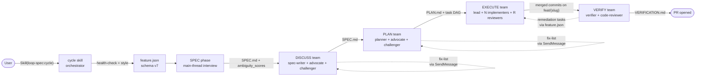
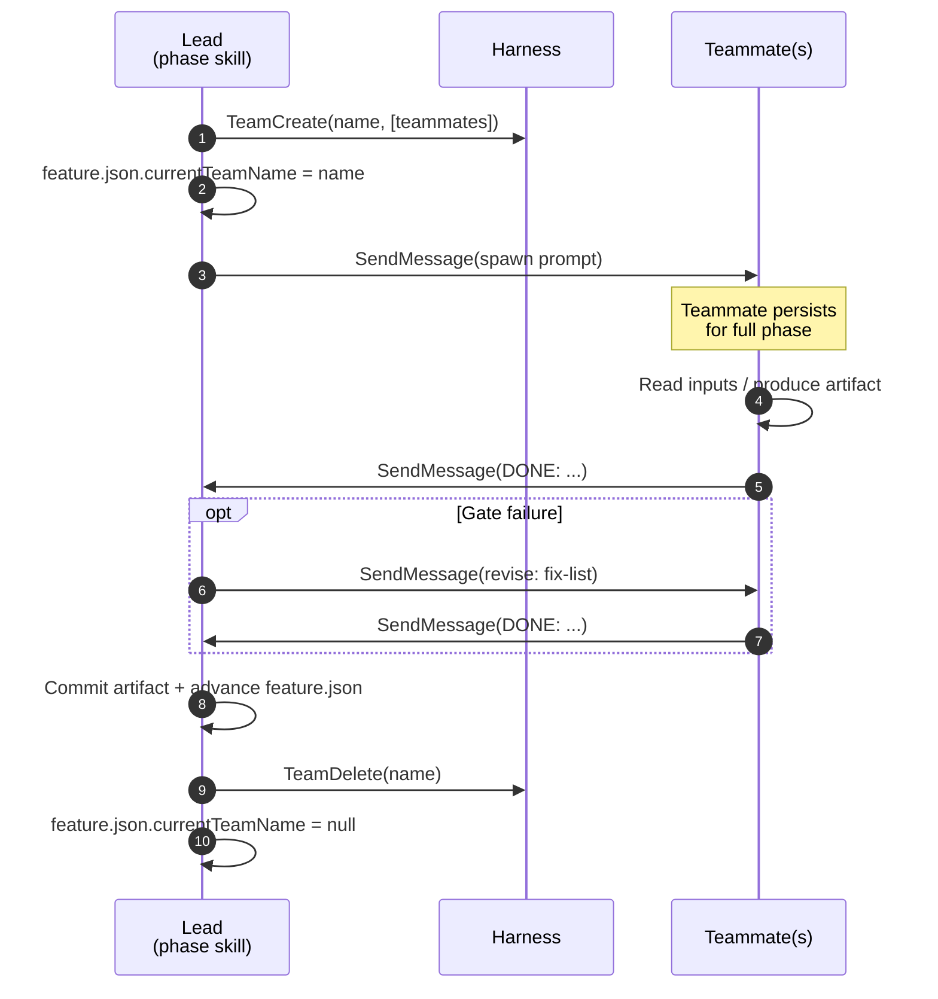
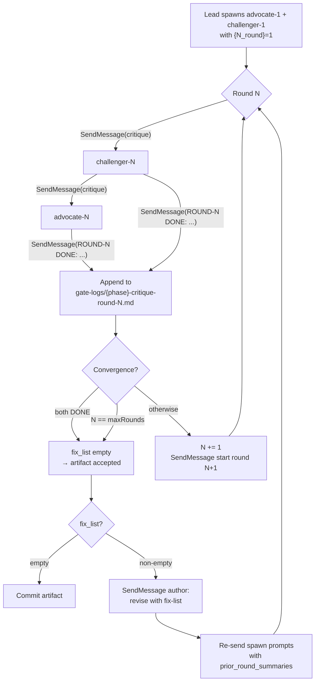
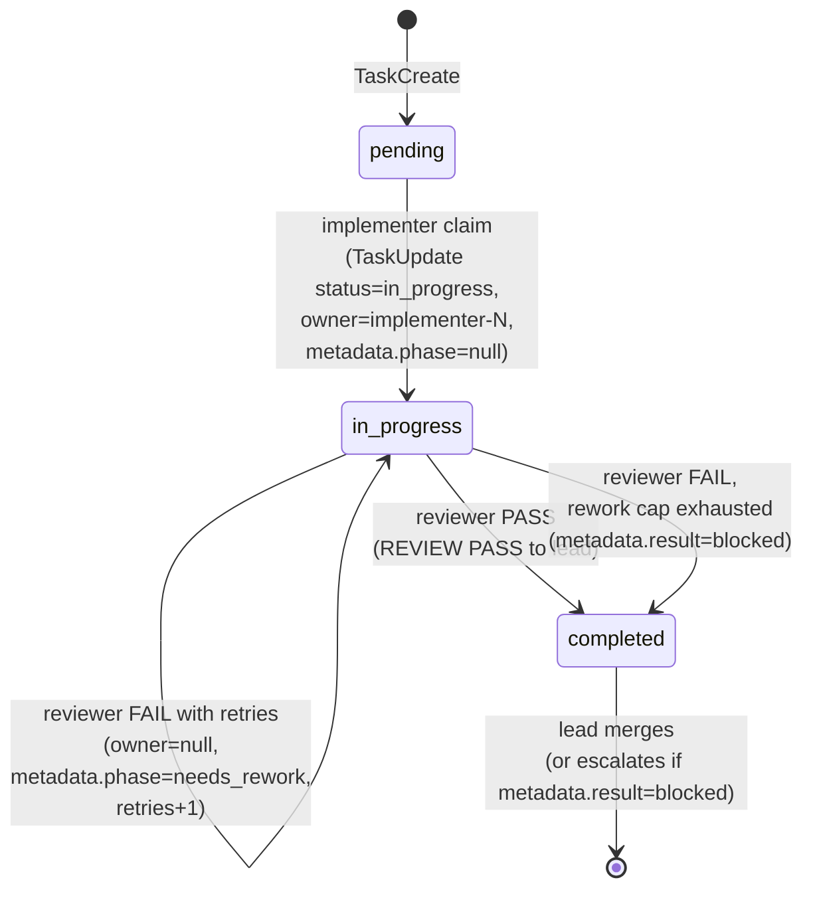

# loop-spec

Loop-driven development from a spec file, for Claude Code.

Give the cycle a feature description — or a pre-authored spec `.md` — and it runs **SPEC → DISCUSS → PLAN → EXECUTE → VERIFY → ITERATE**: an outer convergence loop that judges the integrated result against your *original goal* and rewinds itself until converged or the iteration limit (10) is spent, then opens a PR. Every phase writes a committed markdown artifact; every run is resumable from `feature.json`.

The same archetypes cover the rest of the development surface: `/loop-spec:cycle new <description>` bootstraps a **net-new application** in an empty directory (greenfield mode), `/loop-spec:debug <error or vague symptom>` runs an **evidence-disciplined spec-driven debugging loop** (red reproduction as the oracle), and the `autonomous` token runs any of it **question-free from the command line** — every point that would ask a human instead takes the model's recommended answer and records it in an auditable decisions record. Anything that is *not* already spec-shaped — a Slack message, a Jira ticket, an email, a prompt — goes in through `/loop-spec:intake`, which converts it into a spec draft and starts the cycle from it.

- **Zero package deps.** Shipped code is bash + git + jq + python3. One external tool: [graphify](https://github.com/safishamsi/graphify) (required code graph). Anti-over-engineering discipline ported from [ponytail](https://github.com/DietrichGebert/ponytail) (on by default).
- **Single tier.** Gate behavior is fixed; trivially-scoped plans skip the plan critique via a structural fast-path measured from the actual task DAG — never inferred from your prompt.
- **Teams-optional.** Runs on both agent-team harness generations (explicit `TeamCreate` on CC < 2.1.178, implicit `Agent({name})` teams on newer, resolved by `lib/teams-capability.sh`) and degrades to one-shot subagents or a bounded loop fleet without teams.

**Status:** v2.5.2 (rebranded from super-spec).

## Install

1. Register the marketplace and install the plugin:
   ```bash
   claude plugin marketplace add https://github.com/aztechead/loop-spec.git
   claude plugin install loop-spec@loop-spec-marketplace
   ```

2. Optionally set `CLAUDE_CODE_EXPERIMENTAL_AGENT_TEAMS=1` to enable agent teams (both harness generations are supported; `lib/teams-capability.sh` picks explicit vs implicit automatically). See [docs/loop-spec/PREREQUISITES.md](docs/loop-spec/PREREQUISITES.md). Without it the cycle runs on the no-teams fallbacks: one-shot subagents for critique/verify and the loop-fleet rung for EXECUTE (needs the `claude` CLI on PATH).

   Ensure `bash >= 4`, `git`, `jq >= 1.5`, and `python3 >= 3.6` are on PATH. macOS ships them all by default; minimal Linux images (Alpine, distroless) may need `apk add jq python3` or equivalent.

3. **Install graphify (required).** graphify is loop-spec's de-facto code-graph solution; the cycle aborts at startup without it, because the design phases (SPEC/DISCUSS/PLAN) query the graph to ground their work. It is a Python 3.10+ tool published as `graphifyy`:
   ```bash
   uv tool install graphifyy     # recommended (manages PATH); or pipx/pip install graphifyy
   graphify install              # register the skill, then `graphify --help` to verify
   ```
   On first cycle run loop-spec builds `graphify-out/graph.json` (deterministic AST extraction, no API key, offline) and commits it. Constrained environments can bypass the requirement with `LOOP_SPEC_REQUIRE_GRAPHIFY=0` (degraded mode: design phases fall back to Glob/Grep).

   **Probe-before-assert grounding.** During the SPEC/DISCUSS/PLAN design phases the
   lead runs read-only probes (e.g. `bq show`, `gcloud describe`, `curl -s`,
   `psql -c '\d'`) on any external-system premise before treating it as fact. Each
   result is appended to a committed `docs/loop-spec/features/{slug}/EVIDENCE.md`
   ledger (via `lib/evidence.sh add`, which assigns sequential `EVID-NNN` ids) and
   cited in the artifact's `## Grounding` section. Facts that cannot be probed are
   declared as `ASSUMPTION: <claim> | verify: <command>` bullets rather than asserted
   from model memory. The deterministic `lib/grounding-lint.sh` gate blocks the DISCUSS
   commit and the PLAN Step 5.5 cluster when the `## Grounding` section is missing,
   malformed, or references an unresolved evidence id. The challenger flags ungrounded
   claims with an `UNGROUNDED:` marker so the lead can resolve them with an actual
   probe before the gate re-runs. Protocol details: `skills/shared/grounding-protocol.md`.

4. Update your `CLAUDE.md` model policy to allow whatever the harness's `opus` and `sonnet` aliases resolve to (dispatch targets these two aliases; see `skills/shared/model-matrix.md`).

5. Restart Claude Code (or run `/reload-plugins`) so the new skills register.

## Your first feature — a 5-minute walkthrough

From a repo you want to change:

```
/loop-spec:cycle add a --json flag to the export command
```

What happens, in order:

1. **Startup (silent).** Workspace/teams/model/Workflow probes run and cache to `.loop-spec/runtime.json`. First run in a project also builds the graphify code graph and the 5-domain codebase map (`docs/loop-spec/codebase/`) — one-time cost, reused forever.
2. **A feature worktree is created** at `.claude/worktrees/{slug}` on branch `feat/{slug}`. Your checkout is never switched.
3. **SPEC** interviews you (max 6 rounds, one perspective per round) until the ambiguity gate passes, then writes `docs/loop-spec/features/{slug}/SPEC.md`. Answer the questions; that is your main involvement in style `auto`.
4. **DISCUSS** runs the advocate/challenger critique of the spec; **PLAN** writes `PATTERNS.md` (real codebase analogs) and `PLAN.md` (a task DAG with verify commands), gated by its own critique + feasibility + coverage checks.
5. **EXECUTE** implements the tasks in parallel (dispatch scales with the DAG width), one commit per task on `feat/{slug}`.
6. **VERIFY** runs the marker scan, the test-tamper scan, every acceptance criterion's verify command, and a code-review HARD-GATE — then pushes the branch and opens the PR.
7. **ITERATE** re-judges the integrated result against your ORIGINAL request (not the spec it wrote) and rewinds the loop itself if the goal is not met. When it converges — or spends its 10 rounds, loudly — the run completes and prints the PR URL, any `## Shipped with warnings`, and the backlog count.

You review the PR. That's the whole workflow.

**Want checkpoints?** `/loop-spec:cycle style:step <description>` pauses after every phase so you can read SPEC.md / PLAN.md / VERIFICATION.md before continuing. Styles: `auto` (default) / `step` / `interactive` / `review-only`.

**Already have a spec?** `/loop-spec:cycle path/to/spec.md` skips the interview entirely — the draft is graph-grounded, scored against the ambiguity gate, and normalized with your requirements preserved verbatim.

**Interrupted?** Just run `/loop-spec:cycle` again. Resume re-grounds first (reads `PROGRESS.md`, checks `git log`, runs your test command once) and continues from the last durable state.

## Usage

### Start a feature cycle

`cd` into the project repo, open Claude Code, then invoke either:

```
/loop-spec:cycle
```

or equivalently:

```
Skill(loop-spec:cycle)
```

Each per-phase skill is directly slash-invocable (the skill is the command, no separate command layer): `/loop-spec:spec`, `/loop-spec:discuss`, `/loop-spec:plan`, `/loop-spec:execute`, `/loop-spec:verify`, `/loop-spec:iterate`, `/loop-spec:map-codebase`. Use one when you want to run a single phase rather than the full cycle. The bundled loop engine is also directly invocable as `/loop-spec:loop-runner` for standalone autonomous loops ("implement this spec", "keep going until tests pass", overnight/cron runs) outside the cycle. Two additional standalone skills are available outside the cycle:

- `/loop-spec:intake` -- turn ANY input into a cycle-ready spec draft and kick off the cycle: a pasted Slack message, a Jira ticket, an email, a `.txt`/`.md` file, or a bare prompt. It faithfully restructures the source into a draft at `.loop-spec/intake/{slug}.md` (**restructure, never invent** — the source's open questions stay open for the ambiguity gate/DISCUSS to resolve; the verbatim original is preserved in the draft's `## Source` provenance block) and hands it to `/loop-spec:cycle` via the existing spec-file ingest path. Inline tokens pass through (`/loop-spec:intake new autonomous <pasted text>` takes a Slack message describing a new app all the way to a PR, question-free); `--no-run` stops after writing the draft.
- `/loop-spec:debug` -- bounded spec-driven debugging loop for a **specific error** (message, stack trace, failing test) or a **non-specific symptom** ("something's wrong", flaky, slow). Non-specific input runs a TRIAGE pass (suite run, git history/bisect, graph + fragility hotspots, named logs) that converges on one reproducible signal; the hard gate is a **red reproduction before any fix**; the FIX loop is bounded (5 hypotheses × 3 attempts, falsify-before-change); VERIFY keeps the repro as a regression test and runs the full suite + test-tamper scan. Writes `docs/loop-spec/debug/{slug}/BUG.md` (the committed audit trail — and the spec draft if the fix escalates to a full cycle). Autonomous-mode aware.
- `/loop-spec:loop-debug` -- **one-shot** entry point to the debug loop: same machinery as `/loop-spec:debug`, but autonomous mode is forced on, so a single invocation runs TRIAGE→REPRODUCE→FIX→VERIFY end to end with no mid-run questions and reports once at the end. Terminates only in fixed-and-verified, instrumented-and-waiting, or escalated-to-cycle.
- `/loop-spec:assess` -- standalone, read-only codebase fragility and health assessment; workspace-aware; dispatches bounded code-reviewer subagents at the top-N hotspots and writes `docs/loop-spec/assessment/ASSESSMENT.md`.
- `/loop-spec:quality-loop` -- iterative pre-commit review convergence loop; workspace-aware; runs deterministic checks then parallel code-reviewer and security-reviewer passes, repeating until convergence or the round limit is exhausted.
- `/loop-spec:grill` -- toggle grill mode (`on`/`off`/`status`). Grill mode is **on by default**: a session-start directive makes the assistant front-load 2-4 sharp disambiguation questions right after your initial prompt to lower ambiguity before acting. Persists in `.loop-spec/grill.conf`; `LOOP_SPEC_GRILL=0` is the session kill switch.
- `/loop-spec:discipline` -- toggle discipline mode (`on`/`off`/`status`), an opt-in set of five behavioral gates (brainstorm-before-coding, verification-before-claims, investigation-before-fixes, decision-gate, intent-gate). Persists in `.loop-spec/discipline.conf`.
- `/loop-spec:simplicity` -- toggle simplicity mode (`on`/`off`/`status`) and set intensity (`lite`/`full`/`ultra`). **On by default at `full`**: a session-start directive makes the assistant climb the laziness ladder before writing code -- YAGNI, reuse, stdlib, native, installed dep, one line, then the minimum that works -- without cutting validation, error handling, security, or accessibility. VERIFY's `code-reviewer` runs the matching over-engineering pass (delete/stdlib/native/yagni/shrink). Concept and implementation ported from [ponytail](https://github.com/DietrichGebert/ponytail). Persists in `.loop-spec/simplicity.conf`; `LOOP_SPEC_SIMPLICITY=0` is the session kill switch.
- `/loop-spec:rules` -- manage the **self-learning loop** rules (`add`/`list`/`render`/`path`). Every repeated mistake becomes a permanent rule in `.loop-spec/RULES.md`, carried into every future session by `hooks/team/rules-inject.sh` (default on, inert until rules exist; `LOOP_SPEC_RULES=0` kills it). Pass `--check "<cmd>"` to back a rule with a deterministic check rather than a prose note. Mechanics in `lib/rules.sh`.
- `/loop-spec:onboard` -- one-time guided setup wizard. A few multiple-choice questions write the optional config in place (grill, self-learning, discipline, commit strategy). Non-destructive and re-runnable; everything it sets is also documented for manual setup here.

None of the workflow skills set `disable-model-invocation`: the cycle orchestrator chains phases via the Skill tool (a `disable-model-invocation` skill cannot be invoked that way), and each phase hands off to the next the same way. You start a run with `/loop-spec:cycle`; the orchestrator drives the rest.

The cycle skill runs a quiet startup health-check — agent-teams probe, model probe (two 1-token dispatches, cached 24h in `.loop-spec/runtime.json`; `LOOP_SPEC_SKIP_HEALTHCHECK=1` skips), and Workflow availability. **You just give it a feature description** — there is no menu. `/loop-spec:cycle <feature description>` launches immediately with style `auto` (single-tier: gate behavior is fixed). A bare `/loop-spec:cycle` asks one free-text question for what you want to build — nothing else.

**From a spec file:** `/loop-spec:cycle path/to/spec.md` starts the loop from a pre-authored spec. The SPEC phase skips its interview (spec-file ingest mode): it grounds the draft against the code graph, scores the ambiguity gate on the draft itself, normalizes it into the SPEC.md format (requirements preserved verbatim), and proceeds to DISCUSS. (Headless: `LOOP_SPEC_SPEC_FILE=path`.)

**Self-regulating operation (Ralph-loop patterns, bounded):**

- **Progress journal** — every phase transition appends what/next/gotchas to `.loop-spec/features/{slug}/PROGRESS.md`; resume reads it (with `git log` + one test run) before re-entering any phase, so a fresh or compacted session re-orients from durable state and never builds on a silently broken tree.
- **Backlog** — VERIFY's deferred Minor findings and ITERATE's round-limit-spent gaps land in `.loop-spec/BACKLOG.md` instead of evaporating. `/loop-spec:cycle backlog` drains it one feature per loop, bounded by `LOOP_SPEC_MAX_FEATURES` (default 1). Overnight form: `while :; do claude -p "/loop-spec:cycle backlog"; done` — the Ralph loop with explicit stop conditions.
- **Test-tamper scan** — VERIFY fails fast if the diff deletes tests, adds skip/focus annotations, or swallows a test command's exit code (`lib/test-tamper-scan.sh`); the acceptance oracle cannot be gamed silently.
- **Phase watchdog** — each phase is stamped (`currentPhaseStartedAt`) and checked against a wall-clock ceiling (60m default; `LOOP_SPEC_PHASE_TIMEOUT_MINS` overrides); a wedged phase becomes visible instead of eternal.
- **Self-learning** — repeated VERIFY gate failures and limit-spent iterate ships write deterministic rules into `.loop-spec/RULES.md` (injected at session start), so the loop stops repeating its own mistakes.
- **Fresh-context rewinds** (opt-in `LOOP_SPEC_ITERATE_FRESH=1`) — ITERATE rewinds hand off through committed state and relaunch in a clean session rather than accumulating context.

**Single tier — nothing to infer, nothing to ask.** Gate behavior is fixed (`skills/shared/tier-matrix.md`): spec critique always runs, plan critique is skipped only by the structural fast-path (<=2 tasks, <=3 files, no security signal, measured AFTER planning), code review blocks Critical + Important (Minor is backlogged), `iterate.maxIterations = 10`. You can override the style inline anywhere in the text (`style:auto|step|interactive|review-only`); legacy `tier:` tokens are ignored.

**Execution style** (`auto` default; override inline):
- `auto` -- end-to-end. Hard-gate failures self-heal (re-dispatch upstream agent with findings, max 3 retries per gate, 40 global) before pausing for human.
- `step` -- pause between phases. You review SPEC.md / PLAN.md / VERIFICATION.md before next phase fires.
- `interactive` -- pause before every subagent dispatch. Maximum control.
- `review-only` -- auto except at critique-gate reconciliation, where it pauses for your judgment.

**Grill mode (on by default).** Right after your opening prompt, the assistant runs a short "grill" pass — 2-4 sharp clarifying questions (structured multiple-choice where the answers are discernible) — to collapse the highest-leverage ambiguities before committing to an approach, and feeds those answers into the SPEC interview. Inside the cycle, the SPEC phase Socratic interview is the in-cycle realization of this; outside the cycle it is injected as a session-start directive by `hooks/team/grill-inject.sh`. Toggle with `/loop-spec:grill on|off|status` or the `LOOP_SPEC_GRILL=0` kill switch.

**Model selection is fixed** (no preset). Opus runs the reasoning-heavy roles (spec-writer, planner, challenger, iterate-judge, code-reviewer); sonnet runs the high-throughput and defense roles (advocate, spec-compliance-reviewer, implementer, verifier, mappers). Per-role defaults can be overridden via `LOOP_SPEC_MODEL_<ROLE>` env vars. See `skills/shared/model-matrix.md`.

### What the cycle does

The six phases run in order (ITERATE can rewind the chain):

| Phase | Produces | Gates |
|-------|----------|-------|
| **SPEC** | `docs/loop-spec/features/{slug}/SPEC.md` with `ambiguity_scores` frontmatter | 6-round Socratic interview; ambiguity gate (ambiguity <= 0.20) |
| **DISCUSS** | `docs/loop-spec/features/{slug}/SPEC.md` (revised) | spec critique gate (always runs) |
| **PLAN** | `docs/loop-spec/features/{slug}/PATTERNS.md` (Step 0) + `PLAN.md` (Step 1) | plan critique gate + feasibility check |
| **EXECUTE** | per-task commits on `feat/{slug}` branch | per-task spec-compliance gate with retry; dispatch via the concurrency ladder (subagent / loop fleet / agent team / opt-in Workflow DAG) |
| **VERIFY** | `docs/loop-spec/features/{slug}/VERIFICATION.md` + map-codebase refresh in `docs/loop-spec/codebase/` + PR opened | acceptance gate + code-review HARD-GATE |
| **ITERATE** | `docs/loop-spec/features/{slug}/ITERATION.md` (per-iteration verdict log) | dual oracle (deterministic acceptance gate **+** an `iterate-judge` goal re-judge); converged → ship, else classify the gap and rewind to EXECUTE / PLAN / SPEC. Bounded by `feature.iterate.maxIterations` (10) — the one limit the cycle respects; when it is spent a one-shot report-only confirmation pass re-judges the final fix and every accepted gap lands in `warnings[]` + BACKLOG.md |

**ITERATE — the convergence loop.** VERIFY proves the SPEC acceptance checklist is met; ITERATE asks the harder question: is the result there yet *against the original goal*? A fresh `iterate-judge` (opus, maker≠checker) scores the integrated result against the user's original intent and classifies the single highest-leverage gap — `execute` (implementation), `plan` (decomposition), or `spec` (wrong scope) — then ships when converged or the iteration limit is spent, or rewinds to the matching phase to fix it.

**Fully autonomous in `auto`/`review-only`.** No gap type blocks on a human: `execute`, `plan`, and `spec` rewinds all run on their own (the `spec` rewind re-enters DISCUSS in autonomous refinement mode). This is safe because the judge always scores against the **immutable original goal** (`feature_title`), never the rewritten SPEC, so a rewind can move the work *toward* the goal but can never redefine "done" to cheat its own oracle — and the iteration limit hard-caps the loop. When the limit is spent it ships-with-warnings rather than waiting. An overnight `auto` run never pauses for input. Only the explicit human-in-loop styles (`step`/`interactive`) surface the SPEC-rewind approval gate. This generalizes loop-spec's former EXECUTE-only remediation into the full `DISCOVER → PLAN → EXECUTE → VERIFY → ITERATE → repeat` loop.

EXECUTE dispatch is the concurrency ladder (see "EXECUTE concurrency ladder" above and `skills/shared/tier-matrix.md`): the DAG width `W` selects sequential/batched **subagent** waves, the self-claim **agent team** (up to 3 implementers, manual FIFO merge queue), or — on explicit `LOOP_SPEC_EXECUTE_WORKFLOW=1` opt-in for very wide DAGs — the deterministic **Workflow DAG** (`lib/workflows/execute-dag.js`). The **loop fleet** (`LOOP_SPEC_EXECUTE_LOOPS=1`, or automatic when agent teams are unavailable) instead compiles the tasks to a loop plan and runs them as bounded headless `claude -p` loops with per-iteration verification and SPEC/PLAN hash-locking. All rungs merge into `feat/{slug}` and return the same result shape.

### First-run setup (one time per project)

The very first time you invoke `/loop-spec:cycle` in a project, before SPEC starts the cycle ensures `docs/loop-spec/codebase/{TECH,ARCH,QUALITY,CONCERNS,DOMAIN}.md` all exist:

1. **GSD ingest.** If the project already has a get-shit-done map at `.planning/codebase/`, loop-spec concatenates the relevant GSD docs into loop-spec format (with an `Imported from GSD` header) and commits them.
2. **Mapper dispatch.** For whatever's still missing after ingest (always at least `DOMAIN.md`, since GSD has no analog), the cycle invokes `Skill(loop-spec:map-codebase) --domain <missing>`. Mapper agents run in parallel; each writes one of the 5 docs.

Subsequent runs skip Step 5.5 entirely; the incremental refresh at end of VERIFY keeps the map fresh.

### Resume an in-flight feature

If a cycle was interrupted, re-invoke `Skill(loop-spec:cycle)`. It scans `.loop-spec/features/*/feature.json`, finds incomplete features within the staleness window (default 48h), and — on the legacy explicit-teams harness only — probes the prior phase team via `TaskList({team})` to catch a still-live orphan (on implicit/no-teams harnesses the team is treated as gone and the feature resumes directly). Before re-entering the recorded phase it re-grounds: reads `PROGRESS.md`, reviews `git log`, and runs the test command once — a broken tree is redirected to remediation instead of being built on. State writes are atomic (`.tmp` + `sync` + rename, with `.bak` rotation) so partial crashes leave the previous-good state recoverable. Loop-fleet EXECUTE state is durable too: re-entering EXECUTE resumes halted tasks from `.loop/` state instead of re-running completed iterations.

### Refresh codebase mapping standalone

Auto-refresh runs at end of each cycle. Manual invocation:

```
Skill(loop-spec:map-codebase)             # incremental, only stale domains
Skill(loop-spec:map-codebase) --full      # re-map all 5 domains
Skill(loop-spec:map-codebase) --domain tech,arch
```

### Non-interactive mode

For CI / scripting / smoke tests, set env vars before invoking:

```bash
export LOOP_SPEC_NON_INTERACTIVE=1
export LOOP_SPEC_ANSWER_STYLE=auto
export LOOP_SPEC_ANSWER_TITLE="add subtract function"
```

The cycle skill detects the env var and skips every AskUserQuestion call.

### Autonomous mode (no human in the loop)

Strictly stronger than non-interactive: instead of pre-pinning answers in env vars, every
point that would ask a question takes the model's **recommended answer** — grounded in the
code graph, the codebase map, and best practice — and records it as an assumed decision.

```bash
claude -p "/loop-spec:cycle autonomous add rate limiting to the public API"
# or: export LOOP_SPEC_AUTONOMOUS=1
```

What changes: style is forced to `auto`; the SPEC phase runs its Socratic interview in
**self-answered form** (the model asks and answers each perspective's questions, scoring
honestly); the grill directive is suppressed; explicit `LOOP_SPEC_ANSWER_*` / `LOOP_SPEC_CMD_*`
vars still win where set; safety aborts (dirty repos, the code-review
HARD-GATE, the test-tamper scan) are never overridden. Every assumed answer lands in
SPEC.md's `## Decisions (assumed — autonomous)` list and PLAN.md's `## User decisions
(already made)` record suffixed `(assumed)` — the PR reviewer reads exactly what was assumed
and why, and can rerun with corrections pinned. A bare autonomous invocation with no
description aborts (there is no goal to infer).

Autonomous runs manage **every cycle of iteration themselves** — warnings are an audit
record, never the handler. The continuation ladder: self-heal in phase (unbounded gate retries) →
lead-authored artifact fallback when a teammate fails twice → hands-off ITERATE rewinds
(while iterations remain, gaps always rewind — the backlog is never an in-limit
mechanism, in any mode) → only at the iteration limit, accepted gaps become `BACKLOG.md`
entries and the run **chains directly into backlog drain** (bounded by
`LOOP_SPEC_MAX_FEATURES`, never past a failure) →
a gap that spends a second full round of iterations goes **terminal** with its complete evidence trail
(two spent limits on one gap means the approach is wrong, not under-iterated). Full contract:
`skills/shared/autonomous-mode.md`.

### Machine-readable results (headless callers)

Wrappers and CI pipelines should not scrape git log or GitHub for cycle state. Two artefacts provide a stable contract:

**`result.json`** — written by `lib/cycle-result.sh` at the end of every cycle (completed, paused, escalated, or terminal). The stable pointer is `.loop-spec/last-result.json` (overwritten each run); per-feature copies live at `.loop-spec/features/{slug}/result.json`.

Schema (version 1):
```json
{
  "schema": 1,
  "slug": "my-feature",
  "status": "completed | paused | escalated | terminal",
  "reason": "string or null",
  "phaseReached": "the last currentPhase value in feature.json",
  "branch": "feat/my-feature",
  "baseBranch": "main",
  "prUrl": "https://github.com/... or null",
  "checkpointPrUrl": "null or url",
  "converged": true,
  "iterations": {"used": 1, "max": 10},
  "warnings": [],
  "autonomous": false,
  "feature_title": "original goal string",
  "createdAt": "ISO-8601",
  "finishedAt": "ISO-8601"
}
```

`converged` is `true` only when `status == "completed"` AND `warnings[]` contains no `iterate-budget-spent:` or `iterate-terminal:` entries. A completed-but-not-converged run shipped with accepted gaps; the warnings list them.

**`events.jsonl`** — one JSON object per line appended at each phase boundary. Canonical event names: `phase_start`, `phase_end`, `gate_round`, `iterate_verdict`, `completed`, `paused`, `escalated`, `checkpoint_pr`. Schema:
```json
{"ts":"ISO-8601 UTC","slug":"my-feature","event":"phase_end","phase":"execute","data":{"next":"verify"}}
```

**Process exit codes for headless composition** live at the loop-runner layer (`skills/loop-runner/` scripts exit 0 only on verified completion). The cycle skill runs inside a Claude session and cannot set the process exit code — wrappers should read `result.json` instead of scraping git or GitHub.

Both files are local telemetry, deliberately not committed to the feature branch.

### Net-new applications (greenfield)

```bash
mkdir my-app && cd my-app
claude -p "/loop-spec:cycle new autonomous a CLI tool that ... "
```

In a directory with no git repo, `new` (or an interactive confirmation, or autonomous mode
with a description) bootstraps `git init` + an empty initial commit and runs the full cycle
as greenfield: SPEC round 1 swaps Researcher for a **Foundations** perspective (stack,
structure, tooling — autonomous mode picks the boring industry-standard choice), PLAN leads
with a scaffold task every other task blocks on, EXECUTE backfills the detected
test/lint/typecheck commands once the scaffold lands, and the graphify graph + codebase map
are built at VERIFY from the shipped code (an empty repo grounds nothing). `new` inside an
existing repo is refused; workspace-mode greenfield is deferred.

### Environment variables

| Variable | Effect |
|---|---|
| `LOOP_SPEC_EXECUTE_LOOPS` | `1` = force the EXECUTE loop-fleet rung at any DAG width; `0` = never select it (kill switch). Unset = automatic when agent teams are unavailable and `claude` is on PATH. |
| `LOOP_SPEC_LOOP_MAX_ITERATIONS` | Loop-fleet iteration cap (default 10 iterations per task). |
| `LOOP_SPEC_EXECUTE_WORKFLOW` | `1` opts into the Workflow DAG rung on very wide DAGs. |
| `LOOP_SPEC_SKIP_HEALTHCHECK` | `1` skips the startup model probe (also auto-skipped when probed < 24h ago). |
| `LOOP_SPEC_TASK_GUARD` | `0` disables the task metadata / lint / typecheck completion gates. |
| `LOOP_SPEC_PATH_GUARD` | `0` disables the agent path-restriction hook. |
| `LOOP_SPEC_BLOCKEDBY_GUARD`, `LOOP_SPEC_USERGATE_GUARD`, `LOOP_SPEC_STRATEGY_ROTATION`, `LOOP_SPEC_DONE_CRITERIA`, `LOOP_SPEC_DEFLECTION_GUARD`, `LOOP_SPEC_LEARNINGS`, `LOOP_SPEC_DISCIPLINE` | `0` = per-hook kill switches (blockedBy enforcement, user-gate evidence, failure-strategy rotation, done-criteria injection, deflection guard, learnings log, discipline injection). |
| `LOOP_SPEC_GRILL` | `0` = disable the grill-mode SessionStart directive (grill is on by default; `/loop-spec:grill off` persists it). |
| `LOOP_SPEC_SIMPLICITY` | `0` = disable the simplicity-mode (laziness-ladder) SessionStart directive (on by default at `full`; `/loop-spec:simplicity off` persists it). |
| `LOOP_SPEC_RULES` | `0` = disable self-learning RULES.md injection (on by default, inert until rules exist). |
| `LOOP_SPEC_REQUIRE_GRAPHIFY` | `0` = bypass the hard graphify requirement (constrained environments). Default: required; the cycle aborts at startup if graphify is missing, and the design phases fall back to Glob/Grep only in bypass mode. |
| `LOOP_SPEC_SPEC_FILE` | Path to a pre-authored spec `.md` — headless equivalent of `/loop-spec:cycle path/to/spec.md`. |
| `LOOP_SPEC_MAX_FEATURES` | Backlog-drain bound: features per `/loop-spec:cycle backlog` invocation (default 1). |
| `LOOP_SPEC_PHASE_TIMEOUT_MINS` | Phase watchdog wall-clock ceiling (default 60). |
| `LOOP_SPEC_MODEL_<ROLE>` | Per-role model alias override. `<ROLE>` is the SCREAMING_SNAKE form of the JSON key: `SPEC_WRITER`, `PLANNER`, `ADVOCATE`, `CHALLENGER`, `SPEC_COMPLIANCE_REVIEWER`, `ITERATE_JUDGE`, `CODE_REVIEWER`, `IMPLEMENTER`, `VERIFIER`, `MAPPER`, `PATTERN_MAPPER`. Allowed values: `sonnet \| opus \| haiku \| fable`. Unset/empty = canonical default. Invalid value (including any literal model ID) → stderr error + exit 1. Overrides resolve at cycle Step 5 / Step 5.9 and flow into `feature.models.<role>` automatically. |
| `LOOP_SPEC_ITERATE_FRESH` | `1` = ITERATE rewinds hand off through committed state for a clean-session relaunch instead of continuing inline. |
| `LOOP_SPEC_PLAN_MULTI_ANGLE` | `1` opts into multi-angle plan authoring via the Workflow tool. |
| `LOOP_SPEC_TEAMS_MODE` | Force the teams capability mode (`none`/`explicit`/`implicit`), overriding the version probe. |
| `LOOP_SPEC_REGRESSION_SCAN` | `1` enables VERIFY's advisory prior-feature regression scan (off by default). |
| `LOOP_SPEC_NON_INTERACTIVE` + `LOOP_SPEC_ANSWER_*` | CI mode, see above. |
| `LOOP_SPEC_AUTONOMOUS` | `1` = autonomous mode (equivalent to the inline `autonomous` token): self-answer every question site with the recommended option and record it; forces style `auto`; suppresses grill. See above. |

All hook guards additionally self-scope: they no-op outside projects with `.loop-spec/` state, and the task gates only fire on loop-spec-owned tasks (`metadata.loopSpec` / `task-NNN:` subjects).

### Self-learning loop, commit strategy, per-task model tiers

- **Self-learning loop (`RULES.md`).** A loop only improves if it carries its lessons forward. When a gate or verifier rejects the same class of mistake twice, the cycle appends a rule to `.loop-spec/RULES.md` (`lib/rules.sh add "<lesson>" --check "<cmd>"`, deterministic checks preferred over prose). `hooks/team/rules-inject.sh` injects the current rules into every session, and the escalation contract makes coordinators consult `RULES.md` (and PLAN.md's `## User decisions (already made)` record) **before** asking the user anything. You own and curate the file; manage it with `/loop-spec:rules`.
- **Commit strategy.** `.loop-spec/workflow.json` `{"commitStrategy":"at-end"}` makes EXECUTE collapse `feat/{slug}` into a single commit at phase exit; the default (`per-task`, or no file) keeps per-task commit history. Read via `lib/workflow-config.sh`; skipped in workspace mode.
- **Per-task model tier.** A plan task may carry an optional `modelTier` (`mechanical`/`standard`/`frontier`); EXECUTE's subagent/loop rungs resolve it via `lib/model-tier.sh` to route that one task to the cheapest fitting model, overriding the fixed per-role map (a concrete `model` pin still wins). The team rung keeps role defaults since teammates are pre-spawned.

### Artifact tree

```
docs/loop-spec/                          # COMMITTED
├── features/{slug}/
│   ├── SPEC.md
│   ├── PATTERNS.md
│   ├── PLAN.md
│   ├── VERIFICATION.md
│   └── ITERATION.md                      # per-iteration convergence verdicts
└── codebase/
    ├── TECH.md
    ├── ARCH.md
    ├── QUALITY.md
    ├── CONCERNS.md
    └── DOMAIN.md

.loop-spec/                              # GITIGNORED (except codebase/index.json)
├── BACKLOG.md                            # deferred findings + iterate gaps (drain: /loop-spec:cycle backlog)
├── RULES.md                              # self-learning rules (injected each session)
├── features/{slug}/
│   ├── feature.json                      # schema v7, atomic-write with .bak rotation
│   ├── feature.json.bak
│   ├── PROGRESS.md                       # phase-transition journal (what/next/gotchas)
│   ├── spec-interview-transcript.md      # SPEC Socratic interview transcript
│   ├── discuss-transcript.md             # DISCUSS conversational transcript
│   ├── loop-plan.json                    # EXECUTE loop-fleet rung: compiled loop plan
│   └── gate-logs/                        # critique-gate round transcripts
├── worktrees/{slug}/                     # per-task git worktrees, lifecycle = task
├── runtime.json                          # teamsMode, teamsAvailable, workflowsAvailable, workflowExecuteOptIn, modelsProbedAt
└── codebase/
    └── index.json                        # file -> domain[] for incremental map (TRACKED)

.loop/                                    # GITIGNORED loop-fleet runtime state (per worktree)
├── fleet-result.json                     # supervisor result: completed/failed/skipped + per-task results
└── {task-id}/                            # per-loop state: result.json, iter-NNN.raw.json, PROGRESS.md, verifier output
```

### When things fail

- **Health check fails** -- your `CLAUDE.md` model policy probably blocks one of the two model families the fixed map targets. Update policy to allow what the `opus` and `sonnet` aliases resolve to.
- **Critique gate keeps bouncing** (>3 retries on same gate) -- spec or plan is genuinely ambiguous. Cycle pauses and escalates. Edit the artifact manually then re-invoke cycle to resume.
- **Merge conflict on a task branch** -- the lead's sequential merge rebases the worktree onto current `feat/{slug}` HEAD and retries once. If still fails, cycle pauses (counts against `maxRetriesPerTask`, fixed 2).
- **Crash mid-execute** -- `feature.json` records `currentTeamName`, `mergeQueue`, and per-phase artifact paths; the harness task list owns per-task status. Resume probes whether the EXECUTE team is still live, replays the merge queue, and instructs implementers to re-claim orphaned in-flight tasks.
- **Loop-fleet task halts** -- read `halt_reason` in `.loop/fleet-result.json`, not vibes: `no_progress` = task under-specified or too big (split it in PLAN.md); `max_iterations`/`timeout` = raise `LOOP_SPEC_LOOP_MAX_ITERATIONS` and re-enter EXECUTE (state is durable, completed iterations are not re-run); `verifier_integrity` = a worker touched SPEC.md/PLAN.md/verify targets — inspect the diff with suspicion before resuming. Full table in `skills/shared/execute-loop-fleet.md`.
- **Teams unavailable** -- not a failure: the cycle continues on the no-teams fallbacks (`skills/shared/no-teams-fallback.md`). Set `CLAUDE_CODE_EXPERIMENTAL_AGENT_TEAMS=1` to restore persistent phase teams.

See `docs/adopting.md` for more pitfalls and `docs/design.md` for the full architecture (phase walkthroughs, iteration limits, model matrix, fixed operating parameters, agent catalog).

## Design notes — why it is built this way

The two open-source ideas I kept reaching for:

- **[superpowers](https://github.com/obra/superpowers)** -- a curated bundle of skills (brainstorming, writing-plans, subagent-driven-development, TDD, debugging, ...) that turn Claude Code from a freeform assistant into a fast, disciplined collaborator. The lesson I took: skills are how you encode workflow. Skills are how you make Claude FAST.
- **[get-shit-done](https://github.com/gsd-build/get-shit-done)** -- a multi-phase workflow (spec → discuss → plan → execute → verify) that captures every decision in markdown artifacts kept in `.planning/`. The lesson I took: spec-driven development beats prompt-driven development the moment a task is bigger than one commit, because the spec is what catches the design errors that re-rolls can't fix.
- **[ponytail](https://github.com/DietrichGebert/ponytail)** -- a "lazy senior dev" skill that climbs a laziness ladder (YAGNI → reuse → stdlib → native → installed dep → one line → minimum) before writing code, while never cutting validation, error handling, security, or accessibility. The lesson I took: a spec-driven cycle that plans and reviews without an explicit anti-over-engineering reflex still ships bloat; the cheapest code is the code you talk yourself out of writing. Realized here as **simplicity mode** (`skills/simplicity/`, on by default) plus an over-engineering pass in VERIFY's `code-reviewer`.

loop-spec is what happens when you take the speed of superpowers (persistent specialized agents, asymmetric per-role model selection, parallel work) and bolt it onto the durability of GSD (every phase produces a committed markdown artifact, every gate is auditable, every `feature.json` is resumable). Plus a handful of opinionated additions:

- **Persistent phase teams**: each phase runs a team of named teammates that persist for the full phase and communicate via `SendMessage` (explicit `TeamCreate` roster on legacy harnesses; direct `Agent({name})` spawns on the modern implicit-team harness). Within a phase the lead does not re-dispatch a teammate as a fresh `Agent` call — rework rides on `SendMessage` so accumulated context is preserved across rounds.
- **EXECUTE concurrency ladder**: EXECUTE picks its dispatch mechanism by the structural width `W` of the task DAG (`lib/dag-width.sh`), scaling the orchestration weight to the available parallelism instead of always reaching for the heaviest tool. `W == 1` runs a **subagent** sequentially; `2 <= W < t_team` fans out batched **subagent** waves (parallel one-shot `Agent` calls, no persistent team); `t_team <= W < t_wf` spins up an **agent team** (the self-claim `TeamCreate` path); `W >= t_wf` escalates to the **Workflow DAG** (`lib/workflows/execute-dag.js`) only when the operator opted in (`LOOP_SPEC_EXECUTE_WORKFLOW=1`) and the `Workflow` tool is available; and the **loop fleet** (`skills/shared/execute-loop-fleet.md`) runs at any width on `LOOP_SPEC_EXECUTE_LOOPS=1`, or replaces the team rung automatically when agent teams are unavailable. Width thresholds (`t_team`, `t_wf`) are fixed in `skills/shared/tier-matrix.md`. All rungs share the same spec-compliance + retry contract, merge each passed task branch into `feat/{slug}`, and return the identical `{merged, blocked, escalation}` result (subagent/team/workflow rungs use per-task git worktrees under `.loop-spec/worktrees/{slug}/task-NNN/`; the loop fleet uses supervisor-managed worktrees on `loop/<id>` branches). Synthetic `blockedBy` edges between tasks with overlapping `files[]` provide concurrency safety beyond the explicit DAG. This follows the Anthropic tool idiom: subagents for modest fan-out, teams for coordinated high concurrency, Workflow only on explicit opt-in for undeniable fan-out ROI.
- **Design-for-change discipline** (`skills/shared/design-for-change.md`, "seams, not speculation"): the structural companion to simplicity mode. Every design- and code-producing dispatch carries it — DISCUSS asks the corner question ("what's the most likely next change, and is it a local diff?"), the challenger runs the corner test and coupling checks, the planner shapes tasks around boundaries, implementers inject collaborators instead of constructing them deep inside, VERIFY's `code-reviewer` runs a boundary pass (`couple:`/`corner:`/`inject:`/`iface:`), and the debug loop's mandatory sibling sweep fixes same-mechanism occurrences in the same branch. YAGNI cuts artifacts, never seams. Wiring enforced by `tests/design-coverage.test.sh`.
- **Execution discipline for mid-tier models** (`skills/shared/execution-discipline.md`, "evidence over recall"): the design phases run on the strongest reasoning available, but EXECUTE/VERIFY run on throughput models — so every executor dispatch carries a directive that encodes frontier-model execution habits mechanically: verify don't recall (read it, run it, paste the output), surprise is signal (anomalies are evidence, not noise), re-read the acceptance criteria before DONE, depth over breadth, artifacts over memory after compaction, NEEDS_CONTEXT over confident filler. Wiring enforced by `tests/execution-discipline-coverage.test.sh`. Agent hygiene from the same pass: role-family `color` coding, delegation-guard descriptions (cycle agents refuse ad-hoc auto-delegation), and `memory: project` on `code-reviewer` + `pattern-mapper` with hook-enforced write scoping to `.claude/agent-memory/**`.
- **Critique gates** (advocate + challenger pair) on SPEC and PLAN. ROUND-N debate is logged to `.loop-spec/features/{slug}/gate-logs/` and a non-empty fix-list re-dispatches the upstream author via `SendMessage` with prior summaries threaded in. The SPEC critique always runs; the PLAN critique is skipped only by the structural fast-path (<=2 tasks, <=3 files, no security signal — measured from the actual plan, never inferred from the prompt).
- **First-run codebase map** that ingests an existing GSD `.planning/codebase/` if present, then dispatches mappers only for whatever's still missing -- pay for the map once per project, never twice.
- **Pattern-mapper** (also borrowed from GSD) that runs at PLAN Step 0 and writes per-feature `PATTERNS.md` so the planner cites real codebase analogs instead of inventing shapes.
- **Bounded retries**: 3 per gate, per-phase ceilings, 40 global, `iterate.maxIterations = 10`. The cycle either ships or escalates -- it never loops forever.
- **Worktrees always project-local**: per-task worktrees are created under `.loop-spec/worktrees/` (EXECUTE), always within the repo root. The `using-git-worktrees` skill (superpowers-extended-cc plugin) was updated in tandem to enforce the same constraint for general skill use, removing the former `~/.config/...` global path option. Multi-repo setups get a separate worktree dir per repo in single-repo mode; workspace mode uses in-place `feat/{slug}` branches instead (see "Workspaces (multi-repo)" below).
- **VERIFY marker scan** (ported from GSD): before dispatching any acceptance agents, VERIFY scans changed files for unresolved `TBD`/`FIXME`/`XXX` markers and fails fast, saving agent effort on incomplete work.
- **Stall detection** (ported from GSD): EXECUTE resume distinguishes "done", "stalled mid-write" (re-dispatches with the partial diff as context), and "clean stall" (fresh re-dispatch). The previous heuristic of "commits exist = done" could skip review on a crashed agent.
- **Orphaned worktree pruning** (ported from GSD): after EXECUTE completes, it prunes worktrees whose branches are already merged without destroying uncommitted work.
- **Remediation routing**: when VERIFY's acceptance gate or code-review HARD-GATE fires, remediation tasks are persisted to `feature.json.pendingRemediationTasks[]` and consumed by EXECUTE on re-entry — they survive the verify team's teardown without requiring the verify and execute teams to share state.
- **Loop engineering, first-class**: the plugin bundles the **loop-runner**
  skill (`skills/loop-runner/`, also invocable standalone as `/loop-spec:loop-runner`) —
  three tested layers for autonomous execution: `compile_spec.py` (spec → verified task
  plan), `supervisor.py` (plan → fleet of workers in isolated worktrees with merge +
  halt policy), `loop.py` (bounded loop with verifier-integrity locking,
  iteration/stall/timeout stops, durable state, `result.json` contract). EXECUTE
  gains a **loop-fleet rung**: PLAN.md tasks are compiled to a loop plan
  (`lib/plan-to-loop.sh`) and run as a supervised fleet — every iteration of every
  worker mechanically re-runs the task's `verifyCommand`, and SPEC.md/PLAN.md are
  hash-locked so no worker can edit the requirements to match its work. This is the
  strongest spec-adherence guarantee in the plugin, and it requires neither agent teams
  nor the Workflow tool. Enable everywhere with `LOOP_SPEC_EXECUTE_LOOPS=1`; it is also
  the automatic EXECUTE path when agent teams are unavailable. The loop-runner offline
  regression suite (29 checks, fake claude binary) runs as part of `tests/run-all.sh`.
- **Teams-optional operation**: the cycle no longer aborts when
  `CLAUDE_CODE_EXPERIMENTAL_AGENT_TEAMS` is unset. Every phase declares a no-teams
  fallback (`skills/shared/no-teams-fallback.md`): one-shot subagents with the same
  agent types/models/prompts for critique and verify, loop-fleet or subagent rung for
  EXECUTE. Hook guards (task metadata validation, lint/typecheck completion gates, agent
  path restrictions) are scoped to loop-spec-owned tasks (`metadata.loopSpec` /
  `task-NNN:` subjects) and active loop-spec projects, fail open on any parse error,
  and each carries a kill switch — they no longer throw on ordinary TaskCreate/
  TaskUpdate/TaskCompleted traffic or tax tool calls in unrelated projects.

## Workspaces (multi-repo)

loop-spec supports multi-repo projects through workspace mode. Cycle Step 0 runs `lib/workspace.sh detect` and classifies the invocation directory as one of three modes:

- **single** -- the current directory is inside a git repo. Everything works exactly as today.
- **workspace** -- the current directory is a parent containing one or more immediate-child git repos (depth-1 scan, hidden dirs skipped), or an explicit `.loop-spec/workspace.json` pin is present. The pin is required when the parent is itself a git repo (detection would otherwise prefer single mode) or to select a subset of discovered repos.
- **none** -- neither condition holds; the cycle aborts with instructions to cd into a repo or create `.loop-spec/workspace.json`.

### workspace.json pin

Create `.loop-spec/workspace.json` at the parent directory to opt into workspace mode or select a subset:

```json
{"schemaVersion": 1, "repos": [{"name": "frontend", "path": "frontend"}, {"name": "backend", "path": "backend"}]}
```

Each `path` is relative to the workspace root. If the workspace root is or becomes a git repo, add `.loop-spec/` to its `.gitignore`.

### How workspace mode runs

- **State and artifacts** are rooted at the workspace root: `.loop-spec/` and `docs/loop-spec/features/{slug}/`.
- **Repo confirmation** -- cycle Step 0 announces the repo list and (interactively) asks whether to proceed with all repos or a subset. Non-interactive: set `LOOP_SPEC_ANSWER_REPOS=frontend,backend` (comma-separated repo names; default = all).
- **In-place branches** -- each participating repo gets a `feat/{slug}` branch created directly in the working checkout. There are no feature worktrees in workspace mode. The cycle performs a two-phase dirty-repo check before creating any branch: phase 1 scans ALL repos for uncommitted changes and aborts (listing every dirty repo) before ANY branch is touched; phase 2 creates branches only when all repos are clean.
- **Per-repo command detection** -- Step 4 detects test, lint, and typecheck commands separately for each repo root.
- **Per-task `repo` field** -- PLAN tasks each carry a `repo` field (matching a workspace repo name) and workspace-relative `files[]` paths (`<repo>/<path>`). One task = one repo; cross-repo work = multiple tasks with `blockedBy` edges.
- **EXECUTE subagent rung** -- workspace mode caps EXECUTE at the subagent rung. At most one implementer works per repo concurrently; implementers commit directly on the repo's `feat/{slug}` branch via `git -C <repo>`. No per-task worktrees.

  **KNOWN LIMITATION (v1):** the team, loop-fleet, and Workflow EXECUTE rungs are single-repo only. Workspace mode always runs the subagent rung regardless of DAG width. `LOOP_SPEC_EXECUTE_LOOPS=1` is refused with an escalation in workspace mode. These rungs are deliberately deferred to a future release.

- **Per-repo push and PR** -- VERIFY pushes and opens one PR per repo that has commits over its base SHA. Repos with no task commits are left untouched; their `feat/{slug}` branch is deleted on completion.
- **Resuming** -- workspace features store `"workspaceMode": "workspace"` in `feature.json` (schema v7). Resume requires re-invoking the cycle from the workspace root; invoking from any other directory will prompt you to cd to the workspace root.

## Architecture

loop-spec is built on Claude Code agent teams when they are available. The cycle skill is a thin orchestrator; each phase skill owns its own team, teammates persist for the full phase and communicate via SendMessage, and tasks are tracked via the harness `TaskList`. Cycle Step 2 resolves a **`teamsMode`** (`lib/teams-capability.sh`, version-gated): on Claude Code **>= 2.1.178** (`implicit`) the `TeamCreate`/`TeamDelete` tools were removed, so each phase spawns its named teammates directly with `Agent({name})` (`skills/shared/implicit-team-mode.md`); on earlier builds (`explicit`) it uses per-phase `TeamCreate`/`TeamDelete`. With teams enabled either way, the orchestrator never spawns one-shot subagents for in-phase work -- fresh `Agent` calls without a `name` are reserved for background codebase mappers. Without teams (`teamsMode == "none"`, i.e. `runtime.json.teamsAvailable == false`), phases substitute one-shot `Agent` calls per `skills/shared/no-teams-fallback.md`, and EXECUTE runs the loop-fleet rung (bounded headless `claude -p` loops supervised by `skills/loop-runner/scripts/supervisor.py`) or subagent waves -- same artifacts, gates, and result contracts on all paths.

Each feature runs in its own git worktree created at cycle Step 5 via `git worktree add .claude/worktrees/{slug} -b feat/{slug} {baseSha}`. All phase work (SPEC through VERIFY: docs, state, code, commits) happens inside that worktree on branch `feat/{slug}`. The user's main checkout is never switched onto a feature branch. On resume, the cycle discovers in-progress features by scanning `.loop-spec/features/*/feature.json` and re-enters the recorded worktree via its `worktreePath`. loop-spec is schema-7 only; older schemas are skipped with a warning.

### Top-level cycle



Solid arrows are forward progression; dotted arrows are gate-failure retry loops. Each phase persists its artifact under `docs/loop-spec/features/{slug}/` and commits it before handoff, so a crash at any boundary is resumable.

### Per-phase team lifecycle

Every phase follows the same lifecycle. The lead is the orchestrator's tool-using thread; teammates are spawned via `TeamCreate` with specialized agent types from `agents/loop-spec-*.md`.



Resume detection in cycle Step 1 reads `currentTeamName` from each candidate `feature.json` and probes the harness via `TaskList`: a successful call means the prior team is still live (orphaned — manual `TeamDelete` required), an error means the team is gone and the feature can be resumed by recreating the team fresh.

### Critique gate (DISCUSS + PLAN)

Both DISCUSS and PLAN run a paired critique gate on their artifact. The SPEC critique always runs; the PLAN critique is skipped only by the structural fast-path (<=2 tasks, <=3 files, no security signal). Rounds are capped at 2 (fixed). Convergence ends the loop early on mutual `DONE`.



Gate transcripts are persisted under `.loop-spec/features/{slug}/gate-logs/` so a re-entry after revision can replay prior debate context into the new round.

### EXECUTE: the agent-team rung (self-claim parallelism)

EXECUTE is the only phase without an authoring/critique pair. The diagram below is the **agent-team rung** of the concurrency ladder (selected when `t_team <= W < t_wf` with teams available). The lead pre-populates the harness task list from PLAN.md tasks (plus any `pendingRemediationTasks` from a prior VERIFY pass), then a long-lived team of implementers (and reviewers) self-claim unblocked tasks until the list drains. On narrower DAGs (`W < t_team`) EXECUTE instead runs the lighter **subagent rung** (`skills/shared/execute-subagent.md`): the lead drives waves of one-shot `Agent` calls and merges inline, with no persistent team. On `LOOP_SPEC_EXECUTE_LOOPS=1` (any width) or when teams are unavailable, the **loop-fleet rung** (`skills/shared/execute-loop-fleet.md`) replaces this diagram entirely: `lib/plan-to-loop.sh` compiles the same task set into a loop plan and `supervisor.py` walks the DAG with bounded headless loops. On very wide DAGs with opt-in it escalates to the **Workflow DAG**. All rungs produce the same merged `feat/{slug}` branch.


Each claimed task runs in an isolated per-task git worktree under `.loop-spec/worktrees/{slug}/task-NNN/`, so concurrent implementers cannot race on the working tree. Synthetic `blockedBy` edges between any pair of pending tasks whose `files[]` overlap (computed in Step 2b) provide additional concurrency safety beyond the explicit DAG.


### Implementer task lifecycle



All status transitions are confined to the three harness-documented values (`pending`, `in_progress`, `completed`). Implementer/reviewer handoffs and rework happen via `owner` reassignment and `metadata.phase`/`metadata.result` mutation while status stays `in_progress`.

See [docs/loop-spec/PREREQUISITES.md](docs/loop-spec/PREREQUISITES.md) for setup.

## Limitations

Known harness limitations when running with agent teams enabled (none of these apply to the loop-fleet or subagent paths):

1. **No session resumption with in-process teammates.** `/resume` will not restore teammates from a previous session; phase-boundary resume only.
2. **No nested teams.** Teammates cannot spawn sub-teams. Only the lead agent may create a team.
3. **One team at a time per lead.** A lead cannot manage multiple concurrent teams.
4. **`skills` and `mcpServers` frontmatter in agent definitions are inert when running as teammate.** Only the lead's skills and MCP servers are active.
5. **Permissions set at spawn.** All teammates inherit the lead's permission mode; per-teammate permission scoping is not supported.

## Repository layout

```
loop-spec/
├── .claude-plugin/
│   ├── plugin.json
│   └── marketplace.json
├── agents/                          # 13 specialized agent defs (teammates + one-shot mappers/probe)
│   ├── spec-writer.md
│   ├── planner.md
│   ├── pattern-mapper.md
│   ├── implementer.md
│   ├── spec-compliance-reviewer.md
│   ├── verifier.md
│   ├── code-reviewer.md
│   ├── advocate.md
│   ├── challenger.md
│   └── mapper-{quality,concerns,domain}.md
├── skills/
│   ├── cycle/SKILL.md               # entry point (references/: workspace-mode, startup-probes, detect-commands, codebase-map-bootstrap)
│   ├── spec/SKILL.md                # interview OR spec-file ingest mode (spec-draft.md)
│   ├── discuss/SKILL.md
│   ├── plan/SKILL.md                # references/: workspace-task-format, patterns-bootstrap
│   ├── execute/SKILL.md             # references/: team-rung-protocol
│   ├── verify/SKILL.md              # references/: workspace-mode
│   ├── iterate/SKILL.md             # outer convergence loop (goal re-judge + confirmation pass)
│   ├── map-codebase/SKILL.md
│   ├── assess/SKILL.md              # standalone codebase fragility and health assessment (workspace-aware)
│   ├── debug/SKILL.md               # bounded debugging loop: triage -> red repro -> fix -> verify (BUG.md artifact)
│   ├── intake/SKILL.md              # anything -> spec draft -> cycle (slack/jira/email/txt/prompt converter)
│   ├── quality-loop/SKILL.md        # iterative pre-commit review convergence loop (workspace-aware)
│   ├── loop-runner/                 # bundled loop-runner skill: loop.py, compile_spec.py, supervisor.py + offline test suite
│   ├── pause/ rollback/ forensics/  # cycle lifecycle utilities
│   ├── discipline/                  # 5-gate behavioral directive toggle
│   ├── simplicity/                  # laziness-ladder directive toggle (ponytail-ported; lite/full/ultra)
│   ├── checking-gates/ specifying-gates/  # user-gate verification flow
│   └── shared/                      # model-matrix, tier-matrix, team-prompts/, model-policy, autonomous-mode, execute-loops, execute-subagent, execute-loop-fleet, no-teams-fallback, cycle-resume-escalation, dispatch-fanout, feature-state-schema
├── lib/                             # extracted bash with unit tests
│   ├── feature-write.sh             # atomic feature.json writes with .bak rotation
│   ├── git-ops.sh                   # base-branch detection, slugify, sha helpers (-C <path> for workspace mode)
│   ├── workspace.sh                 # workspace mode resolver (detect / list-repos / resolve-repo)
│   ├── fragility-scan.sh            # per-file fragility ranking from git history (used by assess)
│   ├── quality-loop-state.sh        # round/finding/convergence tracker (used by quality-loop)
│   ├── gsd-ingest.sh                # codebase + PATTERNS.md ingestion from GSD
│   ├── dag-width.sh                 # DAG peak-antichain width for the EXECUTE ladder
│   ├── plan-to-loop.sh              # EXECUTE tasks[] -> loop-runner plan (loop-fleet rung)
│   ├── ralph-remediation.sh         # VERIFY remediation loop harness
│   ├── workflow-availability.sh     # CC-version gate for the Workflow tool
│   ├── feature-init.sh              # single source of truth for the schema-7 feature.json skeleton + models map
│   ├── resolve-bin.sh               # resolve real executables past version-manager shell shims (nvm/pyenv/...)
│   ├── acceptance-lint.sh           # flags bare-substring grep acceptance criteria (plan feasibility gate)
│   ├── criteria-coverage.sh         # SPEC Good-Enough criteria must appear in PLAN (plan Step 5.5 gate)
│   ├── test-tamper-scan.sh          # anti-reward-hacking: deleted tests / added skips / || true (VERIFY Step 1.5)
│   ├── backlog.sh                   # deferred-work backlog (.loop-spec/BACKLOG.md) + drain-mode support
│   ├── teams-capability.sh          # 3-way teamsMode probe: none / explicit / implicit (CC >= 2.1.178)
│   ├── team-ops.sh                  # team_name_for_phase + agent-teams env assertion
│   ├── workflows/                   # dynamic-workflow scripts (execute-dag, map-codebase, ...)
│   └── checkpoint / decision-coverage / detect-test-cmd / pause-snapshot / plan-adherence / regression-scan / validate-task-metadata / worktree-commit-check
├── hooks/
│   ├── restrict-agent-paths.sh      # PreToolUse Write|Edit: per-role path guard (open-dispatch caller detection, fail-open)
│   ├── team/                        # task gates (TaskCreate/TaskCompleted, scoped to loop-spec tasks), advisory hooks (strategy-rotation, done-criteria, deflection guard, learnings, discipline)
│   └── hooks.json
├── tests/
│   ├── run-all.sh                   # meta runner: validators + hook + lib units + workflow syntax + loop-runner suite
│   ├── validate-agents.sh           # frontmatter + tools-list + model invariants
│   ├── lib/                         # unit tests for lib/*.sh
│   ├── workflows/smoke.sh           # ESM syntax check (runtime async-wrapper emulation) for lib/workflows/*.js
│   └── fixtures/                    # probe transcripts, sample agent definitions
└── docs/
    ├── design.md                    # full architecture
    ├── tier-guide.md
    └── adopting.md
```

## Docs

- `docs/design.md` -- full architecture
- `docs/tier-guide.md` -- fixed gate behavior + execution styles (single-tier)
- `docs/adopting.md` -- adoption guide
- `tests/README.md` -- test matrix

## Tests

```bash
bash tests/run-all.sh    # 32 suites: validators + hook + lib units + workflow syntax + the bundled loop-runner offline suite (no claude CLI required — loop tests use tests/fakeclaude)
```

End-to-end cycle coverage is the manual matrix in `tests/README.md` (run against a live Claude Code session); there is no scripted headless e2e test. The loop-runner suite (`skills/loop-runner/tests/run_tests.sh`, 29 checks) covers every halt reason, verifier-integrity locking, resume, plan validation, compilation, and a full supervisor end-to-end with worktrees and merges.

## Workflows integration

Phase skills opportunistically dispatch [Claude Code dynamic workflows](https://code.claude.com/docs/en/workflows) at fan-out points (`map-codebase`, VERIFY acceptance gate, VERIFY code-review HARD-GATE, PLAN multi-angle on `LOOP_SPEC_PLAN_MULTI_ANGLE=1`). The wrapper pattern preserves all existing TeamCreate orchestration and falls back automatically when the `Workflow` tool is unavailable.

### Setup

The cycle's startup health-check probes `Workflow` tool availability and writes `.loop-spec/runtime.json` (which also records `teamsAvailable`, `workflowExecuteOptIn`, and the cached `modelsProbedAt`). If the tool is denied:

```bash
/permissions
# add Workflow to allow list
```

To force the fallback path everywhere:

```bash
export CLAUDE_CODE_DISABLE_WORKFLOWS=1
```

Workflow subagents need `Bash`, `Read`, `Grep`, `Glob` (already in the typical loop-spec allowlist).

### Fan-out parameters (fixed)

| Param | Value |
|---|---|
| refuteVoters | 3 |
| planAngles | 3 |
| dimensionReviewers | 3 |
| completenessCritic | true |

### Bundled standalone commands

`hooks/install-bundled-workflows.sh` mirrors two scripts as user-facing slash commands:

- `/loop-spec:codebase-audit` -- multi-dimension code review of the current diff
- `/loop-spec:multi-angle-plan` -- draft N plans, judge, synthesize

## License

MIT.
