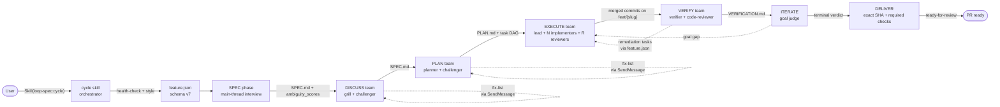
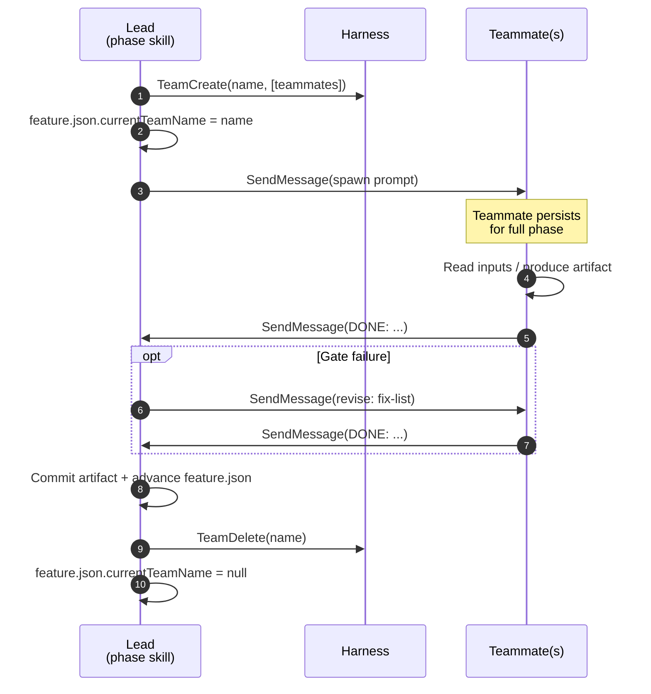
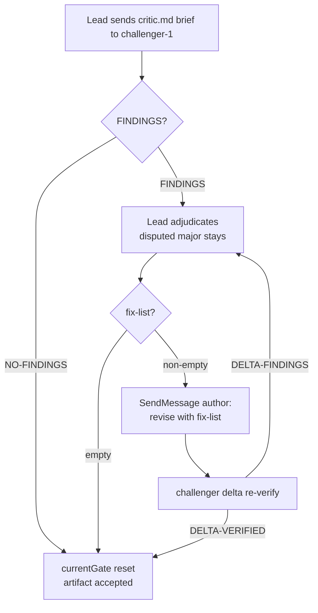
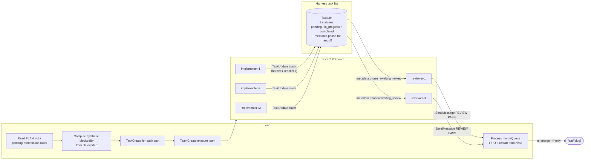
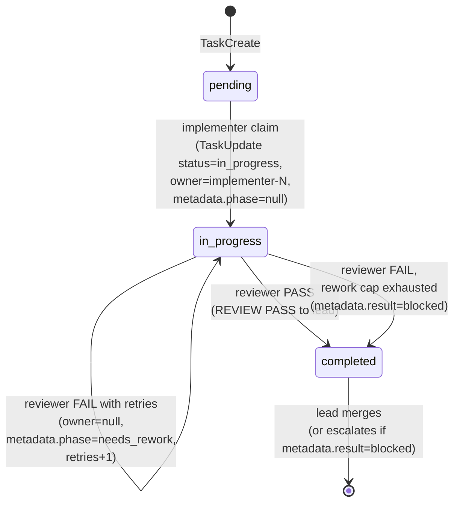

# loop-spec architecture

Operator-facing diagrams, artifact layout, and design notes extracted from the
README so the entry-point stays short. Behavior contracts still live in skills
and `lib/`; this page is the map, not the authority.

## Cycle orchestration

From 3.0 the cycle skill does not sequence the phases itself: `graph/cycle.graph.json` declares the topology and `lib/graph/run.sh` executes it, so phase successors, ITERATE's rewind targets, DELIVER's CI-remediation path and the human pause points are data rather than prose. Each phase skill still owns its own dispatches WITHIN a node — the engine owns sequencing, not content. Full model: [gdd.md](gdd.md). When agent teams are available, inherit-selector teammates persist for the whole phase and communicate over `SendMessage`, so rework rides on accumulated context instead of fresh spawns. A Claude role alias on the implicit-team harness (CC >= 2.1.178) cannot bind on a named spawn — in-process teammates inherit the lead model — so `lib/implicit-team-model.sh` selects a nameless one-shot Agent instead (`skills/shared/dispatch.md`). `lib/teams-capability.sh` resolves the team mechanism per Claude Code version: explicit `TeamCreate`/`TeamDelete` on older builds, direct named `Agent({name})` spawns on 2.1.178 and later, and a documented fallback per phase (`skills/shared/dispatch.md`) when teams are off, with the same artifacts, gates, and result contracts on every path.

Under Claude Code each feature runs in its own git worktree by default
(`.claude/worktrees/{slug}`, branch `feat/{slug}` from the fetched base SHA).
`lib/worktree-base.sh` verifies that location can actually hold the checkout before it
is used — a sandboxed harness may deny writing harness-config paths such as
`.claude/commands/**` anywhere inside the repository, which aborts `git worktree add`
part-way through — and relocates the worktree outside the repository when it cannot.
`LOOP_SPEC_WORKTREE_DIR` sets that base explicitly.
`LOOP_SPEC_WORKTREES=0` instead uses a clean in-place feature branch and
deterministically blocks later worktree creation/entry. OpenCode, Codex, and ADK always use a clean
in-place branch because those harnesses cannot switch a live session root. Resume scans
both the invocation root and registered feature worktrees for incomplete features
inside the staleness window (48h), then adopts the recorded absolute root before
reading phase state.



Solid arrows are forward progression; dotted arrows are gate-failure retries. Every arrow shown is an edge declared in `graph/cycle.graph.json`, and the dotted rewinds are `route` edges whose conditions name a probe script and an expected token — not prose the orchestrator re-reads each run. Design and verification artifacts are committed before handoff; DELIVER persists its external observation locally without creating a post-check commit that would invalidate the checked SHA.

### Per-phase team lifecycle



Resume reads `currentTeamName` from each candidate `feature.json` and, on the explicit-teams harness, probes `TaskList({team})` to detect a still-live orphan. On implicit and no-teams harnesses the prior team is treated as gone and the feature resumes directly.

### Critique gate protocol (challenger-only)



Gate transcripts persist under `gate-logs/` so a delta re-verify has the prior findings.

### EXECUTE, agent-team rung

The lead pre-populates the harness task list from PLAN.md (plus any `pendingRemediationTasks` a prior VERIFY recorded), then implementers self-claim unblocked tasks until the list drains:



Each claimed task runs in an isolated worktree under `.loop-spec/worktrees/{slug}/task-NNN/`, so concurrent implementers cannot race on the working tree.



Status transitions stay within the three harness-documented values; handoffs and rework ride on `owner` and `metadata.phase`/`metadata.result` while status remains `in_progress`.


## Artifact tree

```
docs/loop-spec/                          # committed
├── features/{slug}/
│   ├── SPEC.md
│   ├── PATTERNS.md
│   ├── PLAN.md
│   ├── VERIFICATION.md
│   ├── EVIDENCE.md                       # probe ledger (EVID-NNN ids)
│   ├── REVIEW-ORDER.md                   # the reviewer's guide (ordered path:line stops)
│   └── ITERATION.md                      # per-iteration convergence verdicts
├── RETRO.md                              # dated retrospective reports
├── telemetry/runs/{slug}.json            # per-run digests (local by default; committed only under LOOP_SPEC_COMMIT_TELEMETRY=1)
├── assessment/ASSESSMENT.md              # /loop-spec:assess output
└── codebase/
    ├── TECH.md ARCH.md QUALITY.md CONCERNS.md DOMAIN.md

.loop-spec/                              # gitignored (exceptions noted)
├── BACKLOG.md                            # deferred findings + iterate gaps
├── RULES.md                              # self-learning rules (gitignore-excepted, committed)
├── extensions.json                       # project review layers / phase instructions / facts (committed)
├── features/{slug}/
│   ├── feature.json (+ .bak)             # schema v7, atomic writes
│   ├── PROGRESS.md                       # phase-transition journal
│   ├── spec-interview-transcript.md
│   ├── discuss-transcript.md
│   ├── loop-plan.json                    # loop-fleet compiled plan
│   ├── result.json / events.jsonl        # machine-readable run contract
│   └── gate-logs/                        # critique-gate round transcripts
├── intake/{slug}.md                      # intake drafts (provenance included)
├── worktrees/{slug}/                     # per-task git worktrees
├── sentinel-queue.json                   # triaged queue (re-derived per scan)
├── sentinel-events.jsonl                 # sentinel decision ledger
├── runtime.json                          # probe cache
├── last-result.json                      # stable result pointer
└── codebase/index.json                   # file -> domain map (tracked)

.loop/                                    # gitignored loop-fleet state (per worktree)
├── fleet-result.json
└── {task-id}/                            # per-loop result.json, iteration logs
```


## Repository layout

```
loop-spec/
├── .claude/rules/                   # path-scoped contributor reminders (not @imported)
├── .claude-plugin/                  # plugin.json + marketplace.json
├── extensions/adk/loop_spec_adk/    # ADK bridge: env + skills + dispatch (imports google-adk)
├── extensions/opencode/loop-spec.ts # opencode bridge: shell.env/chat.message/event hooks (node builtins only)
├── agents/                          # specialized agent definitions (teammates)
├── skills/
│   ├── cycle/ spec/ discuss/ plan/ execute/ verify/ iterate/ deliver/ # seven phases + orchestrator
│   ├── assess/ debug/ intake/ quality-loop/ revise/ retro/
│   ├── status/ sentinel/ watch/ micro/ rules/ onboard/
│   ├── grill/ simplicity/ human-code/ discipline/               # session-mode toggles
│   ├── pause/ rollback/ forensics/                             # lifecycle utilities
│   ├── loop-runner/                 # bundled loop engine + its offline test suite
│   └── shared/                      # cross-skill contracts (tier-matrix, model-matrix, autonomous-mode, claude-harness, opencode-harness, adk-harness, ...)
├── lib/                             # extracted bash, one concern per script, unit-tested
├── hooks/                           # PreToolUse/Stop/SessionStart guards + hooks.json
├── tests/
│   ├── run-all.sh                   # unit gate: tests/lib/*.test.sh (non-integration); run a suite's own file directly for hooks/validators/workflow/loop-runner checks
│   ├── lib/                         # unit tests for lib/*.sh
│   └── e2e/                         # live smokes (opt-in): full cycle + sentinel drive loop
└── docs/
    ├── design.md                    # full architecture
    ├── adopting.md                  # adoption guide
    ├── examples/issue-to-pr.yml     # GitHub Action recipe
    └── loop-spec/sentinel.md        # unattended operation recipes
```


## Workflows integration

Phase skills can dispatch [Claude Code dynamic workflows](https://code.claude.com/docs/en/workflows) at fan-out points (the VERIFY acceptance and code-review gates, and PLAN multi-angle on opt-in). The wrapper preserves the team orchestration and falls back automatically when the `Workflow` tool is unavailable. If the tool is denied, add `Workflow` to the allow list via `/permissions`; to force the fallback everywhere, set `CLAUDE_CODE_DISABLE_WORKFLOWS=1`. Fan-out parameters are fixed: 3 refute voters, 3 plan angles, 3 dimension reviewers, completeness critic on.

`hooks/install-bundled-workflows.sh` also installs two standalone commands: `/loop-spec:codebase-audit` (multi-dimension review of the current diff) and `/loop-spec:multi-angle-plan` (draft N plans, judge, synthesize).


## Design notes

Three open-source projects shaped this one:

- [get-shit-done](https://github.com/gsd-build/get-shit-done): a multi-phase workflow that captures every decision in markdown artifacts. Its lesson: spec-driven beats prompt-driven as soon as a task is bigger than one commit, because the spec catches design errors that re-rolls cannot. Several mechanisms are ported directly: the pattern-mapper (with GSD `.planning/` ingest), the VERIFY marker scan, stall detection on resume, and orphaned-worktree pruning.
- [ponytail](https://github.com/DietrichGebert/ponytail): a "lazy senior dev" skill that climbs a ladder (YAGNI, reuse, stdlib, native, installed dep, one line, minimum) before writing code, without cutting validation, error handling, security, or accessibility. Ported here as simplicity mode plus an over-engineering pass in VERIFY's code review.

Positions the codebase takes:

- Deterministic predicates for autonomous decisions. Anything that decides whether the loop may act without a human is a unit-tested script (`autonomous-chain.sh`, `trust.sh`, `test-tamper-scan.sh`, `grounding-lint.sh`, `artifact-lint.sh`), never prose in a skill. Phase artifacts (SPEC.md, PLAN.md, PATTERNS.md, VERIFICATION.md, the tasks[] handoff JSON) are structurally linted at the PRODUCING phase's exit, so the next phase never spends cycles repairing a misformatted handoff — and PLAN persists its gate-validated tasks[] as machine-readable `tasks.json` that EXECUTE consumes directly instead of re-parsing markdown prose. Telemetry and accelerator hooks fail open; authority checks fail closed.
- Bounded everything. 3 retries per gate, 40 global, 10 iterations, cooldowns on sentinel picks, wall-clock watchdogs on phases. The cycle ships or escalates; it does not loop forever.
- Maker/checker separation. The iterate judge is never the agent that did the work, verify workers cannot edit the spec they are verified against, and trust is computed from git/CI facts rather than self-reports.
- As little code as possible ("the ponytail ladder", `skills/shared/laziness-ladder.md`): before writing, stop at the first rung that holds — YAGNI, DRY, stdlib, native, installed dep, one line, the minimum that works. Rung 1 is countable only after writing, so `lib/indirection-scan.sh` checks the changed files for small private single-caller helpers. Rung 2 uniquely requires the rest of the tree because it asks whether something already exists somewhere the run has never looked; a run that never opens the file holding the helper concludes honestly that it does not exist. "Search the tree first" was in the directive from the beginning and second copies shipped anyway, so the rung is measured rather than exhorted: `lib/duplication-scan.sh scan <files>` names each duplicated block and the file it already lives in, and `diff <base> [head]` reports only clones a change introduced, so a reviewer sees this author's duplication rather than the repository's standing debt. It matches at two tiers, and the second is the reason it works on produced code: `duplicate=` is the same lines verbatim, `similar=` is the same lines with every identifier and literal replaced. An agent writing `orders.ts` beside `users.ts` emits the same twelve lines with one noun swapped throughout, which a verbatim matcher reports clean — a DRY probe blind to that passes exactly the diffs it exists to catch. The shape tier is fenced to stay usable: a wider window, rejection of windows whose own lines are mostly identical (a table of uniform rows otherwise matches a shifted copy of itself at every offset), and suppression of shape findings overlapping a verbatim one. It reads code only and skips generated files and marked generated regions. Findings carry file:line and therefore block at VERIFY (`dry:`) on the same rule as the other probes. What the probe cannot decide stays judgment: duplication is one *reason to change* expressed twice, so blocks that merely resemble each other are reported and left apart. Enforced by `tests/ponytail-coverage.test.sh`.
- Code for humans ("house style over habit", `skills/shared/human-code.md`): read the neighbors before writing a line and match them — naming, error idiom, test structure, layout — because generated code fails its reader in a specific way: it is correct, and it looks nothing like the code around it. Comments carry why, never what, and comment *density* is set by the file rather than an absolute, so a module that documents nothing does not acquire a docstring convention from one diff. The convention is measured, not recalled: `lib/house-style.sh probe <files>` reports density, doc-comment usage, indentation, and naming case from the actual neighbors (or, for a file that does not exist yet, from its future neighbors), and `lib/comment-tells.sh` flags added comments that narrate the edit, narrate history, or restate the next line. Every code-producing dispatch carries the directive, a SessionStart hook covers the main thread, and VERIFY's reviewer runs both probes: a deviation a probe can demonstrate blocks; a convention you believe in but cannot show is taste, and taste stays Minor. Carve-outs never cut: `simplicity:` markers, file-header purpose blocks, TODO/FIXME/NOTE/HACK/SAFETY markers, spec-required contract docs. Enforced by `tests/human-code-coverage.test.sh`.
- Design for change ("seams, not speculation", `skills/shared/design-for-change.md`): design to interfaces, give units their collaborators instead of constructing them internally, put boundaries where change is likely, and never build speculative artifacts behind a seam. Every design- and code-producing dispatch carries this directive, and VERIFY's reviewer runs a boundary pass. Enforced by `tests/design-coverage.test.sh`.
- Execution discipline for throughput models (`skills/shared/execution-discipline.md`): the design phases run on the strongest reasoning models, EXECUTE/VERIFY on faster ones, so every executor dispatch carries mechanical habits: read it and run it instead of recalling it, treat anomalies as signal, re-read the acceptance criteria before claiming done, prefer `NEEDS_CONTEXT` over confident filler.
- Loop engineering as a first-class layer: `compile_spec.py` (spec to verified task plan), `supervisor.py` (plan to a fleet of workers in isolated worktrees with merge and halt policy), and `loop.py` (bounded loop with verifier-integrity locking and durable state) ship with their own offline regression suite and power both the standalone loop-runner skill and EXECUTE's loop-fleet rung.


## Limitations

Harness limitations when running with agent teams (none apply to the loop-fleet or subagent paths):

1. `/resume` does not restore in-process teammates; resume happens at phase boundaries.
2. Teammates cannot spawn sub-teams; only the lead creates teams.
3. One team at a time per lead.
4. `skills` and `mcpServers` frontmatter in agent definitions is inert for teammates; only the lead's are active.
5. Teammates inherit the lead's permission mode; per-teammate permission scoping is not supported.
