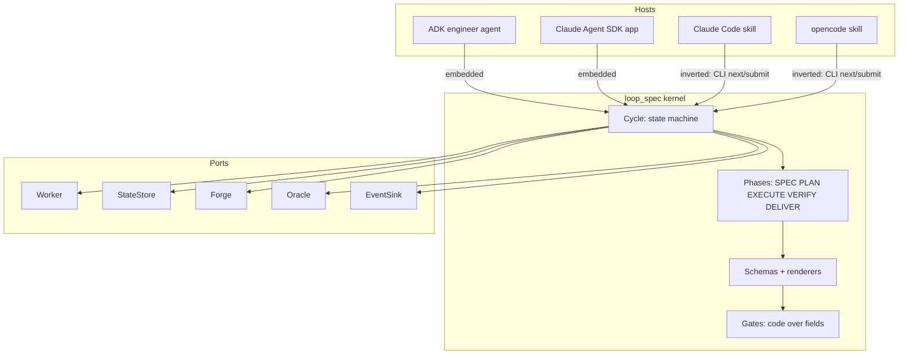
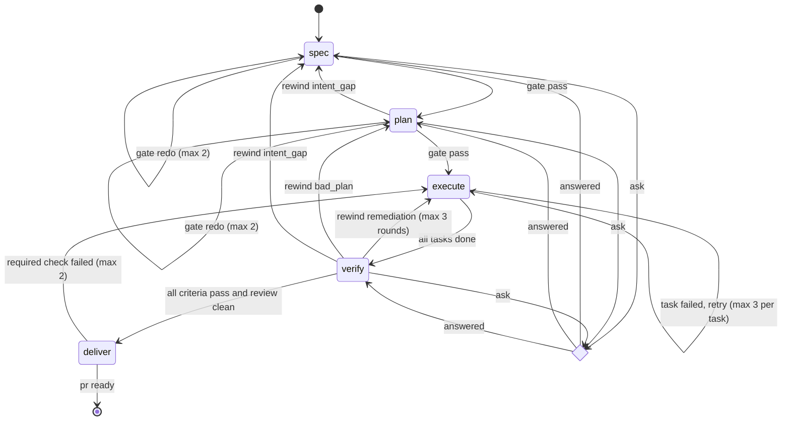

# loop-spec 7: design for the rebuild

For the maintainer who will build loop-spec 7 in a new repository. Also for the engineer
who will embed it as the brain of an engineer agent on Google's Agent Development Kit
(ADK).

When you finish this page you can name the kernel's five interfaces. You can name
the five phases and their schemas, and the two run modes. You can say which parts of
loop-spec 6 the rebuild ports, rewrites, or drops. This page is a design. It ships no code. The decisions come from
the design interview recorded at the end.

## Contents

- The problem loop-spec 6 could not fix
- Decisions from the interview
- Architecture in one picture
- The kernel
  - Phase contract
  - State machine
  - Push-left rule
  - Ask protocol
  - Events
- The five phases and their schemas
- Run modes: embedded and inverted
- Adapters
- Prompt fragments
- Repository layout of the new package
- Cut list: what happens to loop-spec 6
- Test strategy
- Build order
- Open questions
- Interview record
- Sources

## The problem loop-spec 6 could not fix

Loop-spec 6 is a model-led design. A skill body tells the model what to do. A driver
script refuses transitions the model gets wrong. Over six major versions the refusals
grew into 163 scripts, 40 shared contracts, 30 skills, and 61 test suites, because every
observed failure produced one more guard. The failures the interview named are the ones
that shape of design cannot close:

- **Agents get lost.** A phase agent reads a skill, a harness contract, a stance, a
  directive, and the artifacts of earlier phases. It then decides what to read next. When
  it skips one, nothing downstream notices until a gate refuses.
- **Churn between phases.** A gate refuses at PLAN for a field SPEC never had a
  deterministic way to produce. The model then repairs prose until the gate passes.
- **Cost and speed.** Each guard is a prompt read or a subprocess. The guards outnumber
  the work.
- **Reliability.** State drift, orphaned teams, and resumes that misread state.

The rebuild inverts control. Code owns the loop. The model is a bounded worker that
receives one phase's inputs and returns one typed output. Nothing downstream can depend
on something upstream did not produce, because the producing schema is the only source.

## Decisions from the interview

| Decision | Choice |
|---|---|
| Primary consumers | An engineer agent on ADK, and Claude Agent SDK embeddings. Human developers use Claude Code and opencode. OpenAI Codex is dropped. |
| Shape | Harness-neutral kernel with harness adapters |
| Control | Code owns the state machine. The model is a per-phase worker. |
| Phases | SPEC, PLAN, EXECUTE, VERIFY, DELIVER. Critique is a step inside SPEC and PLAN. ITERATE becomes VERIFY's rewind edge. |
| Phase output | JSON schema per phase. Markdown is rendered from JSON, never parsed. |
| Human involvement | The runner pauses on a typed question. A supervisor answers. No fixed approval stops. A stop happens only for a question or when the run cannot proceed. |
| Language | Python 3.14 on uv. One package: importable library plus a CLI. |
| Models | Model agnostic. Prompts and schemas must work on any provider. |
| Run modes | Embedded (kernel calls a worker) and inverted (harness model is the worker). One Phase contract behind both. |
| State | Pluggable store, repo-file backend default |
| Delivery | Pluggable forge, GitHub default |
| Execution | The plan marks tasks parallel-safe or sequential. The host chooses how many workers run. The kernel supports both without rearchitecture. |
| Quality gates | Acceptance criteria as runnable commands. Adversarial critique in SPEC and PLAN. Independent code review in VERIFY. Static scans are dropped. |
| Events | JSONL in the state store, Python logging, and a host callback interface |
| Side commands | status, pause, resume, rollback, revise, debug |
| Prompt prose | Ported as prompt fragments, rewritten to the skill-authoring guidance cited below |
| Where | A new repository. This document is the hand-off. |

## Architecture in one picture



The kernel never imports a harness. A host implements the ports it needs and receives
the rest as defaults. The defaults are a subprocess worker that runs a command the host
names, a repo-file store, and a GitHub forge. The default oracle raises on every
question. The default sink writes JSONL and logs.

## The kernel

### Phase contract

A Phase is a Python class with five members. Both runners drive every phase
through exactly these.

```python
class Phase(Protocol):
    name: PhaseName                       # "spec" | "plan" | "execute" | "verify" | "deliver"
    input_model: type[BaseModel]          # what the kernel hands the worker
    output_model: type[BaseModel]         # what the worker must return
    tools: ToolPolicy                     # allow-list and read-only flag per tool class

    def build_prompt(self, inp: BaseModel, fragments: FragmentSet) -> Prompt: ...
    def gate(self, inp: BaseModel, out: BaseModel, ctx: GateContext) -> GateResult: ...
    def render(self, out: BaseModel) -> dict[str, str]: ...   # path -> markdown
```

Rules the contract enforces:

- **The kernel builds `input_model` only from earlier `output_model`s and the feature record.**
  A field PLAN needs must exist on SPEC's output model. This is the push-left rule
  below, stated as a type.
- **`gate` is code over fields.** It runs commands, compares values, and counts. It
  never calls a model. It returns `pass`, `redo(reasons)`, `rewind(to, reasons)`, or
  `ask(questions)`.
- **`render` is one way.** Markdown is a view for humans and the pull request. The
  kernel never reads it back.
- **`tools` is data.** The embedded runner passes it to the worker. The inverted runner
  prints it for the harness skill to honor. Neither runner interprets it further.

### State machine



The kernel object is `Cycle`. Its public surface is small on purpose:

```python
class Cycle:
    def __init__(self, feature: FeatureRef, ports: Ports, policy: Policy): ...
    def next(self) -> Step            # Run(phase, input, prompt) | Ask(questions) | Done(result)
    def submit(self, phase: PhaseName, output: dict) -> Transition
    def answer(self, question_id: str, answer: Answer) -> None
    def status(self) -> Status
```

`next` and `submit` are the whole protocol. The embedded runner loops them with a
Worker. The inverted runner exposes them as CLI subcommands. Every transition writes the
feature record through the StateStore before it returns. A crash between calls loses
at most the in-flight worker call. The next `next` call re-issues it.

Retry ceilings live in `Policy` with a documented reason each, per the "no voodoo
constants" rule in the skill-authoring guide. A host may lower them. The engineer agent
runs with the defaults.

### Push-left rule

Loop-spec 6 grew a gate at PLAN for every field a run once lacked. The rebuild states the
rule the interview asked for as a test the kernel runs on itself:

> A gate at phase N may reference only fields that phase N's `input_model` declares.
> An earlier phase's `output_model` or the kernel produces every such field.

`tests/test_push_left.py` walks each Phase, collects the field paths its `gate` reads
(the gate declares them in a `reads` tuple), and fails when a path has no producer. A
new gate therefore begins with a schema change upstream. The same test fails when an
`output_model` field has no consumer, so schemas cannot grow fields nobody reads.

### Ask protocol

Every phase may return questions instead of an output. The kernel treats a question
as a first-class state, not a side channel.

```python
class Question(BaseModel):
    id: str
    header: str                # <= 12 chars, matches AskUserQuestion and opencode `question`
    text: str
    options: list[Option]      # 2 to 4; the first is the recommended answer
    multi: bool = False
    blocking: bool = True      # False: the phase may proceed with the recommended option

class Answer(BaseModel):
    question_id: str
    labels: list[str]
    free_text: str | None
    source: Literal["human", "supervisor", "recommended"]
```

`Cycle.next` returns `Ask` when an unanswered blocking question exists. The kernel
persists the questions with the feature record and emits an `ask` event. Who answers is
the Oracle port's job:

| Host | Oracle implementation |
|---|---|
| Claude Code skill | Calls `AskUserQuestion` with the same shape, then `loop-spec answer` |
| opencode skill | Calls the `question` tool, then `loop-spec answer` |
| Claude Agent SDK | A `can_use_tool` handler that maps the kernel's questions onto the AskUserQuestion input and returns `PermissionResultAllow(updated_input=...)` |
| ADK | A `LongRunningFunctionTool` named `ask_supervisor`. The invocation pauses. The client resumes with the `FunctionResponse` under `ResumabilityConfig(is_resumable=True)`. |
| Unattended | The `RecommendedOracle` returns the first option and records `source: recommended`. It refuses a question marked `blocking` unless policy allows. |

A question has a hard cap of four per phase per round, matching the harness tools. A
phase that needs more asks the four that unblock the most and records the rest as
assumptions in its output. SPEC's output model carries `assumptions: list[Assumption]`,
so PLAN can see what SPEC assumed.

### Events

Phase start and finish were the one thing the interview required to survive. Every
transition emits:

```json
{"ts":"...","feature":"slug","event":"phase_start","phase":"plan","attempt":1}
{"ts":"...","feature":"slug","event":"phase_end","phase":"plan","attempt":1,"verdict":"pass","duration_s":41.2}
```

The full event set is `cycle_start`, `phase_start`, `phase_end`, `gate`, `ask`,
`answer`, `worker_call`, `task_start`, `task_end`, `rewind`, `deliver`, `cycle_end`,
`error`. Three sinks ship, all on by default:

- `JsonlSink` appends to `events.jsonl` in the StateStore.
- `LoggingSink` emits structured records through `logging.getLogger("loop_spec")`.
- `EventSink` is the Protocol a host implements. ADK hosts forward to their trace; SDK
  hosts forward to their own logger. The kernel calls every registered sink.

`worker_call` carries token counts and wall time when the Worker reports them, so cost
per phase is a query over one file.

## The five phases and their schemas

Each phase lists its input, output, gate, and the critique step where one exists.
Schemas are Pydantic models. Field lists here are the load-bearing ones. Full models
live in `loop_spec/schemas/`.

### SPEC

**Input.** The request text, repository facts the kernel gathers (default branch, test
command probe, language mix), and any prior answers.

**Output.**

```python
class Spec(BaseModel):
    title: str
    goal: str                              # one paragraph, in the requester's words
    boundaries: list[str]                  # what must not change
    criteria: list[Criterion]              # the contract
    assumptions: list[Assumption]
    decisions: list[Decision]              # question, answer, source
    out_of_scope: list[str]
    evidence: list[Evidence]               # file:line or probe output, cited by criteria

class Criterion(BaseModel):
    id: str                                # GE-001 ...
    text: str
    check: Command                         # shell command; exit 0 means met
    expected: str                          # what the output shows when met
    kind: Literal["behavior", "regression", "non_functional"]
```

**Critique step.** After the draft, the kernel calls the worker again with the
`critic` fragment and a rubric over the same model. The critic returns
`Findings(major: list[Finding], minor: list[Finding])`. A major finding sends the draft
back with the findings inlined, once. The second draft goes to the gate with any
surviving major findings recorded on the spec. There is no advocate and no third round.

**Gate.** Every criterion has a non-empty `check`. Every `check` runs and exits
non-zero on the unchanged tree, or the spec marks the criterion `kind: regression` and it exits
zero. Every load-bearing claim about the repository cites `evidence`. No open blocking
question. Redo at most twice, then ask.

The gate that a check exits non-zero before the change is what makes criteria
testable. It replaces the six lint scripts loop-spec 6 ran over SPEC.md prose.

### PLAN

**Input.** The `Spec`, repository facts, and the patterns the worker reads during the
phase.

**Output.**

```python
class Plan(BaseModel):
    approach: str
    tasks: list[Task]
    global_constraints: list[str]          # copied verbatim from Spec.boundaries
    test_strategy: str

class Task(BaseModel):
    id: str
    subject: str
    goal: str
    files: list[str]
    read_first: list[str]
    depends_on: list[str]
    parallel_safe: bool                    # no file overlap with any other unblocked task
    criteria: list[str]                    # Criterion ids this task satisfies
    verify: Command
    steps: list[str]
```

**Critique step.** Same shape as SPEC's, with the plan rubric: coverage, dependency
order, file overlap, and task size.

**Gate.** Every `Spec.criteria[].id` appears in at least one task. Every `depends_on`
names a task. No cycle. The kernel recomputes `parallel_safe` from `files`
overlap, and the plan's value must match. Every `files` entry that exists is readable. Redo at most
twice, then rewind to SPEC with `intent_gap` when the plan cannot cover a criterion.

`parallel_safe` is how the interview's execution answer is met. The plan marks what can
run together. The host decides how many workers to spawn. The kernel accepts any number
of concurrent `submit` calls for tasks whose `parallel_safe` is true and whose
dependencies have finished.

### EXECUTE

EXECUTE is a task loop, not one worker call. `Cycle.next` returns one `Run` per ready
task. A host may call `next` repeatedly to receive every ready task and run them
concurrently. When more than one task is in flight, each runs in its own git worktree.
When the host runs one task at a time, it runs on the feature branch. The kernel merges a finished
task's commit onto the feature branch with fast-forward only, in completion order.

**Input per task.** The `Task`, its `Criterion`s, `Plan.global_constraints`, and the
current branch head.

**Output per task.**

```python
class TaskResult(BaseModel):
    task_id: str
    status: Literal["done", "blocked"]
    commit: str | None
    verify_output: str
    files_changed: list[str]
    blocked_reason: str | None
    needs_context: str | None              # the exact missing fact
```

**Gate per task.** `commit` exists on the worktree and is one commit. `verify` runs and
exits zero. `files_changed` is a subset of `Task.files` plus their test modules. A
task that fails its gate retries up to three times with the gate output inlined. A
`blocked` task with `needs_context` raises an `Ask`.

### VERIFY

**Input.** The `Spec`, the `Plan`, the branch head, and the base SHA.

**Step 1: acceptance.** The kernel runs every `Criterion.check` itself and records exit
codes and output. No model call. A failing check is a remediation task.

**Step 2: review.** A worker with read-only tools reviews the diff against the `Spec`
and returns:

```python
class Review(BaseModel):
    findings: list[Finding]

class Finding(BaseModel):
    file: str
    line: int
    severity: Literal["blocking", "minor"]
    claim: str
    route: Literal["patch", "bad_plan", "intent_gap"]
    fix_hint: str | None
```

**Gate.** Every criterion passed. No blocking finding. The full test command passed.
Routes: `patch` findings become remediation tasks and rewind to EXECUTE. `bad_plan`
rewinds to PLAN with the findings. `intent_gap` raises an `Ask` with the question the
finding names, then rewinds to SPEC with the answer.

Policy caps remediation rounds at
three. After that the run ends `escalated` with the record intact.

The kernel records minor findings on the verification record and in the pull request
body. No finding disappears silently, and no minor blocks the run.

### DELIVER

**Input.** The verified head SHA, the `Spec`, the `Plan`, and the verification record.

**Output.** Written by the kernel, not a worker: `Delivery(pr_url, head_sha, checks)`.
DELIVER has one worker call, which writes the pull request body from the rendered
records with the `pr_body` fragment. The Forge port pushes the exact SHA, opens or
updates one pull request, and waits for required checks with a timeout. A failed
required check whose log names a file the diff touched becomes a remediation task and
rewinds to EXECUTE, at most twice. Any other failure ends the run `escalated` with the
check name and log excerpt in the result.

## Run modes: embedded and inverted

Both runners consume the same `Cycle` and the same `Phase` objects.

### Embedded

```python
async def run(cycle: Cycle, worker: Worker, oracle: Oracle) -> Result:
    while True:
        step = cycle.next()
        match step:
            case Run(phase, inp, prompt):
                out = await worker.run(prompt, phase.output_model, phase.tools)
                cycle.submit(phase.name, out)
            case Ask(questions):
                for q in questions:
                    cycle.answer(q.id, await oracle.answer(q))
            case Done(result):
                return result
```

The Worker port:

```python
class Worker(Protocol):
    async def run(self, prompt: Prompt, output_model: type[BaseModel], tools: ToolPolicy) -> BaseModel: ...
    def capabilities(self) -> WorkerCapabilities   # concurrency, structured_output, read_only_tools
```

Two Workers ship:

- `ClaudeSdkWorker` calls `claude_agent_sdk.query` with `output_format={"type":
  "json_schema", "schema": output_model.model_json_schema()}` and reads
  `ResultMessage.structured_output`. It treats `subtype != "success"` or a missing
  `structured_output` as a failed call, per the SDK documentation.
- `AdkWorker` builds an `LlmAgent` with `output_schema=output_model` and the phase's
  tools, runs it through a `Runner`, and validates the final content. ADK raises
  `ValidationError` on a schema mismatch and does not retry. The worker retries once
  with the error inlined, then fails the call.

A host may also supply its own Worker. The engineer agent will: its executor agents are
the Worker for EXECUTE, and it may register two of them.

### Inverted

The harness model is the worker. The skill is a thin loop over the CLI:

```
loop-spec next   --feature <slug>          # prints one of:
                                           #   RUN phase=<p> prompt=<path> schema=<path> tools=<json>
                                           #   ASK questions=<path>
                                           #   DONE result=<path>
loop-spec submit --feature <slug> --phase <p> --output <path|->
loop-spec answer --feature <slug> --question <id> --label <text> [--free-text <text>]
```

`RUN` writes the rendered prompt and the JSON schema to files and prints their paths.
The skill reads the prompt, does the work with the tools the harness gives it, writes
the JSON, and calls `submit`. `submit` validates against the schema and runs the gate.
A validation failure prints the error paths and exits 2; the skill fixes the JSON and
submits again. The model never sees the kernel, the other phases, or the feature record.

The Claude Code skill body is under 60 lines. Its whole job is the loop above plus
mapping `ASK` onto `AskUserQuestion`. There are no phase skills, no shared contracts,
and no hooks that fight the model. Loop-spec 6 needed a Stop-hook guard to keep a session from walking out of an open
phase. The rebuild does not. An unfinished phase is a feature record whose next `RUN`
is the same phase, and `loop-spec status` says so.

### Choosing a mode

| Host | Mode | Why |
|---|---|---|
| ADK engineer agent | Embedded | The agent owns the process and the model call. |
| Claude Agent SDK app | Embedded | Same. |
| Claude Code | Inverted | The developer's session is the worker. They watch it work. |
| opencode | Inverted | Same. |
| Headless CLI (`loop-spec run`) | Embedded with the subprocess Worker | Runs `claude -p` or `opencode run` per phase for a developer who wants unattended runs without writing code. |

## Adapters

An adapter is the smallest thing that makes a host a working consumer. Each is a
directory in the package. Its tests run it against the kernel with a fake Worker.

| Adapter | Contents |
|---|---|
| `loop_spec.adapters.adk` | `AdkWorker`, `ask_supervisor` long-running tool, `build_app(root_dir, ...)` returning an `App` with `ResumabilityConfig(is_resumable=True)`, an `EventSink` that forwards to the ADK event stream |
| `loop_spec.adapters.claude_sdk` | `ClaudeSdkWorker`, a `can_use_tool` oracle, an example supervisor |
| `loop_spec.adapters.claude_code` | The skill directory the installer copies: `SKILL.md`, and `.claude-plugin/plugin.json` |
| `loop_spec.adapters.opencode` | The skill and command the installer copies. No TypeScript plugin. The kernel needs no hook into the harness. |
| `loop_spec.forge.github` | The Forge over `gh` when present, else the REST API with a token from the environment |
| `loop_spec.store.files` | The StateStore over `.loop-spec/<slug>/` and `docs/loop-spec/<slug>/` |

A host that needs a different Forge or StateStore implements the Protocol. The
conformance tests under `tests/conformance/` run against any implementation the host
points them at.

## Prompt fragments

The interview asked that the shared contracts survive as prompt prose, rewritten to
current skill-authoring guidance. The guidance the rewrite follows, from the sources
cited at the end:

- Assume the model is capable. Add only what it does not already know. Cut
  explanations of concepts.
- Match freedom to fragility. A fragile step gets an exact command. A judgment step
  gets a short heuristic list.
- One term per concept. No synonyms for variety.
- Keep references one level deep. A fragment never points at another fragment.
- Prefer scripts for deterministic work. A check the kernel can run is not a prompt.
- Examples over adjectives where output quality depends on shape.
- Consistent point of view. Fragments address the worker in the imperative.
- Test with every model in use. A live eval runs each fragment on at least two providers
  before it ships.

Each fragment is a markdown file with frontmatter declaring `purpose`, `max_tokens`, and
`phases`. A test fails in three cases. A fragment exceeds its budget. A phase includes a
fragment that does not list that phase. No phase includes the fragment.

| Fragment | Ported from | Budget | Phases |
|---|---|---|---|
| `grounding` | grounding-protocol.md | 250 | spec, plan, verify |
| `criteria` | acceptance-lint, criteria-coverage, writing-good-tests | 300 | spec |
| `critic_spec` | critique-gate-protocol, team-prompts/critic | 300 | spec |
| `critic_plan` | same, plan rubric | 300 | plan |
| `tasking` | planner agent, laziness ladder rungs 1 and 2 | 300 | plan |
| `implementer` | implementer-contract, execution-discipline, human-code, TDD | 400 | execute |
| `reviewer` | code-reviewer agent, review-routing, design-for-change | 350 | verify |
| `pr_body` | pr-body.sh, plain-language | 150 | deliver |
| `plain_language` | plain-language.md, Orwell and STE-informed rules | 150 | all |

Total budget for any one phase stays under 1,200 tokens of fragments. The current
implementer dispatch carries roughly ten contracts by reference and several thousand
tokens inline. The reduction is deliberate: what a gate can check is not repeated in
prose.

Dropped, with the reason:

- `engineering-stances.md`: a stance is a deliverable list. The deliverables that
  matter are schema fields now.
- `tier-matrix.md`, `model-matrix.md`, `compact-profile.md`: routing by profile is a
  Policy object, not prose.
- `no-deferral.md`: the schema has no field for deferral, and VERIFY records minors.
- `dispatch.md`, `execute-rungs.md`, `execute-loop-fleet.md`, `execute-subagent.md`,
  `team-prompts/`: dispatch is the host's business.
- The four `*-harness.md` contracts: the adapters replace them.
- `human-docs.md`, `laziness-ladder.md` rungs 3 to 7, `engineering-directives.md`:
  folded into `implementer` and `tasking` where a sentence survives, otherwise dropped.

## Repository layout of the new package

```
loop-spec/
├── pyproject.toml                 # uv-managed; python >= 3.14; deps: pydantic
├── src/loop_spec/
│   ├── cycle.py                   # Cycle, Step, Transition, Policy
│   ├── phases/                    # spec.py plan.py execute.py verify.py deliver.py
│   ├── schemas/                   # one module per phase output, plus feature.py, events.py
│   ├── render/                    # markdown views of each schema
│   ├── fragments/                 # *.md with frontmatter; loaded, budgeted, tested
│   ├── ports.py                   # Worker, StateStore, Forge, Oracle, EventSink Protocols
│   ├── runners/                   # embedded.py inverted.py
│   ├── store/files.py
│   ├── forge/github.py
│   ├── adapters/                  # adk/ claude_sdk/ claude_code/ opencode/
│   ├── commands/                  # status pause resume rollback revise debug
│   └── cli.py                     # uvx loop-spec ...
├── tests/
│   ├── test_push_left.py
│   ├── test_fragments.py
│   ├── phases/                    # one file per phase, fake Worker, fixture repos
│   ├── conformance/               # StateStore and Forge conformance suites
│   └── adapters/
├── docs/                          # this document's successors, one job each
└── README.md
```

Dependencies are `pydantic` and, per adapter extra, `google-adk` or `claude-agent-sdk`.
No other runtime dependency. The interview's language decision retires the no-package-manager rule from
loop-spec 6. `uv` is the installer.

## Cut list: what happens to loop-spec 6

Every current directory, with its fate. "Port" means the idea survives in the new
shape. "Source" means the author writes the new code by reading the old. "Drop" means
nothing carries over.

| Current | Fate | Where it lands |
|---|---|---|
| `skills/cycle`, `spec`, `spec-lite`, `discuss`, `plan`, `execute`, `verify`, `iterate`, `deliver` | Port | `phases/` and `schemas/` |
| `skills/oneshot`, `micro`, `auto`, `intake`, `onboard`, `retro`, `assess`, `sentinel`, `watch`, `quality-loop`, `forensics`, `rules`, `settings`, `walkthrough`, `checking-gates`, `specifying-gates`, `loop-runner` | Drop | A small change is a spec with one criterion and a plan with one task. The kernel is cheap enough not to need a short path. |
| `skills/status`, `pause`, `rollback`, `revise`, `debug` | Port | `commands/` |
| `skills/shared/*` | Port or drop per the fragment table | `fragments/` |
| `agents/*` | Source | Fragments and `ToolPolicy` per phase |
| `lib/cycle-driver.sh`, `phase-entry.sh`, `phase-exit.sh`, `graph/` | Source | `cycle.py` |
| `lib/feature-write.sh`, `feature_read.py`, `state-ref.sh` | Source | `store/files.py` |
| `lib/deliver.sh`, `pr-delivery.sh`, `pr-body.sh`, `pr-comments.sh`, `checkpoint-pr.sh` | Source | `forge/github.py` and `phases/deliver.py` |
| `lib/events.sh`, `cycle-result.sh` | Source | `schemas/events.py` and the sinks |
| `lib/*-lint.sh`, `*-scan.sh`, `*-tells.sh`, `house-style.sh`, `surface.sh` | Drop | Schemas and gates replace prose lint. Static style scans were cut in the interview. |
| `lib/harness.sh`, `teams-capability.sh`, `implicit-team-model.sh`, `execute-rung.sh`, `task-route.sh`, `workflow-*.sh`, `lib/workflows/` | Drop | The host owns dispatch. |
| `lib/supervisor/*`, `docs/loop-spec/supervisor-interface.md` | Source | `ports.py`. The four-port shape is kept and made Python. |
| `hooks/*`, `output-styles/` | Drop | No hook fights the model when the model does not own the loop. |
| `extensions/opencode/loop-spec.ts` | Drop | The opencode adapter needs no plugin. |
| `extensions/adk/` | Source | `adapters/adk/` |
| `extensions/sessions/` | Drop | |
| `lib/opencode-install.sh`, `codex-install.sh`, `adk-install.sh` | Port | `loop-spec install <host>` |
| `.codex-plugin/`, `skills/shared/codex-harness.md` | Drop | Codex is out of scope per the interview. |
| `tests/*` | Source | Fixture repos and the behaviors they pin inform `tests/phases/`. No coverage-grep test survives; the schema test replaces the coupling pin. |
| `evals/` | Port | A live eval runs the embedded runner with a real Worker on the same fixtures. Never in CI. |
| `docs/loop-spec/*` | Source | Rewritten one job per page as the code lands. |

## Test strategy

- **Kernel tests never call a model.** A `ScriptedWorker` returns canned outputs per
  phase. Every transition, retry ceiling, rewind, and ask path is a unit test.
- **Gate tests run real commands on fixture repositories** under `tests/fixtures/`.
  A criterion's `check` is a real shell command against a real tree.
- **Schema tests** pin the push-left rule and the fragment budgets.
- **Conformance suites** for StateStore and Forge run against the shipped
  implementations and against a host's, by path.
- **Adapter tests** use each SDK's fake or a subprocess stub. They prove the adapter
  maps the ports, not that the model behaves.
- **Live evals** are opt-in, cost money, and record to an ignored directory, as today.

## Build order

Each step ends with `uv run pytest` green and a tagged commit.

1. `schemas/`, `ports.py`, `cycle.py` with `ScriptedWorker`. The state machine is
   complete before any prompt exists.
2. `store/files.py` and the conformance suite.
3. `phases/spec.py` with its gate and fragments. Live eval on one fixture with two
   providers.
4. `phases/plan.py`, `phases/execute.py` with sequential and two-worker parallel runs.
5. `phases/verify.py`, `phases/deliver.py`, `forge/github.py`.
6. `runners/inverted.py`, `cli.py`, the Claude Code adapter. One developer cycle end
   to end.
7. `adapters/adk/` with `ask_supervisor` and resumability. One engineer-agent cycle end
   to end.
8. `adapters/claude_sdk/`, the opencode adapter, `commands/`.
9. Archive this repository with a pointer to the new one.

## Open questions

These did not come up in the interview and do not block step 1. Each has a default.

- **Worktree location for parallel tasks.** Default: `.loop-spec/worktrees/<slug>/<task>`
  inside the repository, relocated by the host when the path is not writable.
- **Base branch selection for revise.** Default: the pull request's base as the Forge
  reports it.
- **Token accounting across providers.** Default: the Worker reports what it can, and
  the `worker_call` event allows nulls.
- **Debug command shape.** Default: a two-phase cycle, REPRODUCE then FIX, sharing
  EXECUTE and VERIFY. It is the one place a sixth phase name may appear.

## Interview record

Recorded on 2026-09-11. Questions paraphrased; answers as given.

1. Harness priority: ADK and Claude Agent SDK first, opencode and Claude Code second. A
   harness-neutral core with adapters.
2. Biggest pain: reliability of the loop, cost and speed, and output quality. Also churn
   between phases, and agents not following earlier artifacts or the plugin's own.
3. Must survive: the phases and their start and finish announcements to a logger. Not
   necessarily their artifacts. Deterministic flow and gates over prose. Push left: never
   check at PLAN what SPEC had no deterministic way to produce.
4. Language: Python 3.14 on uv or TypeScript on bun. Settled on Python by the ADK
   decision.
5. Control: the plugin becomes the brain of an engineer agent on ADK. Human developers
   use Claude Code and opencode and should create code the same way.
6. Phases: five.
7. Artifacts: JSON schema per phase, markdown rendered.
8. Humans: runner pauses with a typed question, supervisor answers.
9. Models: agnostic.
10. Run modes: both, one Phase contract.
11. State and delivery: pluggable, file and GitHub defaults.
12. Side skills: status, pause, resume, rollback, revise, debug.
13. Execute: the plan marks parallel candidates; the implementer chooses one or many
    executors; the plugin supports both.
14. Gates: acceptance criteria as commands, critique in SPEC and PLAN, independent
    review in VERIFY.
15. Events: JSONL, Python logging, host callback.
16. Deliverable of this session: this design document.
17. Where: a new repository.
18. Human gates: none fixed. Stop only on a question or when the run cannot proceed.
19. Prompt prose: port with optimization tactics from the web and skill-authoring best
    practices.

## Sources

- Anthropic, "Skill authoring best practices":
  https://platform.claude.com/docs/en/agents-and-tools/agent-skills/best-practices
- Anthropic, "Effective context engineering for AI agents":
  https://www.anthropic.com/engineering/effective-context-engineering-for-ai-agents
- Anthropic, "Effective harnesses for long-running agents":
  https://www.anthropic.com/engineering/effective-harnesses-for-long-running-agents
- Claude Agent SDK, "Get structured output from agents":
  https://code.claude.com/docs/en/agent-sdk/structured-outputs
- Claude Agent SDK, "Handle approvals and user input":
  https://code.claude.com/docs/en/agent-sdk/user-input
- Google ADK, "Resume agents":
  https://google.github.io/adk-docs/runtime/resume/
- Google ADK, "Function tools" (LongRunningFunctionTool):
  https://adk.dev/tools-custom/function-tools/
- google/adk-python discussion 3759, output_schema validation and retries:
  https://github.com/google/adk-python/discussions/3759
